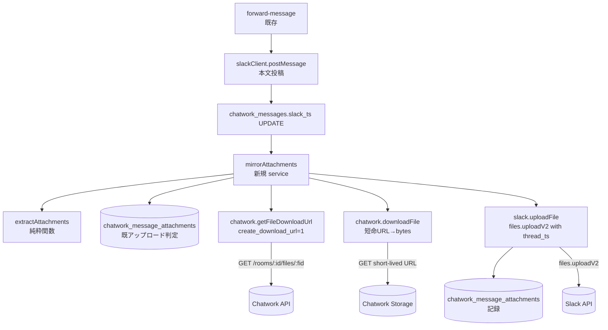

# 技術設計書 - attachment-mirror（Chatwork 添付ファイルを Slack に再アップロード）

> 入力: `.specs/attachment-mirror/requirement.md`
> 制約: `docs/coding-rules.md`（`[MUST]` をハード制約 / `[SHOULD]` 推奨）
> 参照: `.specs/sender-name/design.md`（§4.1 client / §4.5 format / §3.1 schema）, `.specs/forwarding/design.md`（§4.5 forward-message / §4.7 整合性方針）, `chatwork-slack-bridge-overview.md`
> 前提実装: forwarding（#3）/ sender-name（#17）本番稼働中

## 1. 要件トレーサビリティ

| 要件 ID | 設計項目 | 既存資産 |
|---------|---------|---------|
| REQ-001 | `adapters/chatwork/client.ts` に `getFileDownloadUrl` 追加 | 🔁拡張（`getRoom` / `getRoomMembers` と同パターン） |
| REQ-002 | `adapters/chatwork/client.ts` に `downloadFile` 追加 | 🔁拡張（`fetch` 直叩き / 認証なし） |
| REQ-003 | `adapters/slack/client.ts` に `uploadFile` 追加（`files.uploadV2`） | 🔁拡張 |
| REQ-004 | `adapters/chatwork/extract-attachments.ts`（純粋関数） | ❌新規 |
| REQ-005 | `app/services/forward-message.ts` 末尾に `mirrorAttachments` を結線 | 🔁拡張 |
| REQ-005 | `app/services/mirror-attachments.ts`（オーケストレーション） | ❌新規 |
| REQ-006 | `mirror-attachments` 内の try/catch + 構造化ログ | ❌新規 |
| REQ-007 | `db/schema.ts` に `chatwork_message_attachments` 追加 + migration | 🔁拡張 |
| REQ-008 | `docs/setup-guide/` に `files:write` 追加・再インストール手順を追記 | 🔁拡張 |

## 2. アーキテクチャ概要



処理順（`forward-message` への割り込み。既存フロー CON-001 を壊さない）:

1. ルーム解決 → `my` skip → 名前解決 → メッセージ INSERT → resolveTarget → Slack 投稿 → `slack_ts` UPDATE（既存）
2. **`mirrorAttachments` を呼ぶ**（新規）
   - 本文から file_id 群を抽出
   - 既アップロード判定 → 未アップロードのみ処理
   - 各 file_id について: メタ取得 → サイズチェック → バイト取得 → Slack アップロード → mapping 記録
   - **どの失敗も throw せず内部で握る**（既存 forward-message と同じ「ルートは常に 200」契約 / NFR-005）
3. `mirrorAttachments` の結果（success / fallback の件数）を構造化ログに残して終了

> 添付ミラーは「Slack 本文投稿成功 + `slack_ts` UPDATE 成功」が前提条件。投稿失敗時はそもそも `mirrorAttachments` まで到達しないため、添付が宙に浮く心配はない（NFR-005）。

## 3. データ設計

### 3.1 `chatwork_message_attachments`（追加 / Drizzle）

```sql
create table chatwork_message_attachments (
  id bigint generated always as identity primary key,
  chatwork_message_id bigint not null references chatwork_messages(id),
  chatwork_file_id text not null,
  slack_file_id text not null,
  slack_channel_id text not null,
  slack_thread_ts text not null,
  created_at timestamptz not null default now(),
  updated_at timestamptz not null default now(),
  unique (chatwork_message_id, chatwork_file_id)
);
create index chatwork_message_attachments_message_idx
  on chatwork_message_attachments (chatwork_message_id);   -- FK 用 index（[MUST]）
```

設計判断:

- **FK 先は `chatwork_messages.id`（内部 PK）** で `chatwork_message_id`（外部 ID）ではない。理由:
  - 既存 `chatwork_messages` の unique は `(chatwork_room_id, chatwork_message_id)` の複合。FK は単一カラムを参照する方が単純で安全。
  - mapping を消す側面（メッセージ削除時の CASCADE 等）を将来追加するときに ID 参照が自然。
- `chatwork_file_id` は Chatwork API の `file_id`。webhook payload には message_id しか入らないため、本文から抽出する file_id（文字列化）を保存する。
- `slack_channel_id` / `slack_thread_ts` は監査と将来の retry 用（どこに置いたか）。実運用では `chatwork_messages.slack_channel_id` / `slack_ts` と同値だが、ファイル単位の独立性を保つため重複保持する。
- `unique (chatwork_message_id, chatwork_file_id)` で**冪等 upsert**を担保（REQ-007 / NFR-004）。
- `id` / `timestamptz` / FK 明示 index / unique は forwarding / sender-name のスキーマ規約と統一（coding-rules `[MUST]`）。

### 3.2 既アップロード判定（重複防止）

```ts
// 同一 chatwork_message_id 配下の既アップロード file_id 一覧を1回の SELECT で取得
const uploaded = await db.select({ fileId: chatworkMessageAttachments.chatworkFileId })
  .from(chatworkMessageAttachments)
  .where(eq(chatworkMessageAttachments.chatworkMessageId, messageRowId));
const uploadedSet = new Set(uploaded.map((r) => r.fileId));
// 抽出した file_id 群から uploadedSet を除外
```

成功時の記録は `insert ... onConflictDoNothing` で **mapping の二重 insert は防止**される。

### 3.3 冪等性スコープ（REQ-007 / NFR-004）

本テーブルが**保証する**こと:

- ✅ **webhook 再送**: 同じ Chatwork メッセージが 2 回届いても、既存 `chatwork_messages` の `onConflictDoNothing` で `forwardMessage` が早期 return し、`mirrorAttachments` まで到達しない（**既存 message dedup に乗っかる**設計）
- ✅ **mapping 二重 insert**: `unique (chatwork_message_id, chatwork_file_id)` 制約 + `onConflictDoNothing` で防止

本テーブルが**保証しない**こと（本 Issue スコープ外 / `ops-safety` #5 の領域）:

- ❌ **並行 worker による同 file の二重 Slack アップロード**: `SELECT → upload → insert` の順なので、claim 機構なしでは両 worker が Slack にアップロードしうる（DB insert は片方が落ちる）。同 file が Slack に 2 個並ぶ可能性が極稀に残る
- ❌ **本文投稿成功 → 添付処理途中失敗 → 再 webhook 無し**ケースの retry exactly-once

**判断根拠**:
- 現状は単一 Cloud Run インスタンス + synchronous webhook 処理のため、並行 worker による競合は実害ほぼなし
- Chatwork webhook は同一メッセージを冪等性のために短期間で重複送信するが、最初の処理が `chatwork_messages` を insert 済みなら 2 回目は早期 return → `mirrorAttachments` 競合は発生しない
- 将来マルチインスタンス化 / queue / retry を入れる際は `chatwork_message_attachments` に `status text check ('pending','uploaded','failed')` カラムを追加し、`insert ... onConflictDoNothing returning` で claim → `update set status='uploaded'` する設計に拡張する（本テーブルの形は妨げない汎用形）

> Codex 指摘（並行保証不足）を受け、本 Issue のスコープを「webhook 再送のみ保証」に縮小して文言を明確化した。

## 4. モジュール設計

### 4.1 [REQ-001] `getFileDownloadUrl`（`adapters/chatwork/client.ts` 拡張）

```ts
/** Chatwork ファイルのメタと短命ダウンロード URL（REQ-001）。 */
export interface ChatworkFileDownloadInfo {
  fileId: string;       // API の file_id を文字列化
  filename: string;     // API の filename
  filesize: number;     // bytes（NFR-006 で 100MB 上限判定に使う）
  mimeType: string | null; // API レスポンスに含まれれば反映。無ければ null
  downloadUrl: string;  // 約30秒の短命 URL（ログ非出力）
}

export interface ChatworkClient {
  getRoom(roomId: ChatworkRoomId): Promise<ChatworkRoom>;
  getRoomMembers(roomId: ChatworkRoomId): Promise<ChatworkMember[]>;
  /**
   * 添付ファイルのメタと短命ダウンロード URL を取得する
   * （GET /rooms/{room_id}/files/{file_id}?create_download_url=1）。
   * @throws ChatworkApiError 認可・404・レート制限・ネットワーク・不正レスポンス時
   *   （トークン / URL / ファイル名は含めない）
   */
  getFileDownloadUrl(
    roomId: ChatworkRoomId,
    fileId: string,
  ): Promise<ChatworkFileDownloadInfo>;
  /**
   * 短命 URL からファイルバイトを取得する（認証ヘッダ無し / ASM-001）。
   * @throws ChatworkApiError ネットワーク失敗・非 2xx・サイズ超過時
   */
  downloadFile(downloadUrl: string): Promise<{ bytes: Uint8Array; mimeType: string | null }>;
}
```

実装方針:

- `getFileDownloadUrl`: `getRoom` と同形（`fetch` + `X-ChatWorkToken`、非 2xx は `status` のみで `ChatworkApiError`、JSON 検証）。
  レスポンス必須フィールド: `file_id`（**`number | string`** で受けて `String(...)` 化 / 既存 `getRoomMembers` の `account_id` 変換方針と統一）/ `filename` / `filesize`（`number`）/ `download_url`（`string`）。`mime_type` は任意。
- `downloadFile`:
  - `fetch(downloadUrl, { method: "GET" })`（**ヘッダ無し** / ASM-001）
  - `response.arrayBuffer()` → `Uint8Array` に変換
  - `Content-Type` を `mimeType` に取り出す（無ければ null）
  - **サイズ三段防御（NFR-006）**:
    1. 呼び出し側（`mirrorAttachments`）が `getFileDownloadUrl` の `filesize` メタで事前判定
    2. `downloadFile` 内で `Content-Length` を読んで `maxBytes` 超過なら即 `ChatworkApiError`
    3. `arrayBuffer()` 後の **`bytes.byteLength` を `maxBytes` と再照合**（Content-Length 欠落・不正・過小申告に対する保険）。超過なら `ChatworkApiError`
  - `downloadFile` は `maxBytes` を引数または DI で受ける（テスト容易性 / 上限変更の単一ソース）
  - 失敗時は `ChatworkApiError`（URL・バイトは含めない）

### 4.2 [REQ-003] `uploadFile`（`adapters/slack/client.ts` 拡張）

```ts
export interface SlackUploadFileInput {
  channelId: SlackChannelId;
  threadTs: SlackTs;     // 本フェーズは必ず付与（REQ-005 スレッド添付確定）
  filename: string;
  mimeType: string | null;
  bytes: Uint8Array;     // adapter 内部で Buffer.from(bytes) に変換して SDK に渡す
}

export interface SlackClient {
  postMessage(channelId: SlackChannelId, message: SlackMessage): Promise<{ ts: SlackTs }>;
  /**
   * 指定スレッドにファイルをアップロードする（files.uploadV2 / REQ-003）。
   * @returns Slack 側の file.id
   * @throws SlackApiError API 失敗・例外・file.id 欠落時（token / filename / bytes は含めない）
   */
  uploadFile(input: SlackUploadFileInput): Promise<{ slackFileId: string }>;
}
```

実装方針:

- 引数変換:
  ```ts
  await web.files.uploadV2({
    channel_id: input.channelId,
    thread_ts: input.threadTs,
    filename: input.filename,
    file: Buffer.from(input.bytes),    // ASM-003: SDK 型は Buffer | Stream | string
  });
  ```
  `Uint8Array` 直渡しは `@slack/web-api ^7.16.0` の型に合わないため **必ず `Buffer.from(bytes)` で変換**する（Codex 指摘）。
- レスポンス抽出（**入れ子形を主、旧形を保険**）:
  ```ts
  // 主: { ok, files: FilesCompleteUploadExternalResponse[] }
  //     where FilesCompleteUploadExternalResponse.files?: [{ id }]
  function extractSlackFileId(response: unknown): string | undefined {
    // 1. 現行 SDK 形: response.files[0].files[0].id（入れ子）
    // 2. 旧形 a: response.files[0].id
    // 3. 旧形 b: response.file.id
    // どれにもマッチしなければ undefined → SlackApiError
  }
  ```
- 失敗（SDK 例外 / `ok: false` / `file.id` 欠落）は既存 `extractSlackErrorCode` を流用して `SlackApiError` に正規化（token・filename・bytes 非含有）。
- MIME は `files.uploadV2` の `content_type` 相当パラメータがあれば付ける（SDK 型定義で確認）。
- 実装時に `@slack/web-api` の `.d.ts`（`FilesCompleteUploadExternalResponse`）または `context7` で最新シグネチャを再確認する。

### 4.3 [REQ-004] 抽出関数（`adapters/chatwork/extract-attachments.ts`）

```ts
/** 抽出された添付参照。本フェーズでは file_id のみ使う（権威メタは API で再取得）。 */
export interface ChatworkAttachmentRef {
  fileId: string;
}

/**
 * Chatwork メッセージ本文から添付ファイルの file_id を抽出する純粋関数（REQ-004）。
 * 対応記法: [download:<fileId>]<ファイル名 (サイズ)>[/download]
 * 重複した同一 file_id は1つに集約する（webhook 異常時の防御）。
 */
export function extractAttachments(body: string): ChatworkAttachmentRef[];
```

実装方針:

- 正規表現: `/\[download:(\d+)\][\s\S]*?\[\/download\]/g`（render-body.ts と同形）
- 各マッチから `fileId` を取り出し、`Set` で重複を除いてから配列化（順序は本文出現順を保つ）。
- 純粋関数（I/O 無し）。
- `render-body.ts` の `[download:]` 整形ロジックは変更しない（CON-001 / DRY ではあるが、責務が違うため別関数として保持する）。

### 4.4 [REQ-005] オーケストレーション（`app/services/mirror-attachments.ts`）

```ts
export interface MirrorAttachmentsDeps {
  db: DbClient;
  chatworkClient: ChatworkClient;
  slackClient: SlackClient;
  logger: Logger;
  /** ファイルサイズ上限（バイト）。デフォルト 100MB（NFR-006）。テストで差し替え可。 */
  maxBytes?: number;
}

export interface MirrorAttachmentsInput {
  chatworkRoomId: ChatworkRoomId;
  chatworkMessageId: string;     // 構造化ログ用（外部 ID）
  messageRowId: bigint;          // FK 親（chatwork_messages.id）
  body: string;
  slackChannelId: SlackChannelId;
  slackThreadTs: SlackTs;
}

/**
 * Slack 本文投稿成功後に呼ぶ添付ミラー処理（REQ-005 / 006）。
 * 例外は投げない（`forwardMessage` と同じ「ルートは常に 200」契約 / CON-001）。
 */
export async function mirrorAttachments(
  input: MirrorAttachmentsInput,
  deps: MirrorAttachmentsDeps,
): Promise<void>;
```

処理フロー（疑似コード）:

```
1. refs = extractAttachments(body)
2. if refs.length === 0: return（添付なし）
3. try {
     uploadedSet = SELECT chatwork_file_id FROM chatwork_message_attachments
                   WHERE chatwork_message_id = messageRowId
   } catch (err) {
     // SELECT 失敗（DB 障害等）。安全側に倒して mirror 全体を skip し、fallback ログのみ
     log("forward.mirror.select_failed", { err: serializeError(err) })
     return
   }
4. todo = refs.filter(r => !uploadedSet.has(r.fileId))
5. for ref in todo:                  // 逐次（NFR-007）
     try {
       info = await chatworkClient.getFileDownloadUrl(roomId, ref.fileId)
       if info.filesize > maxBytes: log("forward.mirror.too_large") → continue（fallback）
       file = await chatworkClient.downloadFile(info.downloadUrl, { maxBytes })
       // downloadFile 内で Content-Length + 実 byteLength の二段検証も行う（NFR-006）
       up = await slackClient.uploadFile({
         channelId, threadTs,
         filename: info.filename,
         mimeType: file.mimeType ?? info.mimeType,
         bytes: file.bytes,    // adapter 内で Buffer.from(bytes) に変換
       })
       await db.insert(chatworkMessageAttachments)
         .values({
           chatworkMessageId: messageRowId,
           chatworkFileId: ref.fileId,
           slackFileId: up.slackFileId,
           slackChannelId: channelId,
           slackThreadTs: threadTs,
         })
         .onConflictDoNothing({
           target: [chatworkMessageAttachments.chatworkMessageId,
                    chatworkMessageAttachments.chatworkFileId],
         })
       log("forward.mirror.uploaded", { fileId: ref.fileId })
     } catch (err) {
       log("forward.mirror.failed", { kind: classify(err), fileId: ref.fileId, err: serializeError(err) })
       // continue（他の添付処理を継続）
     }
6. log("forward.mirror.done", { total: refs.length, attempted: todo.length, ok: successCount })
```

設計判断:

- **失敗時の本文への追記はしない**。本文側は既に `📎 ファイル名 (サイズ)` のテキスト表示があり（render-body 不変 / CON-001）、Slack を見た人はこの行 + Chatwork リンクから原本へ辿れる。
- **`maxBytes` を DI** で受ける（テスト容易性・将来の設定化 / `[SHOULD]` マジックナンバー排除）。
- **抽出時の `[preview]` 単独**（download なし）は無視する（ASM-002）。これは preview-only 投稿が実運用で発生する場合の追加要件（後続 Issue）。

### 4.5 [REQ-005] `forward-message` 結線

```ts
// 既存処理の最後（slack_ts UPDATE 成功ログの直前 or 直後）に挿入:
try {
  await mirrorAttachments(
    {
      chatworkRoomId: toChatworkRoomId(roomId),
      chatworkMessageId: messageId,
      messageRowId,
      body: event.body,
      slackChannelId: channelId,
      slackThreadTs: toSlackTs(ts),
    },
    {
      db: deps.db,
      chatworkClient: deps.chatworkClient,
      slackClient: deps.slackClient,
      logger: deps.logger,
    },
  );
} catch (err) {
  // mirrorAttachments は内部で握る契約だが、二重防御として外側でも catch（NFR-005）
  deps.logger.error(
    { op: "forward.mirror.unexpected", roomId, messageId, err: serializeError(err) },
    "attachment mirror threw unexpectedly; ignoring to keep forward flow alive",
  );
}
```

設計判断:

- `mirrorAttachments` は契約上 throw しないが、二重防御で外側 try/catch を入れる（既存 `resolveSenderName` の outer try/catch パターンと同じ / handover Completed Work 「Codex が Phase 3 で `resolveSenderName` の DB 失敗時 throw を捕捉」と整合）。
- 既存の Slack 投稿後ログ `forward.posted` は維持（添付ミラーはその後の追加処理として独立）。

## 5. 技術的決定事項

| 決定項目 | 選択 | 理由 |
|---------|------|------|
| 投稿方式 | **スレッド添付**（`thread_ts` 付き `files.uploadV2`） | 本文と添付の対応が視覚的に明確（決定: ユーザー Recommended 採用） |
| ファイルサイズ上限 | **100MB / 件**、全添付を処理 | Slack 1GB 仕様だが Cloud Run メモリ・タイムアウトを踏まえ保守的閾値（ユーザー Recommended 採用） |
| 本文の `📎 ファイル名 (サイズ)` 行 | **そのまま残す**（render-body 不変） | CON-001 非破壊・成功/失敗にかかわらず render-body を純粋関数のまま維持（ユーザー Recommended 採用） |
| 冪等性 | **`chatwork_message_attachments` 専用テーブル**（unique 制約） | webhook 再送・将来の retry でファイル単位の重複防止（ユーザー Recommended 採用） |
| 失敗時挙動 | テキスト表示にフォールバック・転送継続・即時再試行なし | 既存の (A) フォールバック経路を活かす・retry は ops-safety（#5）の領域 |
| 抽出関数の置き場所 | `adapters/chatwork/extract-attachments.ts`（render-body と隣接） | Chatwork 由来データの解析のため境界内（NFR-001） |
| バイト取得方式 | `arrayBuffer()` 一括 | 100MB 上限なら Cloud Run メモリで安全・ストリーミングは YAGNI |
| 並列度 | **逐次** | 添付件数の上限想定が低く、Cloud Run 内で並列化する利点が薄い |
| FK 先 | `chatwork_messages.id`（内部 PK） | 単一カラム FK で単純・CASCADE 拡張に強い |
| `download_url` のヘッダ | **`X-ChatWorkToken` を付けない** | 公式仕様 / 短命 URL は認証情報を含み、ヘッダ二重付与で 400 を返すケースあり（ASM-001） |
| MIME の優先順 | `downloadFile` の `Content-Type` > API メタの `mime_type` > null | 実体のヘッダが最も信頼できる |
| Slack API 失敗の保持情報 | 既存 `SlackApiError`（`op` / `channelId` / `slackError`） | 既存規約と統一・token / filename / bytes 非含有 |
| Slack file 引数 | **`Buffer.from(bytes)` で変換**してから SDK に渡す | `@slack/web-api ^7.16.0` の `file` 型は `Buffer \| Stream \| string`。`Uint8Array` 直渡しは型不一致（Codex 指摘） |
| Slack レスポンス抽出 | **入れ子形主**（`response.files[0].files[0].id`）+ 旧形 2 種フォールバック | 現行 SDK の正規形は入れ子。旧形は SDK 過渡期の保険（Codex 指摘） |
| Chatwork `file_id` 型 | `number \| string` を受けて `String(...)` 化 | Chatwork API は integer で返す。既存 `getRoomMembers` の `account_id` 変換と方針統一（Codex 指摘） |
| 冪等性スコープ | **webhook 再送のみ保証**（既存 message dedup に乗る）。並行 retry exactly-once は `ops-safety` #5 | 単一 Cloud Run + synchronous webhook 前提で実害ほぼなし。claim 機構は将来 `status` カラム / advisory lock で拡張可（Codex 指摘） |
| サイズ検証 | **三段防御**: API meta `filesize` → `Content-Length` → 実 `bytes.byteLength` | Content-Length 欠落・不正・過小申告に対する保険（Codex 指摘） |

## 6. 実装ガイドライン

- ファイル名 kebab-case / `@/` alias / TSDoc（公開関数）/ const-assertion 辞書 / 純粋関数は I/O 無し。
- 外部 SDK / API は adapter 経由（NFR-001）。秘密・本文・氏名・ファイル名・URL・バイトは非ログ（NFR-002）。
- Slack `files.uploadV2` の SDK シグネチャ・戻り値形は実装時に **`context7` または `@slack/web-api` の型定義**で最新仕様を確認する。
- テスト（`[MUST]` / カバレッジ 80%）:
  - `getFileDownloadUrl`: 正常マップ / 不正レスポンス形状 / 非 2xx → `ChatworkApiError`（status のみ）/ トークン・ファイル名・URL 非漏洩
  - `downloadFile`: 正常取得 / `Content-Type` 反映 / 100MB 超過 → `ChatworkApiError` / ネットワーク失敗 / バイト・URL 非ログ
  - `uploadFile`: 正常 → `file.id` 抽出（両形対応）/ `ok: false` → `SlackApiError` / SDK 例外 → `SlackApiError` / `thread_ts` 渡し / token・filename・bytes 非漏洩
  - `extractAttachments`: 0件 / 1件 / 複数件 / 同一 file_id 重複 / `[preview]` 単独（無視）/ 不正トークン（壊さない）/ render-body の出力（整形済み本文）とも独立
  - `mirrorAttachments`:
    - 添付なし → 何もしない・ログのみ
    - 全件成功 → mapping 行が件数分作られる
    - 既アップロード（mapping ヒット）→ Chatwork / Slack API を呼ばない
    - **既アップロード判定 SELECT 失敗** → mirror 全体を safely skip し fallback ログのみ（Codex 指摘）
    - **抽出（`extractAttachments`）周辺の予期しない例外** → 外側 catch で握り fallback ログ
    - サイズ超過（API meta）→ Slack を呼ばず fallback ログ・他の添付は継続
    - **サイズ超過（Content-Length）** → Slack を呼ばず fallback ログ
    - **サイズ超過（実 `bytes.byteLength`）** → Slack を呼ばず fallback ログ（Codex 指摘）
    - Chatwork ファイル取得失敗 → 該当ファイルのみスキップ・他継続
    - Slack アップロード失敗 → mapping 書かず fallback ログ・他継続
    - DB 挿入失敗（極稀）→ 内部で握る・他継続
    - 例外を投げない契約をテストで担保（per-file catch + outer catch の両方）
  - `forward-message`（既存テスト拡張）:
    - 添付付きメッセージで `mirrorAttachments` が呼ばれる
    - 既存の forwarding / sender-name フロー（FK 順序 / my skip / 冪等 / 整合性）非破壊
    - Slack 投稿失敗時は `mirrorAttachments` まで到達しない（添付処理が宙に浮かないことを保証）
  - DB・API はモック。ファイル fixture はダミーバイト（1×1px PNG 程度）/ ダミーファイル名（CON-002）

### YAGNI（本 Issue で含めない）

- Slack → Chatwork の添付転送（#4 slack-reply の後続）
- 大容量ファイル（100MB 超）の分割アップロード / 外部ストレージ経由
- 画像のサムネイル・リサイズ・OCR
- ストリーミング取得（メモリ最適化）
- 添付処理の retry キュー（ops-safety #5）
- Chatwork 側の添付削除に追従して Slack 側も削除する同期
- ウイルススキャン
- `[preview id=...]` 単独投稿の対応
