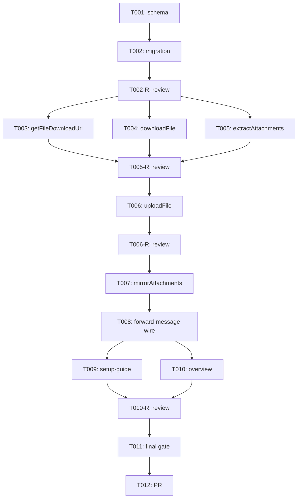

# タスクリスト - attachment-mirror（Chatwork 添付ファイルを Slack に再アップロード）

> 入力: `.specs/attachment-mirror/design.md`, `.specs/attachment-mirror/requirement.md`
> 対象 Issue: #18 / 戦略: systematic（品質ゲート重視）/ 各 `[code]` フェーズ末に `[orchestrator]` レビューゲート（spec-review + spec-test + セカンドオピニオン）
> 前提: forwarding（#3）/ sender-name（#17）本番稼働中。既存フロー非破壊（CON-001）

## 1. 概要

Chatwork 添付ファイルを Slack に再アップロードする機能を、forwarding + sender-name の上に**割り込み追加**する。スキーマ → chatwork adapter（取得）→ slack adapter（アップロード）→ サービス・結線・ドキュメント → 最終ゲートの 5 フェーズ。

`render-body.ts` は変更しない（既存の `📎 ファイル名 (サイズ)` 表示はそのまま残し、添付成功/失敗にかかわらず本文として機能 / CON-001）。

## 2. タスク一覧

### Phase 1: スキーマ・migration [code]

- [x] T001: [REQ-007] `db/schema.ts` に `chatwork_message_attachments` を定義
  - identity PK / `bigint` FK → `chatwork_messages.id` + 明示 index / `unique (chatwork_message_id, chatwork_file_id)` / `timestamptz` / `text` カラム（`chatwork_file_id` / `slack_file_id` / `slack_channel_id` / `slack_thread_ts`）
  - design §3.1 のスキーマと一致
- [x] T002: [REQ-007] `pnpm db:generate` で migration 生成 → compose 上 PostgreSQL で `pnpm db:migrate` 適用確認
  - 既存 `chatwork_room_members`（#17）の次番号として生成されること
  - rollback 想定: テーブル DROP のみ（既存テーブル変更なし）

### Phase 1-R: 基盤レビューゲート [orchestrator]

- [ ] T002-R: Phase 1 の spec-review + spec-test
  - スキーマ `[MUST]` 準拠（identity / timestamptz / FK 明示 index / unique / `text` 型）
  - forwarding / sender-name スキーマ非破壊（既存 migration ファイル不変）
  - migration 連番に欠番がないこと

### Phase 2: chatwork adapter（ファイル取得）[code]

- [ ] T003: [REQ-001] `adapters/chatwork/client.ts` に `getFileDownloadUrl(roomId, fileId)` 追加
  - `GET /rooms/{room_id}/files/{file_id}?create_download_url=1` を `X-ChatWorkToken` で呼ぶ
  - レスポンス検証: `file_id`（**`number | string`** で受けて `String(...)` 化 / 既存 `getRoomMembers` と統一）/ `filename` / `filesize`（number）/ `download_url`（string）必須・`mime_type` 任意
  - 戻り値型 `ChatworkFileDownloadInfo`（`fileId` / `filename` / `filesize` / `mimeType` / `downloadUrl`）を `types.ts` に追加
  - 失敗時 `ChatworkApiError`（status のみ / トークン・URL・ファイル名非含有）
  - `ChatworkClient` インターフェースに追加（既存実装 / モックの双方を更新）

- [ ] T004: [REQ-002] `adapters/chatwork/client.ts` に `downloadFile(downloadUrl, { maxBytes })` 追加
  - `fetch(downloadUrl, { method: "GET" })`（**ヘッダ無し** / ASM-001）
  - `response.arrayBuffer()` → `Uint8Array` に変換
  - `Content-Type` を `mimeType` に取り出す（無ければ null）
  - **サイズ三段防御**（NFR-006 / Codex 指摘）:
    1. `Content-Length` ヘッダで事前判定 → 超過なら `ChatworkApiError`（バイト取得しない）
    2. `arrayBuffer()` 後の **`bytes.byteLength` を `maxBytes` と再照合** → 超過なら `ChatworkApiError`（Content-Length 欠落・不正・過小申告に対する保険）
  - `maxBytes` は引数で受ける（テスト容易性 / `mirrorAttachments` の DI と同期）
  - 失敗時 `ChatworkApiError`（URL・バイト非含有）

- [ ] T005: [REQ-004] `adapters/chatwork/extract-attachments.ts` 新規作成
  - 純粋関数 `extractAttachments(body: string): ChatworkAttachmentRef[]`
  - 正規表現 `/\[download:(\d+)\][\s\S]*?\[\/download\]/g`
  - 同一 file_id 重複は `Set` で除去（出現順保持）
  - `ChatworkAttachmentRef`（`{ fileId: string }`）型を types.ts または同ファイルにエクスポート
  - `render-body.ts` は変更しない（CON-001）

### Phase 2-R: chatwork adapter レビューゲート [orchestrator]

- [ ] T005-R: Phase 2 の spec-review + spec-test
  - `getFileDownloadUrl`: 正常マップ / 不正レスポンス形状 / 非 2xx（401 / 404 / 429 / 500）→ `ChatworkApiError` / トークン・ファイル名・URL 非漏洩
  - `downloadFile`: 正常取得 / `Content-Type` 反映（gif / png / pdf / `application/octet-stream` / なし）/ 100MB 超過 → `ChatworkApiError` / ネットワーク失敗 / バイト・URL 非ログ
  - `extractAttachments`: 0 / 1 / 複数件 / 同一 file_id 重複 / `[preview]` 単独（無視）/ 不正トークン（壊さない）/ 長いファイル名（スペース含む）対応
  - アダプタ境界（[MUST]）/ 秘密非ログ（NFR-002）の遵守

### Phase 3: slack adapter（アップロード）[code]

- [ ] T006: [REQ-003] `adapters/slack/client.ts` に `uploadFile(input)` 追加
  - **`file` 引数は `Buffer.from(input.bytes)` で変換**してから SDK に渡す（ASM-003 / `@slack/web-api ^7.16.0` の `file` 型は `Buffer | Stream | string` / Codex 指摘）
  - `web.files.uploadV2({ channel_id, thread_ts, filename, file: Buffer.from(bytes), ... })` を呼ぶ
  - **レスポンス抽出ヘルパ `extractSlackFileId(response)`**（入れ子形主・旧形フォールバック）を内部実装:
    1. **主**: `response.files[0].files[0].id`（現行 SDK の `FilesCompleteUploadExternalResponse[]` 入れ子形）
    2. 旧形 a: `response.files[0].id`
    3. 旧形 b: `response.file.id`
    4. どれも取れなければ `undefined` → `SlackApiError`
  - 失敗時 `SlackApiError`（既存 `extractSlackErrorCode` を流用 / token・filename・bytes 非含有）
  - `SlackUploadFileInput` 型を `types.ts` に追加（`channelId` / `threadTs` / `filename` / `mimeType` / `bytes`）
  - `SlackClient` インターフェースに追加（既存実装 / モックの双方を更新）
  - SDK の最新シグネチャは `context7` または `@slack/web-api` 同梱の `FilesCompleteUploadExternalResponse.d.ts` で実装時確認

### Phase 3-R: slack adapter レビューゲート [orchestrator]

- [ ] T006-R: Phase 3 の spec-review + spec-test
  - `uploadFile`:
    - **入れ子形**（`{ files: [{ files: [{ id }] }] }`、現行 SDK 主形）→ `file.id` 抽出 ✓
    - 旧形 a（`{ files: [{ id }] }`）→ 抽出 ✓
    - 旧形 b（`{ file: { id } }`）→ 抽出 ✓
    - どれも無い → `SlackApiError`
    - `ok: false` → `SlackApiError`（既存規約準拠）
    - SDK 例外 → `SlackApiError`
    - `thread_ts` が確実に渡される
    - **`bytes`（`Uint8Array`）→ `Buffer.from(bytes)` への変換が行われる**（型不一致テスト）
    - token・filename・bytes 非漏洩
  - 既存 `postMessage` テストへの影響なし（CON-001）

### Phase 4: サービス・結線・ドキュメント [code]

- [ ] T007: [REQ-005/006] `app/services/mirror-attachments.ts` 新規作成
  - `mirrorAttachments(input, deps)` を export（design §4.4）
  - フロー: 抽出 → 既アップロード判定（mapping SELECT）→ 未アップロードのみ逐次処理（メタ取得 → サイズチェック → バイト取得 → Slack アップロード → mapping `onConflictDoNothing` 記録）
  - **例外を投げない**契約（各 file の try/catch で握る・全体外側にも try/catch）
  - サイズ上限は `maxBytes` DI（デフォルト 100MB / NFR-006）
  - 構造化ログ: `op: "forward.mirror.{uploaded,too_large,failed,done}"`（識別子のみ・本文・URL・バイト非出力）
  - 依存: T001, T003, T004, T005, T006

- [ ] T008: [REQ-005] `app/services/forward-message.ts` 結線
  - 既存 `forward.posted` ログの**直前**（または直後）に `mirrorAttachments` 呼び出しを追加
  - 入力: `chatworkRoomId` / `chatworkMessageId`（外部）/ `messageRowId`（FK 親 / `insertedRow.id`）/ `body` / `slackChannelId` / `slackThreadTs`
  - 二重防御の outer try/catch（`forward.mirror.unexpected` ログ。`resolveSenderName` outer try/catch と同パターン / handover 経緯）
  - 既存フロー（FK 順序 / my skip / 名前解決 / 冪等保存 / Slack 投稿 / ts UPDATE）**非破壊**
  - 依存: T007

- [ ] T009: [docs] `docs/setup-guide/` 更新（REQ-008）
  - Slack App の bot scope に **`files:write`** を追加する手順
  - ワークスペース再インストール手順（bot token が変わる旨を明記）
  - Secret Manager の `SLACK_BOT_TOKEN` 更新手順（GCP 側）
  - **Cloud Run の新 token 反映タイミング**を 1 文追記（Codex 改善提案 / memory `required-config-keys-break-cloud-run.md` 教訓踏襲）:
    - Secret Manager の新バージョン作成 → Cloud Run サービスの再デプロイ（新リビジョン）でのみ読み込まれる
    - 既存リビジョンは古い token をキャッシュし続けるため、再デプロイ忘れで `not_authed` が発生する
  - 既存セットアップマニュアル（PR #19）の章立てに合わせる
  - 該当部分のスクショ追加（assistant 自身で撮影＋マスキング / memory `screenshot-masking-workflow.md`）

- [ ] T010: [docs] `chatwork-slack-bridge-overview.md` 更新
  - 添付処理セクションを「(A) テキスト表示のみ」→「(A) フォールバック + (B) Slack 再アップロード」に書き換え
  - `chatwork_message_attachments` テーブル説明追加
  - Slack 表示例（本文 + スレッド添付）を追記
  - 必要 Slack スコープに `files:write` 追加

### Phase 4-R: サービス・結線・ドキュメントレビューゲート [orchestrator]

- [ ] T010-R: Phase 4 の spec-review + spec-test
  - `mirrorAttachments` テスト網羅:
    - 添付なし → 何もせず正常 return
    - 全件成功 → mapping 行が件数分作成
    - 既アップロード（mapping ヒット）→ Chatwork / Slack API を呼ばない
    - **既アップロード判定 SELECT 失敗**（DB 障害等）→ mirror 全体 safely skip・fallback ログのみ（Codex 改善提案）
    - **抽出（`extractAttachments`）周辺の予期しない例外** → 外側 catch で握り fallback ログ（Codex 改善提案）
    - サイズ超過（API meta 段階）→ Slack を呼ばず fallback ログ・他継続
    - サイズ超過（`downloadFile` の Content-Length 段階）→ Slack を呼ばず fallback ログ
    - **サイズ超過（`downloadFile` の実 `bytes.byteLength` 段階）** → Slack を呼ばず fallback ログ（NFR-006 三段防御 / Codex 重大指摘）
    - Chatwork ファイル取得失敗（401 / 404 / 429 / network）→ 該当のみスキップ・他継続
    - Slack アップロード失敗（`ok: false` / SDK 例外 / `file.id` 欠落）→ mapping 書かず fallback ログ・他継続
    - DB 挿入失敗（極稀）→ 内部で握る・他継続
    - 例外を投げない契約（per-file catch + outer catch の両方が例外を捕捉することをテストで担保）
  - **冪等性スコープのテスト**:
    - webhook 再送（同 message を 2 回処理）→ 2 回目は `forwardMessage` 早期 return で `mirrorAttachments` 未到達 ✓
    - mapping 二重 insert（同 message + 同 file）→ `unique` 制約 + `onConflictDoNothing` で 1 行のみ ✓
    - **並行 worker（実害ほぼなしのため本 Issue 非対応）**: テストは `ops-safety` #5 の領域とコメントで明示
  - `forward-message` 既存テスト維持 + 添付分岐の新規テスト
  - 整合性方針（NFR-005）: Slack 投稿失敗時は `mirrorAttachments` まで到達しない
  - overview / setup-guide の更新漏れ確認（特に Cloud Run 再デプロイ手順）
  - カバレッジ 80% 達成
  - **セカンドオピニオン**（Codex / cmux）で「例外契約破り」「秘密情報の漏洩経路」「fallback の網羅性」を重点確認（sender-name Phase 3 で Codex が握り潰し漏れを捕捉した経緯、本 spec フェーズで Codex が SDK 型ズレ・並行冪等性・実バイト長検証を指摘した経緯）

### Phase 5: 最終品質ゲート・受け入れ確認・PR [orchestrator]

- [ ] T011: Final Quality Gate
  - `pnpm lint` / `pnpm typecheck` / `pnpm test`（カバレッジ 80%）パス
  - 受け入れ基準 8 項目（requirement.md §6）の全達成確認
  - overview / setup-guide 反映確認
  - モック / fake adapter での添付ミラー表示確認（本文 + スレッド添付）
  - **実 Slack / 実 Chatwork での手動疎通確認は運用者ステップに分離**（CON-002）
    - 確認手順: テスト用ルームに小さな PNG を添付投稿 → Slack `#chatwork-groups` に本文 + スレッド添付として表示されること
    - 100MB 超過ファイルでフォールバック（テキスト表示のみ）になること
    - 同じ webhook を 2 回手動 POST しても 2 回アップロードされないこと（mapping ユニーク制約）

- [ ] T012: PR 作成
  - spec PR（docs ブランチ・本タスクリスト含む `.specs/attachment-mirror/` 3 点セット）
  - 実装 PR（feature ブランチ / `Closes #18` で紐付け / Conventional Commits 英語）
  - 既存 #15/#16, #20/#21 と同様に **spec PR と実装 PR を分離**

## 3. タスク詳細（要点）

### T001 [REQ-007] chatwork_message_attachments

- **完了条件**: design §3.1 のスキーマを Drizzle で定義。`bigint identity` PK / FK `chatwork_message_id` → `chatwork_messages.id` + 明示 index / `unique (chatwork_message_id, chatwork_file_id)` / `timestamptz`。
- **対象**: `src/db/schema.ts`
- **検証**: `pnpm typecheck` パス・Drizzle のスキーマテスト追加（既存 `schema.test.ts` パターン）

### T003 [REQ-001] getFileDownloadUrl

- **完了条件**: `getRoom` / `getRoomMembers` と同形（`fetch` + `X-ChatWorkToken`、非 2xx は status のみで `ChatworkApiError`、JSON 検証）。レスポンスから `{ fileId, filename, filesize, mimeType, downloadUrl }` をマップ。トークン・URL・ファイル名をエラー / ログに含めない。
- **対象**: `src/adapters/chatwork/client.ts`, `types.ts`

### T004 [REQ-002] downloadFile

- **完了条件**: 短命 URL に対して**ヘッダ無し**で GET。`Uint8Array` + `Content-Type` を返す。`Content-Length` で 100MB 超過を早期 reject。URL・バイトを非ログ。
- **対象**: `src/adapters/chatwork/client.ts`

### T005 [REQ-004] extractAttachments

- **完了条件**: 純粋関数。本文から file_id を抽出（重複除去・出現順保持）。`render-body.ts` 不変。
- **対象**: `src/adapters/chatwork/extract-attachments.ts`

### T006 [REQ-003] uploadFile

- **完了条件**: `files.uploadV2` を呼び、両レスポンス形（`files[]` / `file`）から `file.id` を抽出。`thread_ts` を確実に渡す。失敗は `SlackApiError`（token / filename / bytes 非含有）。
- **対象**: `src/adapters/slack/client.ts`, `types.ts`

### T007 [REQ-005/006] mirrorAttachments

- **完了条件**: design §4.4 のフロー。例外を投げない契約。逐次処理。サイズ上限 DI（デフォルト 100MB）。構造化ログは識別子のみ。
- **対象**: `src/app/services/mirror-attachments.ts`
- **依存**: T001, T003, T004, T005, T006

### T008 [REQ-005] forward-message 結線

- **完了条件**: `forward.posted` ログ前後に `mirrorAttachments` 呼び出しを挿入。外側 try/catch で二重防御（`forward.mirror.unexpected` ログ）。既存フローの FK 順序 / my skip / 冪等保存 / Slack 投稿 / ts UPDATE / 名前解決を**壊さない**。
- **対象**: `src/app/services/forward-message.ts`
- **依存**: T007

### T009 [docs] setup-guide

- **完了条件**: Slack スコープ `files:write` 追加手順 + 再インストール + Secret Manager 更新手順。スクショは assistant 撮影 + マスキング（memory）。
- **対象**: `docs/setup-guide/README.md` ほか

### T010 [docs] overview

- **完了条件**: 添付処理セクションを「(A) のみ」→「(A) フォールバック + (B) Slack 再アップロード」に更新。新テーブル説明・Slack 表示例・スコープ要件を追記。
- **対象**: `chatwork-slack-bridge-overview.md`

## 4. 受け入れ基準の対応（Issue #18）

| 受け入れ基準 | 対応タスク |
|------|-----------|
| 添付ファイル実体が Slack で見られる | T003, T004, T006, T007, T008 |
| 取得は `create_download_url`（短命 URL）経由・トークン / URL / 本文 / ファイル名 / バイト非ログ | T003, T004, T005-R, T010-R |
| 失敗・サイズ超過時は (A) フォールバック・転送継続 | T007, T010-R（fallback 網羅テスト）|
| `files:write` 追加 + 再インストール手順ドキュメント化 | T009 |
| 取得・アップロード・フォールバックのテスト（モック・カバレッジ 80%）| 各 `-R`, T011 |
| overview / deploy docs 更新 | T009, T010, T010-R, T011 |
| 同じ webhook 2回受信で 2回アップロードしない | T001, T007（mapping unique）, T010-R |
| `pnpm lint` / `pnpm typecheck` / `pnpm test` 通過 | T011 |

## 5. リスクと留意点

| リスク | 対応 |
|--------|------|
| 短命 URL（30秒）の有効期限切れ | `getFileDownloadUrl` → `downloadFile` は同一処理内で連続実行。再試行は本 Issue では未対応・fallback に倒す |
| 大容量ファイルでのメモリ枯渇 | 100MB 上限（NFR-006 / **三段防御**: API メタの `filesize` + Content-Length + 実 `bytes.byteLength`）。Cloud Run メモリ設定との整合確認 |
| 既存 `slackTs` UPDATE 失敗ケースとの順序 | `mirrorAttachments` は ts UPDATE 成功後に呼ぶ。UPDATE 失敗時は ts なし → スレッド指定不能 → mirror を呼ばずに return（design §4.5）|
| 例外契約破り（throw が漏れる） | 各 file の try/catch + 外側 try/catch の二重防御 + **既アップロード判定 SELECT も外側 catch でカバー**（Codex 改善提案）。`-R` フェーズでセカンドオピニオン重点確認（sender-name Phase 3 の Codex 指摘経緯） |
| Slack `files.uploadV2` の SDK 形ブレ | **入れ子形主**（`response.files[0].files[0].id`）+ 旧形 2 種フォールバックヘルパで吸収 + 単体テストで 3 形 + 欠落カバー。**`file` 引数は `Buffer.from(bytes)` 変換**（Codex 重大指摘）。実装時に `@slack/web-api` 同梱 `.d.ts` で最新仕様確認 |
| `files:write` 追加忘れ → 本番起動失敗 | setup-guide 更新（T009 / Cloud Run 再デプロイ手順含む）+ memory `required-config-keys-break-cloud-run.md` の教訓踏襲 |
| 実ファイル名・実バイナリの fixture 混入 | テストはダミーバイト（1×1px PNG）/ ダミーファイル名（CON-002）。**ログには識別子可・fixture には実値不可**で文言統一（Codex 改善提案）。`-R` で確認 |
| webhook 再送 | 既存 `chatwork_messages` の `onConflictDoNothing` で吸収（`mirrorAttachments` 未到達）+ mapping `unique (message_id, file_id)` で二重 insert 防止 |
| **並行 worker による同 file の二重 Slack アップロード** | **本 Issue は webhook 再送のみ保証スコープ**。並行 retry exactly-once は `ops-safety` #5（claim 機構 / advisory lock）で扱う（Codex 重大指摘 → スコープ縮小） |
| Cloud Run リクエストタイムアウト | 100MB × 複数添付は逐次処理で長時間化しうる。実運用観察 → 必要なら ops-safety（#5）でキュー化（YAGNI） |

## 6. 依存関係グラフ

