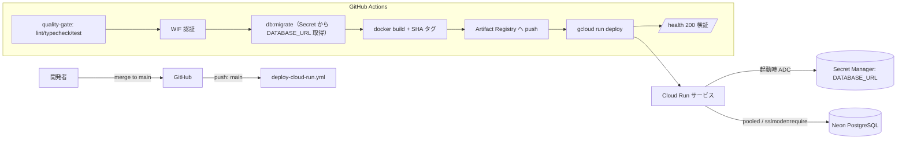
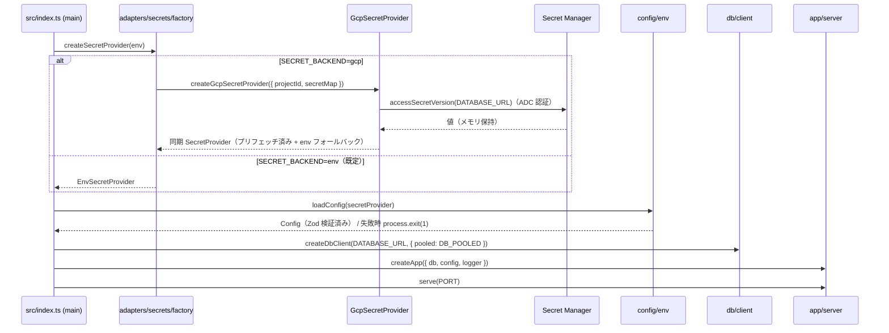

# 技術設計書 - cloud-deploy（本番デプロイのレール構築 / walking skeleton）

> 入力: `.specs/cloud-deploy/requirement.md`
> 制約: `docs/coding-rules.md`（`[MUST]` をハード制約、`[SHOULD]` を推奨として反映）
> 参照: `chatwork-slack-bridge-overview.md`（推奨インフラ / デプロイ方針 / CI/CD 公開方針）、
> `.specs/foundation/`（既存実装）、Zenchaine 既存プロジェクト（zen-base / ZenchainWeb の deploy workflow パターン）

## 1. 要件トレーサビリティマトリックス

| 要件ID | 要件内容 | 設計項目 | 既存資産 | 新規/変更理由 |
|--------|---------|---------|---------|---------|
| REQ-001 | 本番 multi-stage Dockerfile | `Dockerfile`（builder/runner 2 ステージ化） | 🔁変更（既存 Dockerfile は単一ステージ + tsx） | 本番最適化・非 root・コンパイル済み JS 実行へ |
| REQ-002 | Secret Manager secret adapter | `src/adapters/secrets/gcp-secret-provider.ts`, `src/adapters/secrets/factory.ts` | ❌新規（既存は env 実装のみ） | Phase 2 で GCP 実装を追加（IF は維持） |
| REQ-003 | Neon pooled connection 対応 | `src/db/client.ts`（`prepare` オプション）, `src/config/env.ts`（`DB_POOLED`） | 🔁変更 | pooled では prepared statement 不可 |
| REQ-004 | Cloud Run デプロイ workflow | `.github/workflows/deploy-cloud-run.yml` | ❌新規 | foundation は CI（quality）のみ |
| REQ-005 | デプロイドキュメント | `docs/deploy/cloud-run.md`, `docs/deploy/docker.md` | ❌新規 | overview のデプロイ方針を手順化 |
| REQ-006 | 起動シーケンスの非同期化 | `src/index.ts`（async `main()`） | 🔁変更 | secret プリフェッチが非同期になりうるため |

### 1.1 非機能・制約・前提のトレーサビリティ

| 要件ID | 要件内容 | 反映先（設計項目） |
|--------|---------|------------------|
| NFR-001 | セキュリティ（秘密非焼き込み / WIF / 非ログ / 公開最小化） | 4.4 Dockerfile / 4.5 workflow / 7. セキュリティ実装 |
| NFR-002 | イメージ最小化・非 root・タグ固定・脆弱性スキャン | 4.4 Dockerfile / 4.5 workflow（Trivy）/ 6. 技術的決定事項 |
| NFR-003 | デプロイ再現性・SHA タグ・自動デプロイ | 4.5 workflow（frozen-lockfile / SHA タグ / push トリガー） |
| NFR-004 | 型安全・品質ゲート維持 | 4.5 quality-gate / 7. テスト戦略 |
| NFR-005 | 構造化ログ | 4.3 index.ts（pino 踏襲） |
| NFR-006 | アダプタ境界の維持 | 4.1（SDK は adapter 内のみ）/ 7. コーディング規約 |
| NFR-007 | secret 取得の堅牢性（timeout/retry/失敗時 throw） | 4.1（GCP provider）/ 6. 技術的決定事項 |
| CON-001 | 同期 `SecretProvider` IF 維持 | 4.1（async プリフェッチ → 同期 get） |
| CON-002 | OSS / 秘密の非コミット | 4.5 workflow（`vars.*`）/ 4.6 docs（プレースホルダ） |
| CON-003 | WIF 優先 | 4.5（`google-github-actions/auth@v2`） |
| CON-004 | リージョン / 命名規約（asia-northeast1 / `vars.*`） | 4.5 workflow（`env` / `vars.*`） |
| CON-005 | フェーズスコープ（Cloud Tasks / トークン除外） | 7. YAGNI |
| CON-006 | 技術スタック固定（foundation 準拠） | 3. 技術スタック |
| CON-007 | Git / ブランチ / アカウント | 5. データ設計外（運用）/ tasks T013 |
| CON-008 | 公開エンドポイント認証ゲート（後続前提） | 7. セキュリティ実装 |
| ASM-001〜003 | GCP / Neon / GitHub 事前プロビジョニング | 4.6 docs（手順化・前提明記） |
| ASM-004 | ランタイム（Node22 / PG16 / Cloud Run PORT） | 3. 技術スタック / 4.4 Dockerfile |

## 2. アーキテクチャ概要

### 2.1 デプロイパイプライン



### 2.2 実行時の secret 取得・起動シーケンス（SECRET_BACKEND=gcp）



### 2.3 デプロイ後の `/health` 検証

`/health` の処理自体は foundation 実装（`db.ping(DB_HEALTH_TIMEOUT_MS)` → `200/503`）を変更しない。
本フェーズでは workflow の最終ステップで Cloud Run の公開 URL に対し `/health` を叩き、`200`
（Neon 疎通成功）を**デプロイ成功判定**に使う。

## 3. 技術スタック（追加・変更分）

| 種別 | 採用 | バージョン方針 | 備考 |
|------|------|---------------|------|
| Secret 取得（GCP） | `@google-cloud/secret-manager` | 最新安定 | adapter 内のみで使用（境界遵守） |
| コンテナビルド | Docker Buildx（`docker/build-push-action@v6`） | - | GHA cache（`type=gha`）併用 |
| デプロイ | `gcloud run deploy --image`（事前 push 済みイメージ指定） | - | `--source` ではなくビルド済みイメージを指定 |
| GCP 認証 | `google-github-actions/auth@v2`（WIF） | - | SA JSON 鍵を使わない |
| レジストリ | Artifact Registry（`asia-northeast1-docker.pkg.dev`） | - | git SHA タグ + `latest` |

> 既存スタック（Node 22 / Hono / Drizzle + postgres.js / Zod / pino / Biome / Vitest / pnpm）は変更しない。
> 「最新安定」と記した依存・action の具体バージョンは、実装時に context7（resolve-library-id →
> query-docs）および各 action の最新リリースで確定し、`package.json` / workflow にピン留めする。

## 4. モジュール・実装設計

### 4.1 [REQ-002] Secret Manager secret adapter

#### 設定キーの拡張（`config/env.ts`）

bootstrap 段階で必要な「どの backend を使うか」「Secret Manager 参照情報」を Zod で検証する。
これらは**秘密の実値ではなく参照情報・スイッチ**なので env から読む。

```ts
// 追加する設定（既存 ConfigSchema に統合）
SECRET_BACKEND: z.enum(['env', 'gcp']).default('env'),
GOOGLE_CLOUD_PROJECT: z.string().optional(),     // SECRET_BACKEND=gcp のとき必須（refine で担保）
DATABASE_URL_SECRET: z.string().optional(),       // Secret Manager のシークレット名（例: chatwork-slack-bridge-database-url）
DB_POOLED: z.coerce.boolean().default(false),     // Neon pooled = true → postgres.js prepare:false
```

- `SECRET_BACKEND=gcp` のとき `GOOGLE_CLOUD_PROJECT` / `DATABASE_URL_SECRET` を必須にする
  （`z.refine` または `superRefine`）。不足時は `ConfigError`（キー名と理由のみ。値は持たない）。
- ただし `DATABASE_URL` 自体の取得は **secret provider の責務**であり、`loadConfig` は
  provider 経由で `DATABASE_URL` を読む（既存どおり）。backend=gcp の場合、provider は
  Secret Manager からプリフェッチ済みの値を返す。

> 注意: `SECRET_BACKEND` / `GOOGLE_CLOUD_PROJECT` / `DATABASE_URL_SECRET` は **factory が直接
> `process.env` から読む**（secret provider 構築前に必要なため）。`loadConfig` での Zod 検証は
> 「最終的な設定の妥当性」を担保する二重チェックとして機能する。

#### GCP Secret Manager 実装（`adapters/secrets/gcp-secret-provider.ts`）

```ts
import { SecretManagerServiceClient } from '@google-cloud/secret-manager';
import type { SecretKey, SecretProvider } from '@/adapters/secrets/types';
import { EnvSecretProvider } from '@/adapters/secrets/env-secret-provider';

/** Secret Manager から取得する「秘密」キー（Phase 2 は DATABASE_URL のみ）。 */
const SECRET_MANAGER_KEYS = ['DATABASE_URL'] as const;
type SecretManagerKey = (typeof SECRET_MANAGER_KEYS)[number];

export interface GcpSecretProviderOptions {
  projectId: string;
  /** 秘密キー → Secret Manager シークレット名のマッピング。 */
  secretNames: Record<SecretManagerKey, string>;
  version?: string; // 既定 'latest'
}

/**
 * Secret Manager から対象シークレットを起動時にプリフェッチし、
 * 同期 SecretProvider として返す。秘密キー以外は env にフォールバックする。
 *
 * @param options プロジェクト ID とシークレット名マッピング
 * @returns プリフェッチ済みの同期 SecretProvider
 * @throws Secret Manager へのアクセスに失敗した場合
 */
export async function createGcpSecretProvider(
  options: GcpSecretProviderOptions,
): Promise<SecretProvider> {
  const client = new SecretManagerServiceClient();
  const env = new EnvSecretProvider();
  const cache = new Map<SecretKey, string>();

  for (const key of SECRET_MANAGER_KEYS) {
    const name = `projects/${options.projectId}/secrets/${options.secretNames[key]}/versions/${options.version ?? 'latest'}`;
    // bounded timeout + retry（指数バックオフ・最大2回）でアクセス（NFR-007）
    const [version] = await withRetry(
      () => withTimeout(client.accessSecretVersion({ name }), options.timeoutMs ?? 5000, 'secret.access'),
      { retries: 2 },
    );
    const payload = version.payload?.data?.toString();
    // missing / 空 payload は env フォールバックせず起動を中断（壊れた Secret を成功扱いしない）
    if (!payload) {
      throw new SecretAccessError(key); // キー区分のみ。値・name は保持しない
    }
    cache.set(key, payload);
    // 取得した値・name はログに出さない（NFR-001）
  }

  return {
    get(key: SecretKey): string | undefined {
      // 秘密キーはプリフェッチ済みキャッシュのみ。秘密キー以外は env フォールバック
      if ((SECRET_MANAGER_KEYS as readonly string[]).includes(key)) return cache.get(key);
      return env.get(key);
    },
  };
}
```

- SDK 依存はこのファイル（adapter）に閉じ込める（NFR-006）。`app`/`config`/`db` から直接 import しない。
- 認証は ADC（Cloud Run 実行 SA）。コードに鍵を持たない。
- 取得値・シークレット名・接続文字列はログに出さない。
- **取得失敗時の挙動（NFR-007）**: missing / 空 payload は `SecretAccessError`（キー区分のみ保持）で
  throw し、env フォールバックしない。Secret Manager 呼び出しは `withTimeout`（既定 5000ms）+
  `withRetry`（指数バックオフ・最大 2 回）で囲む。`withTimeout` は foundation の共通ユーティリティ、
  `withRetry` は同様の小さな共通ヘルパーとして `src/` に置く（再発明を避け薄く実装）。

#### factory（`adapters/secrets/factory.ts`）

```ts
/**
 * SECRET_BACKEND に応じて SecretProvider を構築する。
 * env（既定）は同期、gcp は Secret Manager をプリフェッチした同期 provider を返す。
 *
 * @returns 構築済み SecretProvider
 * @throws gcp backend で必須設定が無い、または Secret Manager アクセス失敗時
 */
export async function createSecretProvider(): Promise<SecretProvider> {
  const backend = process.env.SECRET_BACKEND ?? 'env';
  if (backend !== 'gcp') return new EnvSecretProvider();

  const projectId = process.env.GOOGLE_CLOUD_PROJECT;
  const databaseUrlSecret = process.env.DATABASE_URL_SECRET;
  if (!projectId || !databaseUrlSecret) {
    throw new SecretConfigError(['GOOGLE_CLOUD_PROJECT', 'DATABASE_URL_SECRET']); // キー名のみ
  }
  return createGcpSecretProvider({
    projectId,
    secretNames: { DATABASE_URL: databaseUrlSecret },
  });
}
```

### 4.2 [REQ-003] Neon pooled connection 対応（`db/client.ts`）

```ts
export interface DbClientOptions {
  /** Neon pooled connection（PgBouncer transaction mode）では prepared statement 不可。 */
  pooled?: boolean;
}

export function createDbClient(databaseUrl: string, options: DbClientOptions = {}) {
  const queryClient = postgres(databaseUrl, {
    // pooled のときは prepared statement を無効化（Neon pooler 対応）
    prepare: options.pooled ? false : undefined,
    // SSL は接続文字列の sslmode=require で解決（Neon）。ローカルは平文。
  });
  const db = drizzle({ client: queryClient });
  // ping / close は既存どおり
}
```

- 既存の `ping(timeoutMs)` / `close()` は変更しない（後方互換）。
- `index.ts` から `createDbClient(config.DATABASE_URL, { pooled: config.DB_POOLED })` で呼ぶ。
- SSL は Neon の接続文字列（`...sslmode=require`）で表現し、コードに SSL 分岐を増やさない。

### 4.3 [REQ-006] 起動シーケンスの非同期化（`src/index.ts`）

```ts
async function main(): Promise<void> {
  const bootstrapLogger = createLogger('info');

  let secrets: SecretProvider;
  try {
    secrets = await createSecretProvider();           // env は同期、gcp は await
  } catch (err) {
    bootstrapLogger.fatal({ op: 'secret.init', err: redactedReason(err) }, 'secret init failed');
    process.exit(1);
  }

  let config: Config;
  try {
    config = loadConfig(secrets);
  } catch (err) { /* ConfigError: キー名と理由のみ → fatal → exit(1) */ }

  const logger = createLogger(config.LOG_LEVEL);
  const db = createDbClient(config.DATABASE_URL, { pooled: config.DB_POOLED });
  const app = createApp({ db, config, logger });
  const server = serve({ fetch: app.fetch, port: config.PORT }, (info) => { /* log */ });
  // SIGTERM/SIGINT graceful shutdown（既存ロジックを main 内に取り込む）
}

void main();
```

- 既存の同期トップレベル処理を `main()` に移し、`createSecretProvider()` を await する。
- 失敗時のログは**値を出さない**（接続文字列・secret 値・シークレット名を含めない）。
- graceful shutdown（`db.close()` → `server.close()`）は維持。

### 4.4 [REQ-001] 本番 multi-stage Dockerfile

```dockerfile
# ---- builder ----
FROM node:22-slim AS builder
WORKDIR /app
RUN corepack enable && corepack prepare pnpm@10.32.1 --activate
COPY package.json pnpm-lock.yaml ./
RUN pnpm install --frozen-lockfile
COPY . .
RUN pnpm build                       # tsc → dist/
RUN pnpm install --prod --frozen-lockfile  # 実行用に prod 依存だけ残す（または prune）

# ---- runner ----
FROM node:22-slim AS runner
WORKDIR /app
ENV NODE_ENV=production
COPY --from=builder --chown=node:node /app/node_modules ./node_modules
COPY --from=builder --chown=node:node /app/dist ./dist
COPY --from=builder --chown=node:node /app/package.json ./package.json
USER node
EXPOSE 8080
CMD ["node", "dist/src/index.js"]
```

- ベースイメージタグ固定（`node:22-slim`、`latest` 禁止）/ 非 root（`node`）/ コンパイル済み JS 実行。
- 秘密情報を `ENV` / レイヤに焼き込まない（実行時に Secret Manager / env から注入）。
- エントリポイントのパス（`dist/src/index.js`）は `tsconfig.json` の `rootDir`/`outDir` に
  依存するため、実装時に `pnpm build` 出力を確認して確定する。
- ⚠️ **`@/` パスエイリアス解決（実装の必須手当て）**: foundation は `@/` エイリアス（`tsconfig.json`
  の `paths`）を使うが、`tsc` は出力 JS の import パスを書き換えないため、`node dist/src/index.js`
  実行時にモジュール解決が失敗する（現状ローカル/コンテナは `tsx` 実行で回避）。本 Dockerfile は
  コンパイル済み JS 実行（`node dist`）を前提とするため、実装時に次のいずれかで必ず解決すること:
  (a) `pnpm build` に `tsc-alias` を追加して出力 import を相対パスへ書き換える、
  (b) esbuild 等でバンドルする、(c) 本番も `tsx` 実行に倒す（`CMD ["pnpm","tsx",…]` + 実行用依存に tsx）。
  → 採否は実装フェーズ（T001/Dockerfile タスク）の完了条件とし、`node dist` 起動が成功することを検証する。
- Cloud Run の `PORT`（8080）で listen（config 経由）。`HEALTHCHECK` は Cloud Run 側の
  ヘルスチェックに委ねるため任意（compose 用の既存定義はローカルで維持してよい）。
- `.dockerignore` に `node_modules` / `.git` / `.env` / `dist` / `coverage` を含める（既存踏襲・追補）。

### 4.5 [REQ-004] デプロイ workflow（`.github/workflows/deploy-cloud-run.yml`）

Zenchaine 既存（zen-base）の deploy パターンを踏襲しつつ、**本フェーズの秘密は `DATABASE_URL`
のみ**に絞った最小構成。

```yaml
name: deploy-cloud-run
on:
  push: { branches: [main] }
  pull_request: { branches: [main] }
  workflow_dispatch:
permissions:
  contents: read
  id-token: write
concurrency:
  group: deploy-cloud-run-${{ github.event_name }}-${{ github.ref }}
  cancel-in-progress: ${{ github.event_name == 'pull_request' }}
env:
  GAR_REGION: asia-northeast1
  CLOUD_RUN_REGION: asia-northeast1

jobs:
  quality-gate:
    runs-on: ubuntu-latest
    steps:
      - uses: actions/checkout@v4
      - uses: pnpm/action-setup@v4
        with: { version: 10.32.1 }
      - uses: actions/setup-node@v4
        with: { node-version: 22, cache: pnpm }
      - run: pnpm install --frozen-lockfile
      - run: pnpm lint
      - run: pnpm typecheck
      - run: pnpm test --coverage

  deploy:
    runs-on: ubuntu-latest
    environment: production
    needs: quality-gate
    # fork 事故防止 + PR では deploy しない
    if: >-
      github.event_name != 'pull_request' &&
      github.repository == 'anyoneanderson/chatwork-slack-bridge'
    steps:
      - uses: actions/checkout@v4
      - id: auth
        uses: google-github-actions/auth@v2
        with:
          workload_identity_provider: ${{ vars.GCP_WORKLOAD_IDENTITY_PROVIDER }}
          service_account: ${{ vars.GCP_DEPLOY_SERVICE_ACCOUNT }}
      - uses: google-github-actions/setup-gcloud@v2
        with: { project_id: ${{ vars.GCP_PROJECT_ID }} }
      # --- 本番 DB へ migration（Secret から DATABASE_URL を取得）---
      - uses: pnpm/action-setup@v4
        with: { version: 10.32.1 }
      - uses: actions/setup-node@v4
        with: { node-version: 22, cache: pnpm }
      - run: pnpm install --frozen-lockfile
      - name: Apply migrations to production DB
        run: |
          set -euo pipefail
          DATABASE_URL="$(gcloud secrets versions access latest --secret="${{ vars.DATABASE_URL_SECRET }}")"
          echo "::add-mask::${DATABASE_URL}"   # Secret Manager 由来は自動マスクされないため明示マスク
          export DATABASE_URL
          pnpm db:migrate          # 空スキーマでも成功（後続フェーズで実テーブル）
      # --- build & push（SHA タグ）---
      - run: gcloud auth configure-docker "${GAR_REGION}-docker.pkg.dev" --quiet
      - uses: docker/setup-buildx-action@v3
      - id: meta
        run: |
          short_sha="${GITHUB_SHA::12}"
          repo="${GAR_REGION}-docker.pkg.dev/${{ vars.GCP_PROJECT_ID }}/${{ vars.ARTIFACT_REGISTRY_REPOSITORY }}/${{ vars.CLOUD_RUN_SERVICE }}"
          echo "image_uri=${repo}:${short_sha}" >> "$GITHUB_OUTPUT"
          echo "latest_uri=${repo}:latest" >> "$GITHUB_OUTPUT"
      - uses: docker/build-push-action@v6
        with:
          context: .
          push: true
          tags: |
            ${{ steps.meta.outputs.image_uri }}
            ${{ steps.meta.outputs.latest_uri }}
          cache-from: type=gha,scope=deploy-cloud-run
          cache-to: type=gha,scope=deploy-cloud-run,mode=max
      # --- イメージ脆弱性スキャン（coding-rules Docker [SHOULD] / NFR-002）---
      - name: Scan image (Trivy)
        uses: aquasecurity/trivy-action@0.28.0
        with:
          image-ref: ${{ steps.meta.outputs.image_uri }}
          severity: CRITICAL,HIGH
          exit-code: '1'        # CRITICAL/HIGH 検出で deploy を止める（運用次第で 0 に緩和可）
          ignore-unfixed: true
      # --- deploy（Secret は実行時取得のため env に参照情報のみ）---
      - id: deploy
        run: |
          set -euo pipefail
          gcloud run deploy "${{ vars.CLOUD_RUN_SERVICE }}" \
            --image "${{ steps.meta.outputs.image_uri }}" \
            --region "${CLOUD_RUN_REGION}" \
            --platform managed \
            --allow-unauthenticated \
            --service-account "${{ vars.CLOUD_RUN_SERVICE_ACCOUNT }}" \
            --port 8080 \
            --min-instances 0 --max-instances 3 --cpu 1 --memory 512Mi \
            --set-env-vars "NODE_ENV=production,SECRET_BACKEND=gcp,GOOGLE_CLOUD_PROJECT=${{ vars.GCP_PROJECT_ID }},DATABASE_URL_SECRET=${{ vars.DATABASE_URL_SECRET }},DB_POOLED=true" \
            --labels "commit-sha=${GITHUB_SHA::12},managed-by=github-actions" \
            --quiet
          url="$(gcloud run services describe "${{ vars.CLOUD_RUN_SERVICE }}" --region "${CLOUD_RUN_REGION}" --format='value(status.url)')"
          echo "service_url=${url}" >> "$GITHUB_OUTPUT"
      # --- /health 検証 ---
      - name: Verify /health
        run: |
          set -euo pipefail
          code="$(curl -fsS -o /dev/null -w '%{http_code}' "${{ steps.deploy.outputs.service_url }}/health")"
          test "$code" = "200" || { echo "::error::/health returned $code"; exit 1; }
```

設計上のポイント:
- **秘密の実値は GitHub に置かない**。`DATABASE_URL` は Secret Manager に保管し、workflow は
  Secret 名（`vars.DATABASE_URL_SECRET`）だけを参照する。`--set-env-vars` には参照情報のみ。
- **DATABASE_URL を Cloud Run の `--update-secrets` で注入しない**。アプリが Secret Manager
  adapter（REQ-002）経由で実行時に取得する設計に統一する（実行 SA に
  `roles/secretmanager.secretAccessor` が必要）。
- migration 用に runner 側で一時的に `DATABASE_URL` を取得するのは許容するが、取得直後に
  `::add-mask::` でマスクし、ログに出さない。
- **タグ運用**: deploy が参照するのは **git SHA タグのみ**。`latest` は可読性のための補助タグで、
  ロールバック・監査の起点は常に SHA タグとする。
- 設定値は repository **variables**（`vars.*`）に置く。WIF のため SA JSON 鍵は不要。

### 4.6 [REQ-005] ドキュメント構成

- `docs/deploy/cloud-run.md`: 必要 GCP リソース一覧、WIF プール/プロバイダ作成、Artifact
  Registry 作成、Secret Manager への `DATABASE_URL` 登録、実行 SA への
  `roles/secretmanager.secretAccessor` 付与、必要な GitHub variables 一覧（表）、デプロイの流れ、
  ロールバック（過去 SHA リビジョン）手順。
- `docs/deploy/docker.md`: `docker build` / `docker run`（`DATABASE_URL` を `-e` で注入）、
  必要な環境変数（`SECRET_BACKEND=env` のローカル/VPS 運用例）、compose との違い。
- 実値・実 ID を書かず、`<PROJECT_ID>` 等のプレースホルダを使う。

## 5. データ設計

- 本フェーズで業務テーブルは追加しない（schema は foundation のまま）。
- `pnpm db:migrate` は空スキーマでも成功（メタテーブル作成は許容）。本番 Neon に対しても
  同じく no-op で成立し、後続フェーズが migration を足すだけで本番反映できる状態にする。

## 6. 技術的決定事項

| 決定項目 | 選択 | 理由 |
|---------|------|------|
| secret 取得方式 | アプリ内 Secret Manager adapter（SDK プリフェッチ） | ユーザー決定。アダプタ境界の設計意図 / Issue スコープ「secret adapter の Secret Manager 実装」に合致 |
| 同期 IF の維持 | 起動時 async プリフェッチ → 同期 `get` | 既存 `SecretProvider` 契約（同期）を壊さず GCP 取得を吸収 |
| backend 切替 | `SECRET_BACKEND`（env / gcp） | ローカル/compose の挙動を変えず、本番のみ Secret Manager に切替 |
| デプロイ方式 | GHA 内で build → Artifact Registry → `gcloud run deploy --image` | ユーザー決定（zen-base / ZenchainWeb と同方式）。SHA タグでロールバック可能 |
| イメージタグ | git commit SHA（+ `latest`） | リビジョン特定・ロールバック容易（coding-rules `[SHOULD]` CI イメージ運用） |
| Dockerfile | multi-stage / 非 root / コンパイル済み JS | 本番最小化・セキュリティ（coding-rules `[SHOULD]` Docker） |
| Neon 接続 | postgres.js `prepare:false`（pooled 時）/ `sslmode` は URL | PgBouncer transaction mode が prepared statement 非対応 |
| DB migration 実行場所 | GHA deploy ジョブ（コンテナ外） | コンテナ起動を軽量に保ち、migration を冪等な単一地点で実行 |
| GCP 認証 | Workload Identity Federation | SA JSON 鍵を発行/保管しない（coding-rules `[SHOULD]`） |
| fork 事故防止 | `if: github.repository == '...'` + PR は deploy しない | overview CI/CD 公開方針 |
| 設定の置き場所 | repository variables（`vars.*`）+ Secret Manager | 秘密の実値を GitHub に置かない |
| リージョン | asia-northeast1 | 既存 Zenchaine プロジェクト群に整合 |
| イメージタグ運用 | deploy は SHA タグのみ参照（`latest` は補助） | ロールバック・監査の起点を一意にする |
| 脆弱性スキャン | Trivy を workflow に組み込み（CRITICAL/HIGH で停止、`ignore-unfixed`） | coding-rules Docker `[SHOULD]` を本フェーズで満たす（暗黙のスコープ外にしない） |
| Cloud Run ヘルスチェック | Cloud Run 既定 + deploy 後の `/health` 検証で代替（startup/liveness probe は設定しない） | walking skeleton では過剰。リソース制限（cpu/memory/max-instances）は deploy で明示 |
| Secret 取得失敗時 | missing/空 payload は throw（env フォールバックしない）+ timeout/retry | 壊れた/未設定 Secret での誤起動を防ぐ（NFR-007） |

## 7. 実装ガイドライン

### コーディング規約（`docs/coding-rules.md` 準拠）
- 外部 SDK（`@google-cloud/secret-manager`）は `src/adapters/secrets/` 経由のみ。
  `app`/`config`/`db`/`routes` から直接呼ばない。
- 公開関数（factory / provider / DB クライアント）に TSDoc（`@param`/`@returns`/`@throws`）。
- 秘密値・接続文字列・シークレット名・取得結果をログに出さない（pino redact 併用）。
- ファイル名 kebab-case / 型 PascalCase / 定数 UPPER_SNAKE_CASE。`@/` エイリアス。

### テスト戦略（`[MUST]` 反映 / カバレッジ 80%）
- `adapters/secrets/factory.ts`: `SECRET_BACKEND=env` で `EnvSecretProvider` を返す /
  `gcp` で必須 env 欠落時にエラー（キー名のみ）。
- `adapters/secrets/gcp-secret-provider.ts`: Secret Manager クライアントを**モック**し、
  プリフェッチ後 `get('DATABASE_URL')` が値を返す / 秘密キー以外は env フォールバック。
- `db/client.ts`: `pooled: true` で `postgres` に `prepare:false` 相当のオプションが渡る
  （postgres をモックして引数を検証）。
- 外部（Secret Manager / DB / ネットワーク）に依存しないモックベースのユニットテストにする。
- workflow / Dockerfile / docs は CI 上での実行・手動デプロイ確認（`[MAY]` 統合）で担保。

### セキュリティ実装（`[MUST]`/`[SHOULD]` 反映）
- 秘密はイメージ・workflow・ソースに焼き込まない。実行時に Secret Manager / env から取得。
- WIF を使い SA JSON 鍵を作らない。実行 SA は `roles/secretmanager.secretAccessor` の最小権限。
- 公開エンドポイントは `/health` のみ。`--allow-unauthenticated` は `/health` 公開のため許容
  （業務エンドポイント追加時に署名検証・認可を別フェーズで設計）。

### YAGNI（本フェーズで含めない）
- Cloud Tasks / Pub/Sub、複数 secret（Chatwork/Slack トークン）、ステージング環境分離、
  カナリアリリース、メトリクス/アラート、複数リージョン、GCP リソースの IaC 自動作成。
