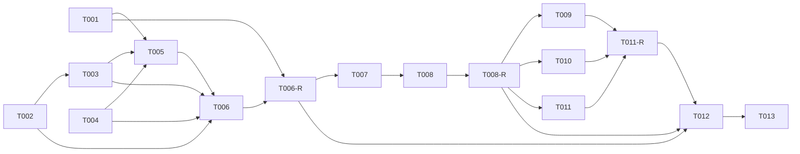

# タスクリスト - cloud-deploy（本番デプロイのレール構築 / walking skeleton）

> 入力: `.specs/cloud-deploy/design.md`, `.specs/cloud-deploy/requirement.md`
> 対象 Issue: #2 / 戦略: systematic（品質ゲート重視）/ 粒度: 標準（1タスク = 数時間〜1日）
> ワークフロー: `docs/issue-to-pr-workflow.md`（GitHub Flow / 実装ファースト / cmux マルチエージェント）
> 前提: `.specs/foundation/` 実装済み（secret adapter / config / db client / Dockerfile / `/health`）

## 1. 概要

設計書に基づき、本番デプロイのレール（build → deploy → Secret → DB 接続）を 4 フェーズに分解する。
`[code]` フェーズの後には必ず `[orchestrator]` のレビューゲート（spec-review + spec-test）を挟む。
業務ロジック・業務テーブル・Cloud Tasks・Chatwork/Slack トークンは対象外（後続フェーズ）。

GCP リソース（プロジェクト / WIF / Artifact Registry / Secret / Neon）は手動プロビジョニング前提
（ASM-001〜003）。本タスクはアプリ・workflow・docs 側の整備が対象。

## 2. タスク一覧

### Phase 1: アプリ側のクラウド対応 [code]
- [x] T001: [REQ-002] 設定キー拡張（`SECRET_BACKEND` / `GOOGLE_CLOUD_PROJECT` / `DATABASE_URL_SECRET` / `DB_POOLED`）+ Zod refine
- [x] T002: [REQ-002] GCP Secret Manager provider（`@google-cloud/secret-manager` 依存追加 + プリフェッチ実装）
- [x] T003: [REQ-002] secret provider factory（`SECRET_BACKEND` で env/gcp 切替）
- [x] T004: [REQ-003] DB クライアントの pooled 対応（`prepare:false` オプション）
- [x] T005: [REQ-006] `src/index.ts` の async bootstrap 化（factory await / 失敗時 exit / shutdown 維持）
- [x] T006: [NFR-004] ユニットテスト（factory / gcp provider モック / db client pooled）

### Phase 1-R: アプリ対応 レビューゲート [orchestrator]
- [ ] T006-R: Phase 1 の spec-review + spec-test（アダプタ境界 / 同期 IF 維持 / 秘密非ログ / カバレッジ 80%）

### Phase 2: コンテナ本番化 [code]
- [ ] T007: [REQ-001] 本番 multi-stage Dockerfile（builder/runner / 非 root / コンパイル済み JS）
- [ ] T008: [REQ-001] `.dockerignore` 追補 + ローカル build/run 動作確認（`SECRET_BACKEND=env`）

### Phase 2-R: コンテナ レビューゲート [orchestrator]
- [ ] T008-R: Phase 2 の spec-review + spec-test（タグ固定 / 非 root / 秘密非焼き込み / `dist` 実行確認）

### Phase 3: デプロイ workflow・ドキュメント [code]
- [ ] T009: [REQ-004] `.github/workflows/deploy-cloud-run.yml`（WIF / quality-gate / migrate / build+push / deploy / `/health` 検証 / repo ガード）
- [ ] T010: [REQ-005] `docs/deploy/cloud-run.md`（GCP リソース / WIF / Secret / variables 一覧 / ロールバック）
- [ ] T011: [REQ-005] `docs/deploy/docker.md`（Docker 単体 / VPS 手順）

### Phase 3-R: workflow・docs レビューゲート [orchestrator]
- [ ] T011-R: Phase 3 の spec-review（actionlint / 秘密非直書き / 実値非記載 / ガード有効）

### Phase 4: 最終品質ゲート・受け入れ確認・PR [orchestrator]
- [ ] T012: Final Quality Gate（lint / typecheck / test 一括 + 受け入れ基準確認 + 本番デプロイ実地確認）
- [ ] T013: PR 作成（Issue #2 紐付け）

## 2.1 優先度・実装順

| 優先度 | タスク | 理由 |
|--------|--------|------|
| P0（受け入れ基準直結） | T001〜T005, T007, T009, T012 | secret 取得・pooled 接続・本番イメージ・deploy/`/health` 検証は Issue #2 の受け入れ基準そのもの |
| P1（品質・運用） | T006, T008, T010, T011 + 各 `-R` | テスト・docs・ローカル検証。P0 と並走しつつマージ前に必須 |
| P2（仕上げ） | T013 | PR 作成（全ゲート通過後） |

> 実装順はフェーズ順（Phase 1 → 4）に従う。フェーズ内の並列可否は「5. 並列実行計画」を参照。

## 3. タスク詳細

### T001: 設定キー拡張
- 要件ID: REQ-002 / REQ-003 / NFR-001
- 設計書参照: design.md 「4.1（設定キーの拡張）」
- 依存関係: なし（foundation の `config/env.ts` を変更）
- 推定時間: 1.5時間
- 対象ファイル: `src/config/env.ts`
- 完了条件:
  - [ ] `SECRET_BACKEND`（enum `env`/`gcp`, 既定 `env`）/ `GOOGLE_CLOUD_PROJECT`（optional）/ `DATABASE_URL_SECRET`（optional）/ `DB_POOLED`（coerce boolean, 既定 false）を追加
  - [ ] `SECRET_BACKEND=gcp` のとき `GOOGLE_CLOUD_PROJECT` / `DATABASE_URL_SECRET` を必須にする refine
  - [ ] 失敗時は既存どおり `ConfigError`（キー名と理由のみ・値非保持）
  - [ ] `secrets.get('SECRET_BACKEND')` 等を追加する場合は `SECRET_KEYS` union も更新（型整合）
- 並列実行: T004 と同時実行可能

### T002: GCP Secret Manager provider
- 要件ID: REQ-002 / NFR-006 / NFR-001
- 設計書参照: design.md 「4.1（GCP Secret Manager 実装）」
- 依存関係: なし（独立実装、テストはモック）
- 推定時間: 2.5時間
- 対象ファイル: `src/adapters/secrets/gcp-secret-provider.ts`, `src/with-retry.ts`, `package.json`
- 完了条件:
  - [ ] `@google-cloud/secret-manager` を dependencies に追加（`pnpm install` 成功）
  - [ ] `createGcpSecretProvider({ projectId, secretNames, version?, timeoutMs? })` が対象シークレットを
        起動時にプリフェッチし、同期 `get` を持つ `SecretProvider` を返す
  - [ ] 秘密キー（`DATABASE_URL`）はキャッシュ、それ以外は内部 `EnvSecretProvider` にフォールバック
  - [ ] **missing / 空 payload は env フォールバックせず `SecretAccessError`（キー区分のみ）を throw**
  - [ ] Secret Manager 呼び出しを **`withTimeout`（既定 5000ms）+ `withRetry`（指数バックオフ・最大2回）**で囲む（NFR-007）
  - [ ] `withRetry` を `src/with-retry.ts` に薄く実装（再発明回避。`withTimeout` は foundation 既存を再利用）
  - [ ] 取得値・シークレット名・接続文字列をログに出さない
  - [ ] TSDoc（`@param`/`@returns`/`@throws`）
- 並列実行: T001, T004 と同時実行可能

### T003: secret provider factory
- 要件ID: REQ-002
- 設計書参照: design.md 「4.1（factory）」
- 依存関係: T002
- 推定時間: 1時間
- 対象ファイル: `src/adapters/secrets/factory.ts`
- 完了条件:
  - [ ] `createSecretProvider(): Promise<SecretProvider>` を提供
  - [ ] `SECRET_BACKEND !== 'gcp'` で `EnvSecretProvider`（同期）を返す
  - [ ] `gcp` で `GOOGLE_CLOUD_PROJECT` / `DATABASE_URL_SECRET` 欠落時にエラー（キー名のみ。値を出さない）
  - [ ] `gcp` で `createGcpSecretProvider` を呼び出しプリフェッチ済み provider を返す
  - [ ] TSDoc
- 並列実行: -

### T004: DB クライアント pooled 対応
- 要件ID: REQ-003
- 設計書参照: design.md 「4.2」
- 依存関係: なし
- 推定時間: 1時間
- 対象ファイル: `src/db/client.ts`
- 完了条件:
  - [ ] `createDbClient(databaseUrl, options?: { pooled?: boolean })` に拡張（既存呼び出しと後方互換）
  - [ ] `pooled: true` で postgres.js に `prepare: false` を渡す
  - [ ] SSL は接続文字列（`sslmode`）に委ね、コードに SSL 分岐を増やさない
  - [ ] `ping` / `close` の挙動は不変
- 並列実行: T001, T002 と同時実行可能

### T005: index.ts の async bootstrap 化
- 要件ID: REQ-006 / NFR-005
- 設計書参照: design.md 「4.3」
- 依存関係: T001, T003, T004
- 推定時間: 1.5時間
- 対象ファイル: `src/index.ts`
- 完了条件:
  - [ ] 起動処理を `async main()` に整理し、`await createSecretProvider()` を最初に実行
  - [ ] secret 初期化失敗 / `ConfigError` を捕捉し、構造化ログ（**値非含有**）後に `process.exit(1)`
  - [ ] `createDbClient(config.DATABASE_URL, { pooled: config.DB_POOLED })` で生成
  - [ ] SIGTERM/SIGINT graceful shutdown（`db.close()` → `server.close()`）を維持
- 並列実行: -

### T006: ユニットテスト
- 要件ID: NFR-004
- 設計書参照: design.md 「7. テスト戦略」
- 依存関係: T002, T003, T004
- 推定時間: 2時間
- 対象ファイル: `src/adapters/secrets/factory.test.ts`, `src/adapters/secrets/gcp-secret-provider.test.ts`, `src/db/client.test.ts`
- 完了条件:
  - [ ] factory: env で `EnvSecretProvider` / gcp 必須欠落でエラー（キー名のみ）
  - [ ] gcp provider: Secret Manager クライアントをモックし、プリフェッチ後 `get('DATABASE_URL')` が値を返す / 他キーは env フォールバック / **空 payload・missing で `SecretAccessError` を throw** / リトライが効く
  - [ ] db client: `pooled:true` で `prepare:false` 相当が postgres に渡る（postgres をモックして引数検証）
  - [ ] カバレッジ 80% 以上を維持して `pnpm test` がパス
  - [ ] 振る舞いベースの命名
- 並列実行: -

### T006-R: Phase 1 レビューゲート
- 要件ID: -（品質ゲート）
- 依存関係: T001〜T006
- 推定時間: 1時間
- 完了条件:
  - [ ] spec-review: アダプタ境界（SDK は adapter 内のみ）/ 同期 IF 維持 / 秘密非ログ / TSDoc
  - [ ] spec-test: `pnpm test` がカバレッジ 80% 以上で通る
  - [ ] `pnpm lint` / `pnpm typecheck` が通る

### T007: 本番 multi-stage Dockerfile
- 要件ID: REQ-001 / NFR-002 / NFR-001
- 設計書参照: design.md 「4.4」
- 依存関係: T005（コンパイル済み JS のエントリポイント前提）
- 推定時間: 2時間
- 対象ファイル: `Dockerfile`
- 完了条件:
  - [ ] builder（依存導入 + `pnpm build` + prod 依存抽出）/ runner（dist + prod node_modules）の 2 ステージ
  - [ ] ベースイメージタグ固定（`node:22-slim`、`latest` 禁止）
  - [ ] 非 root（`node`）で実行、`CMD ["node", "dist/.../index.js"]`（出力パスを `pnpm build` で確認）
  - [ ] 秘密情報を `ENV`・レイヤに焼き込まない
  - [ ] `PORT`（Cloud Run 注入 8080）で listen することを config 経由で担保
- 並列実行: -

### T008: .dockerignore 追補 + ローカル build/run 確認
- 要件ID: REQ-001 / NFR-002
- 設計書参照: design.md 「4.4」
- 依存関係: T007
- 推定時間: 1時間
- 対象ファイル: `.dockerignore`
- 完了条件:
  - [ ] `.dockerignore` に `node_modules` / `.git` / `.env` / `dist` / `coverage` 等を含める
  - [ ] `docker build` が成功し、`SECRET_BACKEND=env` + ローカル PostgreSQL で `/health` が 200
  - [ ] 非 root 実行・イメージサイズが単一ステージより縮小していることを確認
- 並列実行: -

### T008-R: Phase 2 レビューゲート
- 要件ID: -（品質ゲート）
- 依存関係: T007, T008
- 推定時間: 0.5時間
- 完了条件:
  - [ ] spec-review: タグ固定 / 非 root / multi-stage / 秘密非焼き込み
  - [ ] ローカルで本番イメージ起動 → `/health` 200（`SECRET_BACKEND=env`）を確認

### T009: デプロイ workflow
- 要件ID: REQ-004 / NFR-001 / NFR-003
- 設計書参照: design.md 「4.5」
- 依存関係: T008
- 推定時間: 2.5時間
- 対象ファイル: `.github/workflows/deploy-cloud-run.yml`
- 完了条件:
  - [ ] トリガー: push(main) / pull_request(main) / workflow_dispatch、`permissions.id-token: write`
  - [ ] `quality-gate` ジョブ（install/lint/typecheck/test）
  - [ ] `deploy` ジョブに `if: github.event_name != 'pull_request' && github.repository == 'anyoneanderson/chatwork-slack-bridge'`
  - [ ] WIF 認証（`google-github-actions/auth@v2`、SA JSON 鍵不使用）
  - [ ] Secret Manager から `DATABASE_URL` を取得して `pnpm db:migrate`。取得直後に `::add-mask::` でマスク（値をログに出さない）
  - [ ] buildx で build → Artifact Registry へ **git SHA タグ**で push（`latest` は補助タグ。deploy は SHA タグを参照）
  - [ ] **イメージ脆弱性スキャン（Trivy、CRITICAL/HIGH で停止、`ignore-unfixed`）**を build と deploy の間に実行
  - [ ] `gcloud run deploy --image`（実行 SA / `--port 8080` / リソース制限 / `--set-env-vars` に参照情報のみ / `DATABASE_URL` は `--update-secrets` で注入しない）
  - [ ] デプロイ後 `/health` が 200 であることを検証
  - [ ] 設定値は `vars.*`、秘密の実値は workflow に直書きしない
- 並列実行: T010, T011 と同時実行可能

### T010: docs/deploy/cloud-run.md
- 要件ID: REQ-005 / CON-002 / CON-003
- 設計書参照: design.md 「4.6」
- 依存関係: T008-R（着手可）。完了条件で T009 の最終 workflow と照合する
- 推定時間: 1.5時間
- 対象ファイル: `docs/deploy/cloud-run.md`
- 完了条件:
  - [ ] 必要 GCP リソース（プロジェクト / Artifact Registry / WIF プール・プロバイダ / デプロイ SA / 実行 SA / Secret）
  - [ ] 実行 SA への `roles/secretmanager.secretAccessor` 付与手順
  - [ ] 必要な GitHub repository variables 一覧（表）と Secret Manager 登録手順
  - [ ] デプロイの流れ・ロールバック（過去 SHA リビジョン）手順
  - [ ] **Neon のバックアップ / リカバリ確認**（PITR / branch リストア可否・復旧手順の所在）と
        デプロイ後の運用確認項目（`/health` 200 / リビジョン確認 / ロールバック）
  - [ ] **記載した変数名・SA 権限・手順が T009 の最終 workflow と一致**していることを照合
  - [ ] 実値・実 ID・クライアント名を含めず、プレースホルダ（`<PROJECT_ID>` 等）で記述
- 並列実行: T009, T011 と同時実行可能（マージ前に T009 と照合）

### T011: docs/deploy/docker.md
- 要件ID: REQ-005 / CON-002
- 設計書参照: design.md 「4.6」
- 依存関係: なし
- 推定時間: 1時間
- 対象ファイル: `docs/deploy/docker.md`
- 完了条件:
  - [ ] `docker build` / `docker run`（`DATABASE_URL` を `-e` 注入、`SECRET_BACKEND=env`）
  - [ ] 必要な環境変数一覧（VPS / Docker 単体運用）
  - [ ] compose（ローカル開発）との使い分けを明記
  - [ ] **必要な環境変数が T009 の最終 workflow / Dockerfile と一致**していることを照合
  - [ ] 実値を含めずプレースホルダで記述
- 並列実行: T009, T010 と同時実行可能（マージ前に T009 と照合）

### T011-R: Phase 3 レビューゲート
- 要件ID: -（品質ゲート）
- 依存関係: T009, T010, T011
- 推定時間: 0.5時間
- 完了条件:
  - [ ] spec-review: actionlint 相当の妥当性 / 秘密非直書き / repo ガード有効 / docs に実値なし
  - [ ] WIF・Secret 参照・SHA タグ・`/health` 検証ステップが設計どおり
  - [ ] `::add-mask::`（DATABASE_URL）・Trivy スキャン・SHA タグ deploy 参照が含まれている
  - [ ] docs（T010/T011）と workflow（T009）の変数名・手順が一致している

### T012: Final Quality Gate
- 要件ID: -（受け入れ基準）
- 依存関係: T006-R, T008-R, T011-R
- 推定時間: 1時間
- 完了条件:
  - [ ] `pnpm lint` / `pnpm typecheck` / `pnpm test`（カバレッジ 80% 以上）が通る
  - [ ] `main` push（または手動 dispatch）で workflow が回り Cloud Run にデプロイされる
  - [ ] 本番 `/health` が 200（Neon 疎通）を返す
  - [ ] シークレットがイメージ・workflow に直書きされていない（Secret Manager 経由）/ `DATABASE_URL` が `::add-mask::` でマスクされている
  - [ ] イメージが git SHA タグで Artifact Registry に push され、Trivy スキャンが通っている
- 並列実行: -

### T013: PR 作成
- 要件ID: -（リリース）
- 依存関係: T012
- 推定時間: 0.5時間
- 完了条件:
  - [ ] フィーチャーブランチから PR を作成し Issue #2 に紐付け（`Closes #2`）
  - [ ] PR 本文に受け入れ基準チェック結果を記載
  - [ ] anyoneanderson アカウントで作成（gh/git アカウント確認済み）
- 並列実行: -

## 4. 依存関係図

## 5. 並列実行計画

| フェーズ | 並列実行可能タスク |
|---------|-------------------|
| Phase 1 | (T001, T002, T004) を並列 → T003 → T005 → T006 |
| Phase 2 | T007 → T008（逐次） |
| Phase 3 | T009, T010, T011 を並列 |
| Phase 4 | T012 → T013（逐次） |

## 6. 品質チェックリスト（生成後確認）

1. [x] すべてのタスクが要件ID または品質ゲート/リリースと紐付いている
2. [x] 設計書にない機能（業務ロジック・業務テーブル・Cloud Tasks・追加トークン）のタスクは含まない
3. [x] 依存関係が定義されている
4. [x] 推定時間が現実的（合計 約 21〜23 時間）
5. [x] 完了条件が具体的で測定可能
6. [x] 並列実行の機会を明示
7. [x] 各 `[code]` フェーズ後にレビューゲート（`[orchestrator]`）を配置
8. [x] 1 フェーズ 1 ロール（`[code]`/`[orchestrator]` を混在させない）
9. [x] 受け入れ基準（Issue #2）が Final Quality Gate で検証される
