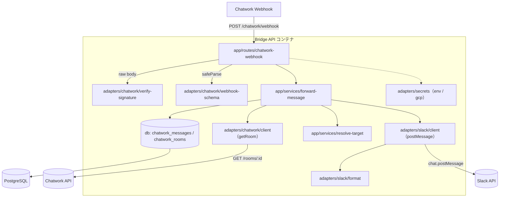
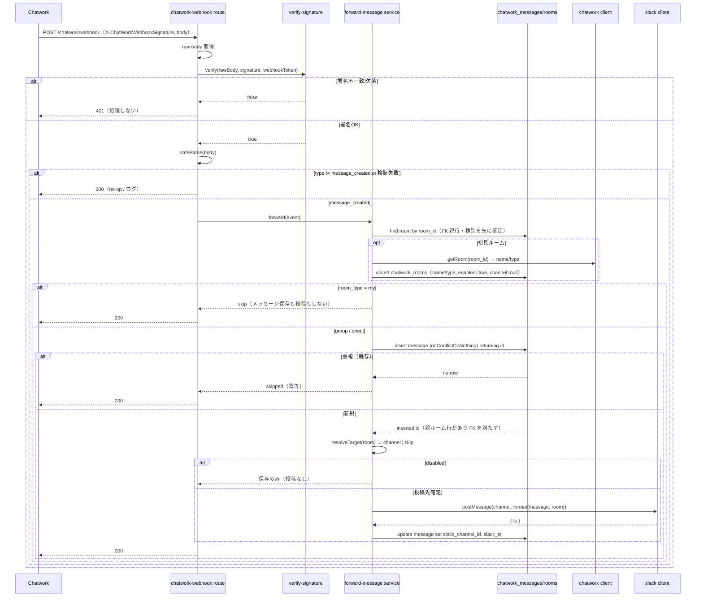

# 技術設計書 - forwarding（Chatwork 新着メッセージを Slack に転送）

> 入力: `.specs/forwarding/requirement.md`
> 制約: `docs/coding-rules.md`（`[MUST]` をハード制約、`[SHOULD]` を推奨として反映）
> 参照: `chatwork-slack-bridge-overview.md`（ユースケース1 / データモデル / `POST /chatwork/webhook`）
> 前提実装: `.specs/foundation/`（config / secret adapter / db client / logger / Hono / `/health`）, `.specs/cloud-deploy/`（gcp secret prefetch / pooled DB）

## 1. 要件トレーサビリティマトリックス

| 要件ID | 要件内容 | 設計項目 | 既存資産 | 新規理由 |
|--------|---------|---------|---------|---------|
| REQ-001 | `POST /chatwork/webhook` | `app/routes/chatwork-webhook.ts` + raw body 取得 | ❌新規 | 最初の業務エンドポイント |
| REQ-002 | 署名検証（HMAC-SHA256 / timing-safe） | `adapters/chatwork/verify-signature.ts` | ❌新規 | Chatwork 署名仕様 |
| REQ-003 | payload バリデーション / イベント判定 | `adapters/chatwork/webhook-schema.ts`（Zod） | ❌新規 | 外部入力検証 |
| REQ-004 | `chatwork_rooms` / `chatwork_messages` migration | `db/schema.ts` 追記 + Drizzle Kit | 🔁空 schema を拡張 | 業務テーブル初投入 |
| REQ-005 | 保存・重複チェック | `app/services/forward-message.ts` + `onConflictDoNothing` | ❌新規 | 冪等保存 |
| REQ-006 | ルームメタ取得・キャッシュ | `adapters/chatwork/client.ts`（`getRoom`） + rooms upsert | ❌新規 | payload に種別なし |
| REQ-007 | 転送ルーティング | `app/services/resolve-target.ts` | ❌新規 | マトリックス判定 |
| REQ-008 | Slack 投稿・`ts` 保存 | `adapters/slack/client.ts`（`postMessage`） + `adapters/slack/format.ts` | ❌新規 | `@slack/web-api` 初導入 |
| REQ-009 | secret / config 拡張 | `config/env.ts`, `adapters/secrets/types.ts`, `adapters/secrets/factory.ts` | 🔁拡張 | 新トークン/チャンネル |

## 2. アーキテクチャ概要

### 2.1 システム構成図



### 2.2 受信〜転送シーケンス



## 3. 技術スタック（追加分）

| 種別 | 採用 | 備考 |
|------|------|------|
| Slack SDK | `@slack/web-api` | `WebClient.chat.postMessage`。slack adapter 経由でのみ使用（coding-rules `[MUST]`） |
| Chatwork client | 自前薄 client（`fetch`） | `GET /rooms/{id}`。`X-ChatWorkToken` ヘッダ。adapter 内に閉じる |
| 署名検証 | Node.js `node:crypto` | `createHmac('sha256', ...)` + `timingSafeEqual` |
| バリデーション | Zod（既存） | webhook payload を `safeParse` |
| ORM | Drizzle（既存） | schema 追記 + `drizzle-kit generate` |

> ライブラリの具体 API・最新仕様（`@slack/web-api` の戻り値型、Chatwork webhook 署名仕様）は
> 実装時に context7 / 公式ドキュメントで確認する。

## 4. モジュール・クラス設計

### ディレクトリ構成（追加・変更分）

```text
src/
├── adapters/
│   ├── chatwork/
│   │   ├── types.ts            # ブランド型 / Room 型 / 種別 union（REQ-006）
│   │   ├── webhook-schema.ts   # Zod: webhook payload / message_created（REQ-003）
│   │   ├── verify-signature.ts # HMAC-SHA256 timing-safe 検証（REQ-002）
│   │   └── client.ts           # 薄い Chatwork API client: getRoom（REQ-006）
│   ├── slack/
│   │   ├── types.ts            # SlackChannelId 等
│   │   ├── format.ts           # 本文+メタの整形（Block Kit/text）（REQ-008）
│   │   └── client.ts           # @slack/web-api ラッパ: postMessage（REQ-008）
│   └── secrets/
│       ├── types.ts            # SECRET_KEYS に新キー追記（REQ-009）
│       └── factory.ts          # gcp prefetch に新シークレット追加（REQ-009）
├── app/
│   ├── routes/
│   │   ├── index.ts            # /chatwork/webhook をマウント（変更）
│   │   └── chatwork-webhook.ts # ルート: raw body / 署名 / parse / service 呼び出し（REQ-001）
│   └── services/
│       ├── forward-message.ts  # オーケストレーション（REQ-005/006/008）
│       └── resolve-target.ts   # ルーティング判定（REQ-007）
├── config/
│   └── env.ts                  # ConfigSchema に新キー追記（REQ-009）
└── db/
    ├── schema.ts               # chatwork_rooms / chatwork_messages（REQ-004）
    └── migrations/             # drizzle-kit generate 出力
```

### 4.1 [REQ-002] 署名検証（`adapters/chatwork/verify-signature.ts`）

```ts
import { createHmac, timingSafeEqual } from "node:crypto";

/**
 * Chatwork Webhook 署名を検証する。
 *
 * 署名は Base64( HMAC-SHA256( rawBody, base64decode(webhookToken) ) )。
 * パース前の raw body に対して計算し、timing-safe に比較する。
 *
 * @param rawBody リクエストボディのバイト列（パース前）
 * @param signature `X-ChatWorkWebhookSignature` ヘッダ値（base64）。欠落時は空文字を渡す
 * @param webhookToken Chatwork が発行した webhook トークン（base64）。secret adapter 経由で取得
 * @returns 署名が一致すれば true、欠落・不正・不一致なら false
 */
export function verifyChatworkSignature(
  rawBody: Buffer,
  signature: string,
  webhookToken: string,
): boolean {
  if (!signature) return false;
  const key = Buffer.from(webhookToken, "base64");
  const expected = createHmac("sha256", key).update(rawBody).digest(); // Buffer
  let received: Buffer;
  try {
    received = Buffer.from(signature, "base64");
  } catch {
    return false;
  }
  // 長さ不一致は timingSafeEqual が throw するため事前に弾く（情報は漏らさない）
  if (received.length !== expected.length) return false;
  return timingSafeEqual(received, expected);
}
```

- **raw body が必須**。Hono では `c.req.raw.clone().arrayBuffer()` 等で生バイトを取得し、検証後に
  `safeParse` する（CON-001）。`c.req.json()` を先に呼ぶと raw body を失うため順序に注意。

### 4.2 [REQ-003] payload バリデーション（`adapters/chatwork/webhook-schema.ts`）

```ts
import { z } from "zod";

/** Chatwork webhook の対象イベント種別。本フェーズは message_created のみ処理する。 */
export const CHATWORK_EVENT_TYPES = ["message_created", "message_updated", "message_deleted"] as const;

export const WebhookEventSchema = z.object({
  account_id: z.number().int(),          // message_created の送信者 ID（mention 系の from_account_id とは別）
  room_id: z.number().int(),
  message_id: z.string().min(1),
  body: z.string(),
  send_time: z.number().int(),
  update_time: z.number().int().optional(),
});

export const WebhookPayloadSchema = z.object({
  webhook_setting_id: z.union([z.string(), z.number()]).optional(),
  webhook_event_type: z.string(),
  webhook_event_time: z.number().int().optional(),
  webhook_event: WebhookEventSchema,
});

export type WebhookPayload = z.infer<typeof WebhookPayloadSchema>;
```

- `JSON.parse` 結果を直接使わず `safeParse` で検証（coding-rules `[MUST]`）。
- `room_id` / `message_id` は DB では `text` 列。数値由来でも文字列化して扱い、ブランド型で混同を防ぐ。

### 4.3 [REQ-006] Chatwork client（`adapters/chatwork/client.ts`）

```ts
/** Chatwork ルーム種別。API の `type` フィールドに対応する。 */
export const ROOM_TYPES = ["group", "direct", "my"] as const;
export type RoomType = (typeof ROOM_TYPES)[number];

export interface ChatworkRoom {
  roomId: ChatworkRoomId;
  name: string;
  type: RoomType;
}

export interface ChatworkClient {
  /**
   * ルーム情報を取得する（`GET /rooms/{room_id}`）。
   *
   * @param roomId 取得対象のルーム ID
   * @returns ルームの名前・種別
   * @throws ChatworkApiError 認可エラー・レート制限・ネットワーク失敗時（本文は含めない）
   */
  getRoom(roomId: ChatworkRoomId): Promise<ChatworkRoom>;
}

export function createChatworkClient(deps: { apiToken: string; baseUrl?: string }): ChatworkClient;
```

- `https://api.chatwork.com/v2/rooms/{room_id}` を `X-ChatWorkToken` ヘッダで呼ぶ。
- `type` が `ROOM_TYPES` 外なら `ChatworkApiError`（または unknown 扱い）。トークンはログに出さない。

### 4.4 [REQ-007] ルーティング判定（`app/services/resolve-target.ts`）

```ts
/** ルーティング結果。投稿する/しないを discriminated union で表す。 */
export type ForwardTarget =
  | { kind: "post"; channelId: SlackChannelId }
  | { kind: "skip"; reason: "mychat" | "disabled" };

export interface ResolveDeps {
  defaultGroupChannelId: SlackChannelId;
  defaultDmChannelId: SlackChannelId;
}

/**
 * ルームの状態から Slack 投稿先（または skip）を決定する。
 *
 * 判定順: my → skip / !enabled → skip / channel あり → そのチャンネル /
 * channel なし → 種別集約（group/direct）。
 *
 * @param room 対象ルーム（DB キャッシュ）
 * @param deps 種別集約チャンネル（フォールバック）
 * @returns 投稿先またはスキップ理由
 */
export function resolveTarget(
  room: { roomType: RoomType; enabled: boolean; slackChannelId: SlackChannelId | null },
  deps: ResolveDeps,
): ForwardTarget {
  if (room.roomType === "my") return { kind: "skip", reason: "mychat" };
  if (!room.enabled) return { kind: "skip", reason: "disabled" };
  if (room.slackChannelId) return { kind: "post", channelId: room.slackChannelId };
  switch (room.roomType) {
    case "group":
      return { kind: "post", channelId: deps.defaultGroupChannelId };
    case "direct":
      return { kind: "post", channelId: deps.defaultDmChannelId };
    default: {
      // never 網羅性チェック（種別追加時にコンパイルエラーで気付く）
      const _exhaustive: never = room.roomType;
      return _exhaustive;
    }
  }
}
```

> 注: `my` は本フローでは保存前（4.5 手順3）に弾くが、種別取得経路の差異に備え、ルーティング層
> （`resolveTarget`）でも `my` を skip して二重に守る。

### 4.5 [REQ-005/006/008] オーケストレーション（`app/services/forward-message.ts`）

処理手順（冪等・整合性方針は NFR-005/006）。**ルーム解決を先に行う**ことで、`chatwork_messages`
→ `chatwork_rooms` の **FK を満たし**、かつ `my` ルームを **保存前に弾く**:

1. `message_created` の `webhook_event` を受け取る（送信者 ID は `account_id`）。
2. **`chatwork_rooms` を `room_id` で検索。無ければ `chatworkClient.getRoom` で名前・種別を取得し
   `enabled=true` / `slack_channel_id=null` で upsert**（FK 親行・種別判定を先に確定する）。
   - **初見ルームで `getRoom` が失敗した場合**（権限なし/429/ネットワーク）: 親ルーム行を作れず
     FK を満たせないため、**メッセージを保存せず**、構造化ログ（識別子のみ）を残して `200` で終了する。
     取りこぼしは Chatwork の webhook 再送に委ね、恒久対策（dead-letter/queue）は ops-safety。
   - 既知ルームは手順2でキャッシュを使い `getRoom` を呼ばないため、この失敗の影響を受けない。
3. **`room_type = my` なら、`chatwork_messages` への保存も Slack 投稿もせず終了**（CON-003 / 要件）。
   （`my` ルームのメタ行は手順2でキャッシュ済みなので、再受信時は `getRoom` を呼ばず即 skip できる。）
4. `chatwork_messages` に **`onConflictDoNothing` で INSERT し `returning` で挿入有無を判定**
   （**親ルーム行が存在するため FK を満たす**）。既存（再送）なら **ここで終了**（二重投稿しない）。
5. `resolveTarget(room)` で投稿先を決定。`disabled`（skip）ならメッセージ保存のみで終了。
6. `post` なら `slackClient.postMessage(channelId, format(message, room))` を呼び、戻り `ts` を取得し、
   `chatwork_messages` を `slack_channel_id` / `slack_ts` で **UPDATE**。

> **整合性方針（[NFR-005]）**: メッセージ INSERT（手順4）を先にコミットし、Slack 投稿（手順6）は
> その後に行う。Slack 投稿は外部呼び出しのため DB トランザクション内に含めない。Slack 投稿が
> 失敗してもメッセージは DB に残り（`slack_ts` は null）、ops-safety フェーズの queue/リトライで
> 再投稿できる。手順6 の ts UPDATE が複数行更新を伴う場合は `db.transaction()` でまとめる
> （coding-rules `[MUST]` 複数ステップ）。
> なお、手順2 のルーム upsert と手順4 のメッセージ INSERT は FK 上の親子のため、初見ルームでは
> 親（rooms）を確実に先にコミットしてから子（messages）を INSERT する。

### 4.6 [REQ-001] ルート（`app/routes/chatwork-webhook.ts`）

```ts
export function createChatworkWebhookRoute(deps: AppDeps & {
  chatwork: ChatworkClient;
  slack: SlackClient;
  webhookToken: string;
}): Hono {
  const r = new Hono();
  r.post("/chatwork/webhook", async (c) => {
    const raw = Buffer.from(await c.req.arrayBuffer()); // 署名検証前に raw body 取得
    const signature = c.req.header("X-ChatWorkWebhookSignature") ?? "";
    if (!verifyChatworkSignature(raw, signature, deps.webhookToken)) {
      deps.logger.warn({ op: "chatwork.webhook.verify" }, "signature mismatch");
      return c.json({ error: "unauthorized" }, 401);
    }
    // 署名は通っても JSON が壊れている可能性があるため、JSON.parse も検証境界として捕捉する。
    // （捕捉しないと malformed JSON で 500 になり、REQ-003「検証失敗は 200」と矛盾する）
    let json: unknown;
    try {
      json = JSON.parse(raw.toString("utf8"));
    } catch {
      deps.logger.warn({ op: "chatwork.webhook.parse" }, "invalid json"); // 本文は出さない
      return c.json({ ok: true }, 200);
    }
    const parsed = WebhookPayloadSchema.safeParse(json);
    if (!parsed.success) {
      deps.logger.warn({ op: "chatwork.webhook.parse" }, "invalid payload");
      return c.json({ ok: true }, 200); // 再送ストーム回避（不正は飲み込んで 200）
    }
    if (parsed.data.webhook_event_type !== "message_created") {
      return c.json({ ok: true }, 200); // 対象外イベントは no-op
    }
    await forwardMessage(parsed.data.webhook_event, deps);
    return c.json({ ok: true }, 200);
  });
  return r;
}
```

- DI でアダプタ・トークンを注入し、テスト時にモック差し替え可能にする（foundation の `AppDeps` を踏襲）。
- `src/index.ts` で chatwork/slack client を生成して `createApp` に渡す（foundation の起動シーケンス拡張）。

### 4.7 [REQ-008] Slack 整形・投稿（`adapters/slack/format.ts`, `client.ts`）

- `format`: ルーム名・送信者を含む本文を組み立てる（overview の表示例）。**アクションボタンは含めない**。
  クライアント名・本文はログに出さないが、Slack 投稿本文には載る（投稿先 Slack は信頼境界内）。
- `client.postMessage(channelId, message)`: `WebClient.chat.postMessage` を呼び `{ ts }` を返す。
  `SLACK_BOT_TOKEN` で初期化。失敗時は `SlackApiError` を throw（呼び出し側でログ）。

## 5. データ設計

### 5.1 スキーマ（`src/db/schema.ts` に追加 / Drizzle）

> overview の `chatwork_rooms` / `chatwork_messages` をベースに、ルーティングに必要な
> **`room_type` 追加**と **`slack_channel_id` の nullable 化**を行う（CON-004）。

```sql
-- chatwork_rooms（ルーム紐付け・キャッシュ）
create table chatwork_rooms (
  id bigint generated always as identity primary key,
  chatwork_room_id text not null unique,
  room_name text not null,
  room_type text not null check (room_type in ('group','direct','my')),
  slack_channel_id text,                 -- 紐付け済みのみ。null は種別集約フォールバック（CON-004）
  enabled boolean not null default true,
  created_at timestamptz not null default now(),
  updated_at timestamptz not null default now()
);

-- chatwork_messages（受信メッセージ）
create table chatwork_messages (
  id bigint generated always as identity primary key,
  chatwork_room_id text not null references chatwork_rooms(chatwork_room_id),
  chatwork_message_id text not null,
  chatwork_account_id text,              -- payload の account_id（送信者 ID）
  sender_name text,                      -- payload に名前は無い。Phase 3 は null 可（解決は後続）
  body text not null,
  sent_at timestamptz not null,          -- send_time（epoch → timestamptz）
  slack_channel_id text,
  slack_ts text,
  slack_thread_ts text,                  -- 本フェーズは null（slack-reply 以降）
  status text not null default 'open' check (status in ('open','done')),
  raw_payload jsonb not null default '{}'::jsonb,
  created_at timestamptz not null default now(),
  updated_at timestamptz not null default now(),
  unique (chatwork_room_id, chatwork_message_id)   -- 重複防止（REQ-005）
);

create index chatwork_messages_room_sent_at_idx
  on chatwork_messages (chatwork_room_id, sent_at desc);  -- FK index も兼ねる
create index chatwork_messages_status_idx
  on chatwork_messages (status);
```

- 主キー `bigint generated always as identity`、時刻 `timestamptz`、文字列 `text`（coding-rules `[MUST]`/`[SHOULD]`）。
- FK `chatwork_room_id` には複合 index 先頭で明示 index（PostgreSQL は自動で張らない / `[MUST]`）。
- `status` / `room_type` は `text` + `CHECK`（enum 型を避け値追加で型変更しない / `[SHOULD]`）。
  TypeScript 側は const assertion + union（`MESSAGE_STATUS` / `ROOM_TYPES`）と対応。
- Drizzle スキーマで上記を定義し、`pnpm db:generate` で migration SQL を出力、`pnpm db:migrate` で適用。

### 5.2 重複チェック（REQ-005 / 冪等性）

```ts
const inserted = await db
  .insert(chatworkMessages)
  .values({ ... })
  .onConflictDoNothing({ target: [chatworkMessages.chatworkRoomId, chatworkMessages.chatworkMessageId] })
  .returning({ id: chatworkMessages.id });
const isNew = inserted.length > 0; // 既存（再送）なら空配列 → 投稿しない
```

## 6. 技術的決定事項

| 決定項目 | 選択 | 理由 |
|---------|------|------|
| ルーティング | mapped→専用 / unmapped(enabled)→種別集約 / disabled→保存のみ / my→無視 | ユーザー決定（マトリックス）。柔軟性とフォールバックを両立 |
| ルームメタ取得 | 初見時のみ Chatwork API、DB キャッシュ | payload に種別が無い（ASM-002）。毎回 API はレート制限的に不可 |
| `slack_channel_id` | nullable | 種別集約フォールバックのため。overview の not null から逸脱（CON-004） |
| `room_type` 列追加 | `text` + CHECK | ルーティングに必須。overview スキーマに無いため追加 |
| 署名検証対象 | raw body（パース前） | HMAC は生バイトに対して計算する必要がある（CON-001） |
| 比較方法 | `timingSafeEqual` + 長さ事前チェック | タイミング攻撃対策（coding-rules セキュリティ） |
| 重複防止 | DB unique + `onConflictDoNothing` returning | アプリ側の事前 SELECT 競合を避け、DB 制約で原子的に冪等化 |
| ルーム解決と保存の順序 | ルーム解決（rooms upsert）→ `my` skip → メッセージ保存 | `chatwork_messages` → `chatwork_rooms` の FK を満たし、`my` を保存前に弾く（要件 / FK 整合） |
| 保存と投稿の順序 | 保存を先にコミット → 投稿 → ts 更新 | Slack 失敗でメッセージを失わない。リトライは ops-safety（NFR-005） |
| 送信者フィールド | `message_created` は `account_id` | `from_account_id` は mention 系イベントの項目。誤ると実 webhook を弾く（Chatwork docs で確認済み） |
| 初見ルームの getRoom 失敗 | 保存せず 200 + ログ | FK 親行を作れず保存不能。Chatwork 再送に委ね、恒久対策は ops-safety。Slack 投稿失敗（保存済み）と区別 |
| 壊れた JSON の扱い | `JSON.parse` を try/catch で捕捉し 200 | 署名通過後の malformed JSON で 500 にせず、検証失敗を 200/400 に統一（REQ-003） |
| 不正 payload / 対象外イベント | 200 で飲み込む | webhook 再送ストーム回避。署名失敗のみ 401 |
| Slack SDK | `@slack/web-api` | overview / coding-rules 指定。adapter に閉じる |
| Chatwork client | 自前薄 client（fetch） | overview 指定（薄い自前 client）。SDK 依存を増やさない |
| トークンの扱い | secret adapter 経由 + factory prefetch 拡張 | 既存 IF を壊さず gcp/env 両対応（CON-006） |
| スレッド化 | 本フェーズは null（トップレベル投稿） | スレッド返信は slack-reply 以降 |

## 7. 実装ガイドライン

### コーディング規約（`docs/coding-rules.md` 準拠）
- ファイル名 kebab-case / 変数・関数 camelCase / 型 PascalCase / 定数 UPPER_SNAKE_CASE / DB は snake_case。
- 外部 SDK（`@slack/web-api`）・Chatwork API・DB は `adapters/{name}/` 経由のみ。`routes`/`services` から直接呼ばない。
- 取り違えやすい識別子は **branded type**（`ChatworkRoomId` / `ChatworkMessageId` / `SlackChannelId`）。
- 固定値は const assertion + union（`ROOM_TYPES` / `MESSAGE_STATUS` / `CHATWORK_EVENT_TYPES`）。`switch` は `never` 網羅。
- 型は `z.infer` 由来。外部入力は `safeParse`。公開関数・アダプタ公開メソッドに TSDoc（`@param`/`@returns`/`@throws`）。
- import は `@/` エイリアス。未使用 import / `console.log` / デッドコードを残さない。

### テスト戦略（`[MUST]` 反映 / カバレッジ 80%）
- **必須テスト**:
  - `verify-signature.ts`: 正当署名で true / 改竄ボディで false / ヘッダ欠落で false / base64 不正で false /
    長さ不一致で false（timing-safe 経路）。
  - 重複チェック（`forward-message` の保存層）: 新規で挿入・投稿 / 同一 message_id 再送で no-op（投稿なし）。
- 加えて: `webhook-schema` の `safeParse`（正常 / 欠落 / 型不正 / 対象外イベント）、`resolveTarget` の
  全分岐（my / disabled / mapped / group fallback / direct fallback）、`slack/format` の整形、ルートの
  署名失敗 401 / 対象外 200。
- Chatwork API / Slack API / DB はアダプタ境界でモックし、外部ネットワーク非依存にする。
- 統合テスト（実 PostgreSQL での migration + 保存）は `[MAY]`（compose 上で手動確認を受け入れ基準に含める）。
- fixture はダミー値（実 room/channel ID・実本文・実クライアント名を使わない / CON-005）。

### セキュリティ実装（`[MUST]` 反映）
- 署名検証失敗は処理せず拒否（401）。raw body に対して検証（CON-001）。
- `*_TOKEN` は secret adapter 経由。ソース・workflow・イメージ・ログに出さない。
- ログは操作名・識別子のみ。本文・送信者氏名・トークンを出さない（NFR-003）。
- 公開エンドポイントは `/health` と `/chatwork/webhook` のみ。
- 外部入力は Zod `safeParse`、DB は Drizzle パラメータ化クエリ（SQLi 対策）。

### YAGNI（本フェーズで含めない）
- Slack 返信・送信確認・アクションボタン動作、queue/リトライ/レート制御、allowlist、
  対応済みステータス操作、`outbound_messages`/`delivery_attempts`/`ai_drafts` テーブル、
  `message_updated`/`message_deleted` 同期、複数チャンネルへの高度ルーティング、添付同期。
