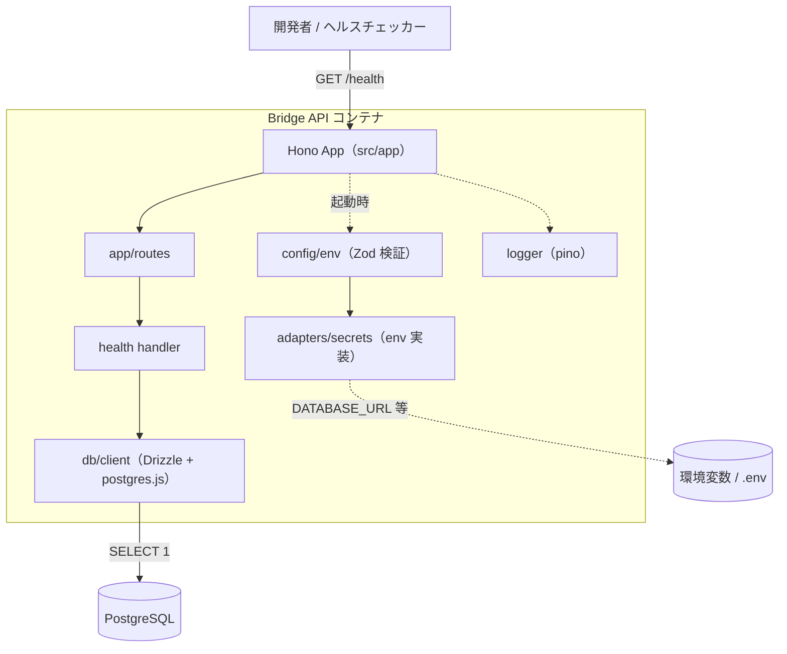
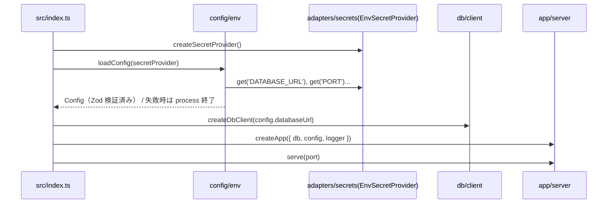
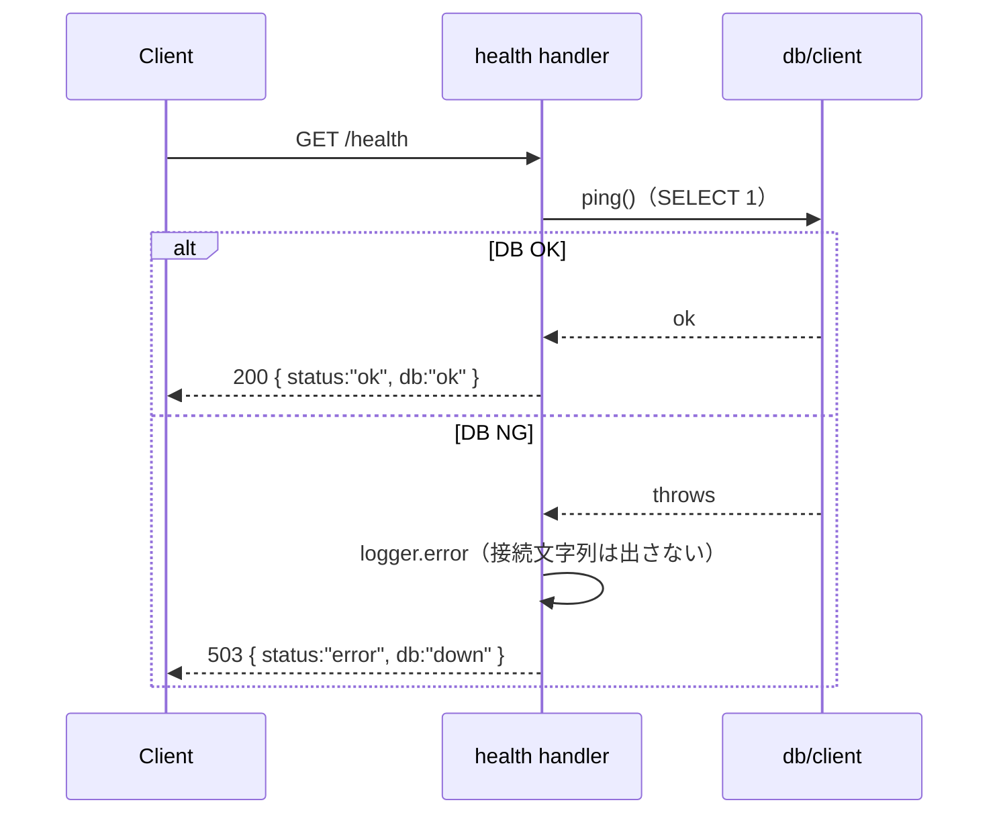

# 技術設計書 - foundation（プロジェクト基盤 / 動く器）

> 入力: `.specs/foundation/requirement.md`
> 制約: `docs/coding-rules.md`（`[MUST]` をハード制約、`[SHOULD]` を推奨として反映）
> 参照: `chatwork-slack-bridge-overview.md`（アダプタ境界 / 技術スタック）

## 1. 要件トレーサビリティマトリックス

| 要件ID | 要件内容 | 設計項目 | 既存資産 | 新規理由 |
|--------|---------|---------|---------|---------|
| REQ-001 | `/health`（DB 疎通含む） | `routes/health.ts` + `db.ping()` | ❌新規 | 新規プロジェクト |
| REQ-002 | Hono 雛形・ルーティング | `app/server.ts`, `app/routes/index.ts`, error handler | ❌新規 | 新規プロジェクト |
| REQ-003 | config / secret adapter | `adapters/secrets/*`, `config/env.ts`（Zod） | ❌新規 | 新規プロジェクト |
| REQ-004 | Drizzle 接続・schema・migration | `db/client.ts`, `db/schema.ts`, `drizzle.config.ts` | ❌新規 | 新規プロジェクト |
| REQ-005 | アダプタ境界ディレクトリ構成 | `src/` ディレクトリ scaffold | ❌新規 | 新規プロジェクト |
| REQ-006 | 構造化ロガー（pino） | `logger.ts` | ❌新規 | 新規プロジェクト |
| REQ-007 | docker-compose ローカル起動 | `docker-compose.yml`, `Dockerfile`, `.dockerignore` | ❌新規 | 新規プロジェクト |
| REQ-008 | ツールチェーン・スクリプト | `package.json`, `tsconfig.json`, `biome.json`, `vitest.config.ts` | ❌新規 | 新規プロジェクト |
| REQ-009 | CI 雛形 | `.github/workflows/ci.yml` | ❌新規 | 新規プロジェクト |

## 2. アーキテクチャ概要

### 2.1 システム構成図



### 2.2 起動シーケンス



### 2.3 /health リクエストシーケンス



## 3. 技術スタック

| 種別 | 採用 | バージョン方針 |
|------|------|---------------|
| Runtime | Node.js | 22 LTS（`engines` + Docker タグ固定） |
| Language | TypeScript | strict、最新安定 |
| Package manager | pnpm | lockfile コミット |
| HTTP framework | Hono | 最新安定（`@hono/node-server` で起動） |
| DB | PostgreSQL | 16（compose の image タグ固定） |
| ORM | Drizzle ORM | `drizzle-orm/postgres-js` + Drizzle Kit |
| DB driver | postgres.js | `postgres` パッケージ |
| Validation | Zod | 最新安定 |
| Logger | pino | `pino`（開発時 `pino-pretty` を devDependency に） |
| Lint / Format | Biome | 最新安定 |
| Test | Vitest | 最新安定（coverage: v8） |

> ライブラリの具体 API・バージョン確認には context7（resolve-library-id → query-docs）を実装時に活用する。

## 4. モジュール・クラス設計

### ディレクトリ構成（REQ-005）

```text
.
├── src/
│   ├── index.ts                 # エントリポイント（起動・graceful shutdown）
│   ├── logger.ts                # pino 構造化ロガー（REQ-006）
│   ├── config/
│   │   └── env.ts               # Zod による設定スキーマ + loadConfig（REQ-003）
│   ├── adapters/
│   │   ├── secrets/
│   │   │   ├── types.ts         # SecretProvider インターフェース
│   │   │   └── env-secret-provider.ts  # 環境変数実装
│   │   ├── chatwork/.gitkeep    # 雛形（forwarding で実装）
│   │   ├── slack/.gitkeep       # 雛形（forwarding/slack-reply で実装）
│   │   ├── queue/.gitkeep       # 雛形（ops-safety で実装）
│   │   └── ai/.gitkeep          # 雛形（ai-mcp で実装）
│   ├── app/
│   │   ├── server.ts            # createApp(deps) → Hono インスタンス（REQ-002）
│   │   ├── routes/
│   │   │   ├── index.ts         # ルート集約・マウント
│   │   │   └── health.ts        # /health ハンドラ（REQ-001）
│   │   └── services/.gitkeep    # 業務サービス（後続フェーズ）
│   └── db/
│       ├── client.ts            # Drizzle + postgres.js クライアント / ping（REQ-004）
│       ├── schema.ts            # Drizzle スキーマ（本フェーズは最小/空）
│       └── migrations/          # Drizzle Kit 生成 SQL
├── tests/                       # Vitest（または各 *.test.ts を src 近接配置）
├── drizzle.config.ts            # Drizzle Kit 設定
├── biome.json
├── vitest.config.ts
├── tsconfig.json
├── package.json
├── pnpm-lock.yaml
├── Dockerfile
├── docker-compose.yml
├── .dockerignore
├── .env.example                 # DATABASE_URL 等のサンプル（実値は入れない）
└── .github/workflows/ci.yml
```

### 4.1 [REQ-003] config / secret adapter

> 📌 要件: 「設定を Zod でバリデーションし、不足・不正があれば起動を中断」

**SecretProvider インターフェース（`adapters/secrets/types.ts`）**

```ts
/** Phase 1 で扱う設定キー（固定）。typo をコンパイル時に検出するため union 型で縛る。 */
export const SECRET_KEYS = [
  'DATABASE_URL', 'PORT', 'LOG_LEVEL', 'NODE_ENV', 'DB_HEALTH_TIMEOUT_MS',
] as const;
export type SecretKey = typeof SECRET_KEYS[number];

/** 秘密情報・設定値の取得経路を抽象化する。 */
export interface SecretProvider {
  /** キーに対応する値を返す。存在しなければ undefined。 */
  get(key: SecretKey): string | undefined;
}
```

> 後続フェーズでキーが増える場合は `SECRET_KEYS` に追記する（型とソースを一箇所で同期）。

**環境変数実装（`adapters/secrets/env-secret-provider.ts`）**
- `process.env` を参照する `EnvSecretProvider` を提供。
- Secret Manager 実装は cloud-deploy で同インターフェースを実装して差し替える。

**設定スキーマ（`config/env.ts`）**
- Zod スキーマで設定を定義し、`z.infer` で型を導出（型とスキーマを二重定義しない）。
- `safeParse` を使い、**失敗時は `ConfigError` を throw する（`process.exit` はしない）**。
  プロセス終了は呼び出し側（`src/index.ts`）の責務とすることで、`loadConfig` 単体をテスト可能にする。
- `ConfigError` は flatten した issue（**キー名と理由のみ。値は保持しない**）を持つ。

```ts
const ConfigSchema = z.object({
  DATABASE_URL: z.string().url(),                 // postgres 接続文字列
  PORT: z.coerce.number().int().positive().default(3000),
  LOG_LEVEL: z.enum(['fatal','error','warn','info','debug','trace']).default('info'),
  NODE_ENV: z.enum(['development','test','production']).default('development'),
  DB_HEALTH_TIMEOUT_MS: z.coerce.number().int().positive().default(2000), // /health の DB ping 上限
});
export type Config = z.infer<typeof ConfigSchema>;

/**
 * 設定を検証して返す。不正・不足時は ConfigError を throw する（プロセス終了はしない）。
 * @throws ConfigError 検証に失敗した場合（キー名と理由のみを保持。値は含めない）
 */
export function loadConfig(secrets: SecretProvider): Config {
  const result = ConfigSchema.safeParse({
    DATABASE_URL: secrets.get('DATABASE_URL'),
    PORT: secrets.get('PORT'),
    LOG_LEVEL: secrets.get('LOG_LEVEL'),
    NODE_ENV: secrets.get('NODE_ENV'),
    DB_HEALTH_TIMEOUT_MS: secrets.get('DB_HEALTH_TIMEOUT_MS'),
  });
  if (!result.success) {
    // fieldErrors のキー名と理由のみを保持（値は持たない）
    throw new ConfigError(result.error.flatten().fieldErrors);
  }
  return result.data;
}
```

`src/index.ts` 側（プロセス終了の責務）:

```ts
try {
  config = loadConfig(secretProvider);
} catch (err) {
  // ConfigError はキー名と理由のみ。値（接続文字列等）はログに出さない
  logger.fatal({ op: 'config.load', issues: (err as ConfigError).issues }, 'invalid config');
  process.exit(1);
}
```

### 4.2 [REQ-006] 構造化ロガー（`logger.ts`）
- `pino({ level, redact })` を生成する `createLogger(level)` を提供。
- 本番ロジックで `console.*` を使わない。
- 秘密情報・全文を出さないことを**実装で担保する**（注意喚起だけに依存しない）:
  - `redact` に接続文字列・トークン相当のパスを登録する。

  ```ts
  export function createLogger(level: LogLevel) {
    return pino({
      level,
      redact: {
        paths: ['DATABASE_URL', '*.DATABASE_URL', 'config.DATABASE_URL',
                'token', '*.token', 'authorization', '*.authorization'],
        censor: '[REDACTED]',
      },
    });
  }
  ```
  - 加えて、ログ対象は識別子・操作名・ステータスに限定する方針を TSDoc とレビュー基準で補強する。

### 4.3 [REQ-004] DB クライアント（`db/client.ts`）

```ts
import { drizzle } from 'drizzle-orm/postgres-js';
import postgres from 'postgres';
import { sql } from 'drizzle-orm';

export function createDbClient(databaseUrl: string) {
  const queryClient = postgres(databaseUrl);     // 接続プール
  const db = drizzle(queryClient);
  return {
    db,
    /**
     * 疎通確認（/health 用）。timeoutMs を超えた場合はタイムアウトとして reject する。
     * DB が失敗ではなく無応答（ハング）の場合でも上限で打ち切る。
     * @throws DB 接続失敗時、またはタイムアウト時
     */
    async ping(timeoutMs: number): Promise<void> {
      await withTimeout(db.execute(sql`select 1`), timeoutMs, 'db.ping');
    },
    async close(): Promise<void> { await queryClient.end(); },
  };
}
export type DbClient = ReturnType<typeof createDbClient>;
```

- `withTimeout(promise, ms, op)` は `Promise.race` ベースの小さなユーティリティ（`src/` 共通）。
  タイムアウト時は `TimeoutError`（op 名を含む）で reject する。
- `ping` の上限は `config.DB_HEALTH_TIMEOUT_MS`（既定 2000ms）を health ハンドラから渡す。
- `schema.ts` は本フェーズでは業務テーブルを定義しない（空 export または最小 export）。
- マイグレーションは Drizzle Kit（`drizzle.config.ts` で `schema`/`out`/`dialect: 'postgresql'` を指定）。
- `pnpm db:generate`（SQL 生成）/ `pnpm db:migrate`（適用）を提供。
- **空スキーマ時の期待動作**: `db:generate` は定義テーブルが無いため新規 migration を生成せず
  変更なしで成功（明示的 no-op）。`db:migrate` は適用対象が無くても成功し、Drizzle の
  migrations メタテーブル（`__drizzle_migrations` 等）作成は許容する。

### 4.4 [REQ-002] Hono アプリ（`app/server.ts`, `app/routes/`）

```ts
export interface AppDeps { db: DbClient; config: Config; logger: Logger; }

export function createApp(deps: AppDeps): Hono {
  const app = new Hono();
  app.route('/', createRoutes(deps));     // /health 等をマウント
  app.notFound((c) => { /* 構造化ログ */ return c.json({ error: 'not_found' }, 404); });
  app.onError((err, c) => { deps.logger.error(...); return c.json({ error: 'internal' }, 500); });
  return app;
}
```

- DI（`AppDeps`）で `db` / `config` / `logger` を注入し、テスト時にモック差し替え可能にする。
- `src/index.ts` で `createApp` の結果を `@hono/node-server` の `serve` に渡し、
  SIGTERM/SIGINT で `db.close()` する graceful shutdown を実装。

### 4.5 [REQ-001] health ハンドラ（`app/routes/health.ts`）

```ts
export function createHealthRoute(deps: AppDeps): Hono {
  const r = new Hono();
  r.get('/health', async (c) => {
    try {
      await deps.db.ping(deps.config.DB_HEALTH_TIMEOUT_MS); // タイムアウト付き疎通確認
      return c.json({ status: 'ok', db: 'ok' }, 200);
    } catch (err) {
      // 接続失敗・タイムアウトいずれも 503。接続文字列は出さない
      deps.logger.error({ op: 'health.db_ping', err: serializeError(err) }, 'db ping failed');
      return c.json({ status: 'error', db: 'down' }, 503);
    }
  });
  return r;
}
```

## 5. データ設計

### 5.1 データモデル
- 本フェーズでは **業務テーブルを作らない**（CON-006）。`schema.ts` は土台のみ。
- マイグレーションディレクトリ（`src/db/migrations/`）と Drizzle Kit 設定のみ用意し、
  後続フェーズ（forwarding 等）が `chatwork_rooms` 等を追加できる状態にする。

### 5.2 主キー・型方針（後続フェーズへの規約）
- 主キー: `bigint generated always as identity`（`serial`/`bigserial` 禁止 — coding-rules `[MUST]`）。
- 時刻: `timestamptz` / 文字列: `text` / FK には明示 index / status 等は `text` + `CHECK`。
- これらは本フェーズではコメントまたは `docs` での明記に留め、テーブル実体は作らない。

## 6. 技術的決定事項

| 決定項目 | 選択 | 理由 |
|---------|------|------|
| DB ドライバ | postgres.js（`drizzle-orm/postgres-js`） | 軽量で Neon pooled connection と整合（ユーザー決定 / overview 推奨構成） |
| ロガー | pino | JSON 構造化・高速・Cloud Logging 親和（ユーザー決定 / coding-rules 例示） |
| secret 抽象化 | `SecretProvider` IF + env 実装のみ | 早すぎる Secret Manager 実装を避け、IF だけ固定（ユーザー決定。cloud-deploy で実装追加） |
| 設定検証 | Zod `safeParse` + `loadConfig` は throw、`index.ts` で exit | 不正設定での起動を防ぎつつ `loadConfig` をテスト可能にする（責務分離） |
| /health の DB 確認 | `ping(timeoutMs)`（bounded timeout, 既定 2000ms） | DB 無応答（ハング）でリクエストが詰まらず、healthcheck として確実に異常を返す |
| 空スキーマの migration | `db:generate` は no-op 成功 / `db:migrate` はメタテーブル作成許容 | 業務テーブル未定義でも初期化が成立し、後続フェーズが migration 追加だけで機能する |
| secret キーの型 | `SecretKey` union 型 | キー typo をコンパイル時に検出（foundation で型土台を固める） |
| ログの秘密情報防止 | pino `redact` + config error は値非保持 | 注意喚起でなく実装で担保（接続文字列・トークンの漏洩防止） |
| DI 方式 | `createApp(deps)` で関数注入 | クラス DI コンテナは過剰。テスト容易性と KISS を両立 |
| Lint/Format | Biome | 単一ツールで lint+format、設定軽量（Issue 指定の選択肢） |
| Package manager | pnpm | Issue 指定 |
| schema.ts の扱い | 業務テーブルなしの土台 | 「使う機能の spec で migration 追加」方針（handover 決定） |
| Dockerfile | 開発/起動用の最小構成 | 本番最適化（multi-stage 厳密化 / 非 root の作り込み）は cloud-deploy へ |

## 7. 実装ガイドライン

### コーディング規約（`docs/coding-rules.md` 準拠）
- ファイル名 kebab-case / 変数・関数 camelCase / 型 PascalCase / 定数 UPPER_SNAKE_CASE。
- 外部 SDK は `src/adapters/{name}/` 経由のみ。`routes`/`services` から直接呼ばない。
- 公開関数・アダプタ公開メソッドに TSDoc（`@param`/`@returns`/`@throws`）。コメントは日本語で「なぜ」を書く。
- import は `@/` エイリアス基本。未使用 import / `console.log` / デッドコードを残さない。
- 型は `z.infer` 由来。固定値は const assertion + union 型。

### テスト戦略（`[MUST]` 反映 / カバレッジ 80%）
- Vitest。振る舞いベースの命名（`{期待} when {条件}`）。
- 本フェーズの主なテスト対象:
  - `config/env.ts`: 必須欠落・型不正で起動が中断する／正常系で型付き Config を返す。
  - `app/routes/health.ts`: DB 正常時 200・DB 失敗時 503（`db.ping` をモック）。
  - `adapters/secrets/env-secret-provider.ts`: 値の取得・未設定時 undefined。
- DB / 外部依存はアダプタ境界でモックし、ユニットテストをネットワーク非依存にする。
- 統合テスト（実 PostgreSQL での `/health`）は `[MAY]`。compose 上での手動確認を受け入れ基準とする。

### セキュリティ実装（`[MUST]` 反映）
- `DATABASE_URL` 等は secret adapter 経由で取得。ソース/CI/イメージに直書きしない。
- `.env` はコミットせず `.env.example` のみ。`.dockerignore` で `.env` / `node_modules` / `.git` 除外。
- ログに接続文字列・トークンを出さない（pino redact 併用可）。
- 公開エンドポイントは `/health` のみ。

### Docker（`[SHOULD]` 反映）
- ベースイメージはバージョンタグ固定（`node:22-slim` 等、`latest` 禁止）。
- compose は app + PostgreSQL、`depends_on` に DB healthcheck 条件。
- 本フェーズの Dockerfile は起動できる最小構成でよい（multi-stage の本格最適化は cloud-deploy）。

### YAGNI（本フェーズで含めない）
- 認証/認可、業務テーブル、queue/ai/chatwork/slack の実装本体、本番デプロイ、
  メトリクス収集、管理画面、キャッシュ層。
