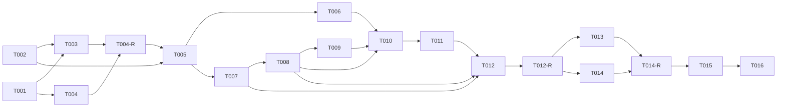

# タスクリスト - foundation（プロジェクト基盤 / 動く器）

> 入力: `.specs/foundation/design.md`, `.specs/foundation/requirement.md`
> 対象 Issue: #1 / 戦略: systematic（品質ゲート重視）/ 粒度: 標準（1タスク = 数時間〜1日）
> ワークフロー: `docs/issue-to-pr-workflow.md`（GitHub Flow / 実装ファースト / cmux マルチエージェント）

## 1. 概要

設計書に基づき、foundation（動く器）の実装タスクを 4 フェーズに分解する。
`[code]` フェーズの後には必ず `[orchestrator]` のレビューゲート（spec-review + spec-test）を挟む。
業務ロジック・本番デプロイ・業務テーブルは対象外（後続フェーズ）。

## 2. タスク一覧

### Phase 1: プロジェクト初期化・ツールチェーン [code]
- [x] T001: pnpm / package.json / npm スクリプト整備
- [x] T002: tsconfig.json（strict）・パスエイリアス設定
- [x] T003: Biome / Vitest / 各設定ファイル
- [x] T004: リポジトリ補助ファイル（.gitignore / .env.example / .dockerignore）

### Phase 1-R: 初期化 レビューゲート [orchestrator]
- [x] T004-R: Phase 1 の spec-review + spec-test 実行（設定の妥当性・`pnpm install`/lint/typecheck 確認）

### Phase 2: コア基盤実装 [code]
- [x] T005: ディレクトリ scaffold（アダプタ境界）
- [x] T006: [REQ-006] 構造化ロガー（pino）
- [x] T007: [REQ-003] secret adapter（SecretProvider IF + env 実装）
- [x] T008: [REQ-003] config/env（Zod 検証 + loadConfig）
- [x] T009: [REQ-004] Drizzle DB クライアント・schema・migration 基盤
- [x] T010: [REQ-002] Hono アプリ雛形（createApp / error handler / index.ts）
- [x] T011: [REQ-001] /health エンドポイント（DB 疎通含む）
- [x] T012: [NFR-002] ユニットテスト（config / health / secret adapter）

### Phase 2-R: コア基盤 レビューゲート [orchestrator]
- [x] T012-R: Phase 2 の spec-review + spec-test 実行（カバレッジ 80% / アダプタ境界遵守 / セキュリティ確認）

### Phase 3: コンテナ・CI [code]
- [x] T013: [REQ-007] Dockerfile / docker-compose.yml（app + PostgreSQL）
- [x] T014: [REQ-009] CI 雛形（.github/workflows/ci.yml）

### Phase 3-R: コンテナ・CI レビューゲート [orchestrator]
- [x] T014-R: Phase 3 の spec-review + spec-test 実行（compose 起動 / CI workflow 妥当性）

### Phase 4: 最終品質ゲート・受け入れ確認・PR [orchestrator]
- [x] T015: Final Quality Gate（lint / typecheck / test 一括 + 受け入れ基準確認）
- [x] T016: PR 作成（Issue #1 紐付け）

## 3. タスク詳細

### T001: pnpm / package.json / npm スクリプト整備
- 要件ID: REQ-008 / CON-002
- 設計書参照: design.md 「3. 技術スタック」「7. 実装ガイドライン」
- 依存関係: なし
- 推定時間: 1時間
- 対象ファイル: `package.json`, `pnpm-lock.yaml`, `.npmrc`(任意)
- 完了条件:
  - [ ] `engines.node` に 22 系を指定
  - [ ] scripts に `dev` / `build` / `lint` / `typecheck` / `test` / `db:generate` / `db:migrate` を定義
  - [ ] 依存: hono, @hono/node-server, drizzle-orm, postgres, zod, pino を追加
  - [ ] devDeps: typescript, @biomejs/biome, vitest, @vitest/coverage-v8, drizzle-kit, pino-pretty, tsx(or 同等) を追加
  - [ ] `pnpm install` が成功する
- 並列実行: T002 と同時実行可能

### T002: tsconfig.json（strict）・パスエイリアス
- 要件ID: NFR-001
- 設計書参照: design.md 「7. 実装ガイドライン（コーディング規約）」
- 依存関係: なし
- 推定時間: 0.5時間
- 対象ファイル: `tsconfig.json`
- 完了条件:
  - [ ] `strict: true`
  - [ ] `@/*` → `src/*` のパスエイリアス設定
  - [ ] `noEmit` ベースの型チェックが可能（ビルドは別途）
- 並列実行: T001 と同時実行可能

### T003: Biome / Vitest 設定
- 要件ID: NFR-001 / NFR-002
- 設計書参照: design.md 「7. 実装ガイドライン（テスト戦略）」
- 依存関係: T001, T002（`@/` エイリアスを Vitest でも解決するため tsconfig に依存）
- 推定時間: 1時間
- 対象ファイル: `biome.json`, `vitest.config.ts`
- 完了条件:
  - [ ] Biome の lint + format ルールが有効
  - [ ] Vitest の coverage プロバイダ（v8）を設定する。**ただし閾値 80% はこの時点で
        有効化しない**（テスト未追加のため）。閾値の有効化は T012 で行う
  - [ ] Phase 1 でテストが無くても落ちないよう `--passWithNoTests` 相当を設定する
        （`test` script もしくは vitest 設定で）
  - [ ] `@/` エイリアスが Vitest でも解決される（tsconfig の paths と整合）
  - [ ] 空状態で `pnpm lint` / `pnpm typecheck` / `pnpm test` がエラーなく実行できる
- 並列実行: T004 と同時実行可能

### T004: リポジトリ補助ファイル
- 要件ID: CON-007 / NFR-003
- 設計書参照: design.md 「7. 実装ガイドライン（セキュリティ / Docker）」
- 依存関係: なし
- 推定時間: 0.5時間
- 対象ファイル: `.gitignore`, `.env.example`, `.dockerignore`
- 完了条件:
  - [ ] `.gitignore` に `node_modules`, `.env`, `dist` 等
  - [ ] `.env.example` に `DATABASE_URL`/`PORT`/`LOG_LEVEL`/`NODE_ENV`/`DB_HEALTH_TIMEOUT_MS`（実値なしのサンプル）
  - [ ] `.dockerignore` に `node_modules`, `.git`, `.env`
- 並列実行: T003 と同時実行可能

### T004-R: Phase 1 レビューゲート
- 要件ID: -（品質ゲート）
- 依存関係: T001, T002, T003, T004
- 推定時間: 0.5時間
- 完了条件:
  - [ ] spec-review で Phase 1 成果物がルール準拠
  - [ ] `pnpm install` / `pnpm lint` / `pnpm typecheck` が通る（実装前の空状態で可能な範囲）

### T005: ディレクトリ scaffold（アダプタ境界）
- 要件ID: REQ-005
- 設計書参照: design.md 「4. ディレクトリ構成」
- 依存関係: T002
- 推定時間: 0.5時間
- 対象ファイル: `src/adapters/{chatwork,slack,queue,secrets,ai}/`, `src/app/{routes,services}/`, `src/db/`（`.gitkeep` 含む）
- 完了条件:
  - [ ] 受け入れ基準のディレクトリ構成が存在する
  - [ ] 空ディレクトリは `.gitkeep` でコミット対象になる
- 並列実行: -

### T006: [REQ-006] 構造化ロガー（pino）
- 要件ID: REQ-006 / NFR-004
- 設計書参照: design.md 「4.2 構造化ロガー」
- 依存関係: T005
- 推定時間: 1時間
- 対象ファイル: `src/logger.ts`
- 完了条件:
  - [ ] `createLogger(level)` が pino インスタンスを返す
  - [ ] pino の `redact` に接続文字列・トークン相当のパス（`DATABASE_URL`, `token`,
        `authorization` 等）を登録し、`[REDACTED]` でマスクする（実装で担保）
  - [ ] TSDoc 付き
- 並列実行: T007 と同時実行可能

### T007: [REQ-003] secret adapter（SecretProvider IF + env 実装）
- 要件ID: REQ-003 / CON-005 / NFR-003
- 設計書参照: design.md 「4.1 config / secret adapter」
- 依存関係: T005
- 推定時間: 1時間
- 対象ファイル: `src/adapters/secrets/types.ts`, `src/adapters/secrets/env-secret-provider.ts`
- 完了条件:
  - [ ] `SECRET_KEYS`（const assertion）と `SecretKey` union 型を定義
  - [ ] `SecretProvider.get(key: SecretKey)` インターフェース定義（キーを型で縛る）
  - [ ] `EnvSecretProvider`（process.env 参照）実装
  - [ ] 未設定キーで undefined を返す
  - [ ] TSDoc 付き
- 並列実行: T006 と同時実行可能

### T008: [REQ-003] config/env（Zod 検証 + loadConfig）
- 要件ID: REQ-003 / NFR-001
- 設計書参照: design.md 「4.1（設定スキーマ）」
- 依存関係: T007
- 推定時間: 1.5時間
- 対象ファイル: `src/config/env.ts`
- 完了条件:
  - [ ] Zod スキーマ（DATABASE_URL/PORT/LOG_LEVEL/NODE_ENV/DB_HEALTH_TIMEOUT_MS 既定2000）と `z.infer` 型
  - [ ] `loadConfig(secrets)` が `safeParse` で検証し、失敗時は **`ConfigError` を throw**
        する（`process.exit` はしない。終了は index.ts の責務）
  - [ ] `ConfigError` は flatten の `fieldErrors`（キー名と理由のみ）を保持し、値を持たない
- 並列実行: -

### T009: [REQ-004] Drizzle DB クライアント・schema・migration 基盤
- 要件ID: REQ-004 / CON-003 / CON-006
- 設計書参照: design.md 「4.3 DB クライアント」「5. データ設計」
- 依存関係: T008
- 推定時間: 2時間
- 対象ファイル: `src/db/client.ts`, `src/db/schema.ts`, `drizzle.config.ts`, `src/db/migrations/`, `src/with-timeout.ts`
- 完了条件:
  - [ ] `createDbClient(databaseUrl)` が `drizzle-orm/postgres-js` で接続し `ping(timeoutMs)`/`close()` を提供
  - [ ] `ping(timeoutMs)` は bounded timeout（`withTimeout` ユーティリティ）で、DB 無応答時も
        上限で打ち切り `TimeoutError` で reject する
  - [ ] `schema.ts` は業務テーブルなしの土台（空 export 可）
  - [ ] `drizzle.config.ts`（dialect: postgresql / schema / out 指定）
  - [ ] **空スキーマ時の期待動作を満たす**: `pnpm db:generate` は新規 migration を生成せず
        変更なしで成功（no-op）／`pnpm db:migrate` は適用対象が無くても成功し、migrations
        メタテーブル作成は許容する
- 並列実行: -

### T010: [REQ-002] Hono アプリ雛形
- 要件ID: REQ-002
- 設計書参照: design.md 「4.4 Hono アプリ」
- 依存関係: T006, T008, T009
- 推定時間: 1.5時間
- 対象ファイル: `src/app/server.ts`, `src/app/routes/index.ts`, `src/index.ts`
- 完了条件:
  - [ ] `createApp(deps)` が `AppDeps`（db/config/logger）を受け、Hono を返す
  - [ ] notFound / onError で構造化ログ出力
  - [ ] `src/index.ts` で `loadConfig` の `ConfigError` を捕捉し、構造化ログ（値を含めない）
        出力後に `process.exit(1)` する
  - [ ] `src/index.ts` で `@hono/node-server` 起動 + SIGTERM/SIGINT graceful shutdown（db.close）
- 並列実行: -

### T011: [REQ-001] /health エンドポイント
- 要件ID: REQ-001 / NFR-005
- 設計書参照: design.md 「2.3 / 4.5 health ハンドラ」
- 依存関係: T010
- 推定時間: 1時間
- 対象ファイル: `src/app/routes/health.ts`
- 完了条件:
  - [ ] DB 正常時 `200 { status:"ok", db:"ok" }`
  - [ ] `db.ping(config.DB_HEALTH_TIMEOUT_MS)` を使い、接続失敗・タイムアウト両方で
        `503 { status:"error", db:"down" }` + 構造化エラーログ（接続文字列を出さない）
  - [ ] routes/index.ts にマウント
- 並列実行: -

### T012: [NFR-002] ユニットテスト
- 要件ID: NFR-002
- 設計書参照: design.md 「7. 実装ガイドライン（テスト戦略）」
- 依存関係: T008, T011, T007
- 推定時間: 2時間
- 対象ファイル: `src/config/env.test.ts`, `src/app/routes/health.test.ts`, `src/adapters/secrets/env-secret-provider.test.ts`, `vitest.config.ts`(閾値有効化)
- 完了条件:
  - [ ] config: 必須欠落/型不正で `ConfigError` が throw される、正常系で型付き Config を返す
  - [ ] health: `db.ping` をモックし、正常時 200 / 失敗時 503 / **タイムアウト時 503** を検証
  - [ ] secret adapter: 取得・未設定 undefined
  - [ ] **vitest の coverage 閾値 80% をここで有効化**し、その状態で `pnpm test` がパス
  - [ ] 振る舞いベースの命名
- 並列実行: -

### T012-R: Phase 2 レビューゲート
- 要件ID: -（品質ゲート）
- 依存関係: T005〜T012
- 推定時間: 1時間
- 完了条件:
  - [ ] spec-review: アダプタ境界遵守 / 型安全 / セキュリティ（秘密情報・ログ）/ TSDoc を確認
  - [ ] spec-test: `pnpm test` がカバレッジ 80% 以上で通る
  - [ ] `pnpm lint` / `pnpm typecheck` が通る

### T013: [REQ-007] Dockerfile / docker-compose
- 要件ID: REQ-007 / NFR-005 / NFR-003
- 設計書参照: design.md 「6 / 7（Docker）」
- 依存関係: T011
- 推定時間: 2時間
- 対象ファイル: `Dockerfile`, `docker-compose.yml`
- 完了条件:
  - [ ] ベースイメージはタグ固定（`node:22-slim` 等、`latest` 禁止）
  - [ ] compose に app + PostgreSQL（image タグ固定）、`depends_on` に DB healthcheck 条件
  - [ ] イメージ/ENV に秘密情報を焼き込まない（実行時注入）
  - [ ] `docker compose up -d` で起動し、app→DB 疎通が成立する
- 並列実行: T014 と同時実行可能

### T014: [REQ-009] CI 雛形
- 要件ID: REQ-009
- 設計書参照: design.md 「1 / 7」
- 依存関係: T003
- 推定時間: 1時間
- 対象ファイル: `.github/workflows/ci.yml`
- 完了条件:
  - [ ] pnpm セットアップ + `pnpm install --frozen-lockfile`（lockfile と CI の再現性を担保）
  - [ ] `pnpm lint` / `pnpm typecheck` / `pnpm test` を実行
  - [ ] 秘密情報を直書きしない（本番デプロイは含めない）
- 並列実行: T013 と同時実行可能

### T014-R: Phase 3 レビューゲート
- 要件ID: -（品質ゲート）
- 依存関係: T013, T014
- 推定時間: 0.5時間
- 完了条件:
  - [ ] spec-review: Dockerfile/compose/CI がルール準拠（タグ固定・非焼き込み・最小公開）
  - [ ] `docker compose up -d` 起動と `/health` 200（DB 疎通）を確認

### T015: Final Quality Gate
- 要件ID: -（受け入れ基準）
- 依存関係: T012-R, T014-R
- 推定時間: 0.5時間
- 完了条件:
  - [ ] `pnpm install && docker compose up -d` でローカル起動できる
  - [ ] `/health` が 200（DB 疎通含む）
  - [ ] `pnpm lint` / `pnpm typecheck` / `pnpm test` が通る
  - [ ] アダプタ境界のディレクトリ構成ができている

### T016: PR 作成
- 要件ID: -（リリース）
- 依存関係: T015
- 推定時間: 0.5時間
- 完了条件:
  - [ ] フィーチャーブランチから PR を作成し Issue #1 に紐付け（`Closes #1` 等）
  - [ ] PR 本文に受け入れ基準チェック結果を記載
  - [ ] anyoneanderson アカウントで作成（gh/git アカウント確認済み）

## 4. 依存関係図

## 5. 並列実行計画

| フェーズ | 並列実行可能タスク |
|---------|-------------------|
| Phase 1 | (T001, T002) → (T003, T004) |
| Phase 2 | (T006, T007) を並列、以降 T008→T009→T010→T011→T012 は逐次 |
| Phase 3 | T013, T014 を並列 |
| Phase 4 | T015 → T016（逐次） |

## 6. 品質チェックリスト（生成後確認）

1. [x] すべてのタスクが要件ID または基盤/品質ゲートと紐付いている
2. [x] 設計書にない機能（業務ロジック・本番デプロイ・業務テーブル）のタスクは含まない
3. [x] 依存関係が定義されている
4. [x] 推定時間が現実的（合計 約 21〜23 時間）
5. [x] 完了条件が具体的で測定可能
6. [x] 並列実行の機会を明示
7. [x] 各 `[code]` フェーズ後にレビューゲート（`[orchestrator]`）を配置
8. [x] 1 フェーズ 1 ロール（`[code]`/`[orchestrator]` を混在させない）
