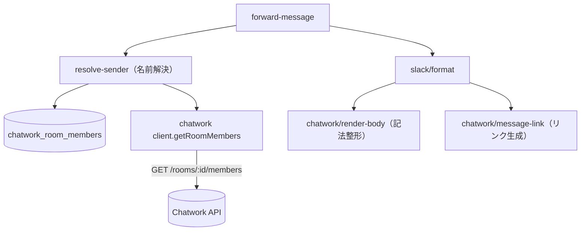

# 技術設計書 - sender-name / Slack 表示改善

> 入力: `.specs/sender-name/requirement.md`
> 制約: `docs/coding-rules.md`（`[MUST]` をハード制約 / `[SHOULD]` 推奨）
> 参照: `.specs/forwarding/design.md`（§4.3 client / §4.5 forward-message / §4.7 format）, `chatwork-slack-bridge-overview.md`
> 前提実装: forwarding（#3）本番稼働中

## 1. 要件トレーサビリティ

| 要件ID | 設計項目 | 既存資産 |
|--------|---------|---------|
| REQ-001 | `adapters/chatwork/client.ts` に `getRoomMembers` 追加 | 🔁拡張（getRoom と同パターン） |
| REQ-002 | `app/services/resolve-sender.ts`（名前解決）+ `forward-message` 結線 | ❌新規 |
| REQ-003 | `db/schema.ts` に `chatwork_room_members` 追加 + migration | 🔁拡張 |
| REQ-004 | `forward-message` で `sender_name` を保存 | 🔁拡張 |
| REQ-005 | `adapters/slack/format.ts` の送信者表示変更 | 🔁拡張 |
| REQ-006 | `adapters/chatwork/message-link.ts`（リンク生成）+ format 結線 | ❌新規 |
| REQ-007 | `adapters/chatwork/render-body.ts`（記法整形）+ format 結線 | ❌新規 |

## 2. アーキテクチャ概要



処理順（forward-message への割り込み。既存フロー CON-001 を壊さない）:
1. ルーム解決（既存：find / getRoom upsert / 再SELECT）
2. `my` skip（既存）
3. **送信者名を解決**（`resolveSender`）。失敗時は account_id フォールバック（転送継続）
4. `chatwork_messages` を `onConflictDoNothing` で保存（既存）。**`sender_name` に解決名（or null）を含める**
5. resolveTarget（既存）→ disabled は保存のみ
6. **`format(message, room)`**（記法整形＋送信者名＋リンクを反映）→ Slack 投稿（既存）→ ts UPDATE（既存）

> 送信者名解決はメッセージ INSERT より前に行い、`sender_name` を INSERT 値に含める。getRoomMembers は getRoom 同様の「保存前の外部メタ取得」であり、失敗しても fallback で転送は継続する（NFR / forwarding §4.5 整合）。

## 3. データ設計

### 3.1 `chatwork_room_members`（追加 / Drizzle）

```sql
create table chatwork_room_members (
  id bigint generated always as identity primary key,
  chatwork_room_id text not null references chatwork_rooms(chatwork_room_id),
  chatwork_account_id text not null,
  name text not null,
  created_at timestamptz not null default now(),
  updated_at timestamptz not null default now(),
  unique (chatwork_room_id, chatwork_account_id)
);
create index chatwork_room_members_room_idx
  on chatwork_room_members (chatwork_room_id);   -- FK 用 index（[MUST]）
```

- 主キー identity / timestamptz / FK 明示 index / unique（coding-rules `[MUST]`）。forwarding のスキーマ規約に統一。
- `name` は表示名。account_id は `text`（既存テーブルと統一）。

### 3.2 キャッシュ upsert（冪等）

```ts
await db.insert(chatworkRoomMembers)
  .values(rows)  // getRoomMembers の全件
  .onConflictDoUpdate({
    target: [chatworkRoomMembers.chatworkRoomId, chatworkRoomMembers.chatworkAccountId],
    set: { name: sql`excluded.name`, updatedAt: sql`now()` },
  });
```
- リフレッシュ時は取得した全メンバーを upsert（名前変更にも追従。継続同期は無し＝ミス時のみ）。

## 4. モジュール設計

### 4.1 [REQ-001] `getRoomMembers`（`adapters/chatwork/client.ts` 拡張）

```ts
export interface ChatworkMember {
  accountId: string;   // API の account_id を文字列化
  name: string;
}

export interface ChatworkClient {
  getRoom(roomId: ChatworkRoomId): Promise<ChatworkRoom>;
  /**
   * ルームのメンバー一覧を取得する（GET /rooms/{room_id}/members）。
   * @throws ChatworkApiError 認可・レート制限・ネットワーク・不正レスポンス時（トークン/本文/氏名は含めない）
   */
  getRoomMembers(roomId: ChatworkRoomId): Promise<ChatworkMember[]>;
}
```
- 実装は `getRoom` と同形（`fetch` + `X-ChatWorkToken`、非2xxは status のみで `ChatworkApiError`、JSON 検証）。
- レスポンス各要素を `{ accountId: String(account_id), name }` にマップ。`account_id`/`name` を持たない要素は無視 or 失敗（Zod もしくは型ガード）。

### 4.2 [REQ-002] 名前解決（`app/services/resolve-sender.ts`）

```ts
/**
 * 送信者 account_id の表示名を解決する。
 * キャッシュ → ミス時 getRoomMembers で1回リフレッシュ → それでも無ければ null（呼び出し側で account_id フォールバック）。
 * getRoomMembers 失敗時も null を返し、転送は止めない（ログは op/識別子のみ）。
 */
export async function resolveSenderName(
  roomId: ChatworkRoomId, accountId: string, deps: ResolveSenderDeps,
): Promise<string | null>;
```
- `deps`: `{ db, chatworkClient, logger }`。
- フロー: cache SELECT →ヒットで返す / ミス→`getRoomMembers`→upsert→cache 再SELECT→ヒットで返す / 失敗 or 不在→`logger.info({op:"forward.sender.unresolved", roomId, accountId})` で null。
- **1メッセージ1リフレッシュ**（無限ループ防止）。

### 4.3 [REQ-007] 記法整形（`adapters/chatwork/render-body.ts`）

```ts
/** Chatwork メッセージ記法を Slack 向けの可読テキストへ変換する。 */
export function renderChatworkBody(body: string): string;
```
- 段階処理（順序に注意）:
  1. **タグ変換**（正規表現ベース）:
     - `[download:\d+]<inner>[/download]` → `📎 <inner>`（inner は「ファイル名 (サイズ)」想定。(A) 表示のみ）
     - `[preview id=\d+( ht=\d+)?]` → 除去（download とセットで出るため）
     - `[dtext:file_uploaded]` → `ファイルをアップロードしました`（既知キー表。未知 `[dtext:*]` は除去）
     - `[title]<inner>[/title]` → `<inner>`（前後に改行）
     - `[info]<inner>[/info]` → `<inner>`（枠を外す）
     - `[qt]…[/qt]` / `[qtmeta …]` → 引用（各行 `> `）/ qtmeta 除去
     - `[To:\d+]` / `[rp\b[^\]]*]` → 除去（メンション。氏名解決は本文側では行わない）
     - `[picon:\d+]` / `[piconname:\d+]` → 除去、`[hr]` → `---`
     - 未知の `[...]` タグは**原文維持**（壊さない）
  2. **絵文字ショートコード**: 主要セットの辞書置換（`(blush)`→😊 等）。未知は原文維持。辞書は `chatwork-emoticons.ts` に分離。
- 変換は純粋関数（I/O 無し）。Slack 制御文字エスケープは format 側で実施（順序は §4.5）。

### 4.4 [REQ-006] メッセージリンク（`adapters/chatwork/message-link.ts`）

```ts
/** Chatwork の特定メッセージを開くディープリンクを生成する。 */
export function chatworkMessageUrl(roomId: string, messageId: string): string {
  return `https://www.chatwork.com/#!rid${roomId}-${messageId}`;
}
```

### 4.5 [REQ-005] Slack 整形（`adapters/slack/format.ts` 変更）

`FormatMessageInput` を拡張:
```ts
export interface FormatMessageInput {
  accountId: string | null;
  senderName: string | null;   // 追加：解決済み表示名
  body: string;
  roomId: string;              // 追加：リンク生成用
  messageId: string;           // 追加：リンク生成用
}
```
整形:
```ts
const sender = escapeSlackText(message.senderName ?? message.accountId ?? UNKNOWN_SENDER_LABEL);
const rendered = escapeSlackText(renderChatworkBody(message.body));
const link = chatworkMessageUrl(message.roomId, message.messageId);
const text =
  `[Chatwork] ${escapeSlackText(room.name)}\n` +
  `${sender}:\n` +
  `${rendered}\n` +
  `<${link}|Chatworkで開く>`;
```
- エスケープは「外部由来テキスト（送信者・ルーム名・整形後本文）」に適用。リンク（自前生成）と固定ラベルはエスケープしない。
- 注意: 記法整形で生成した絵文字や `📎` `>` 引用記号は、エスケープ前に renderChatworkBody で生成される。`>`（引用）が `&gt;` 化されると Slack 引用が壊れるため、**引用行頭の `>` だけはエスケープ対象から除外**する設計とする（実装案: 行単位で「引用行はマーカー処理」/ あるいは render 後に行頭 `&gt; ` を `> ` へ戻す）。テストで担保。

> 設計判断: render → escape の順とし、引用行頭の扱いをテストで固定。絵文字（Unicode）はエスケープの影響を受けない。

## 5. 技術的決定事項

| 決定項目 | 選択 | 理由 |
|---------|------|------|
| メンバーキャッシュ | DB `chatwork_room_members` | 既存 rooms キャッシュと統一・Cloud Run マルチインスタンス/再起動に強い |
| リフレッシュ方針 | ミス時1回のみ + 全件 upsert | レート制限回避・名前変更追従・無限ループ防止 |
| 解決失敗時 | account_id フォールバック・転送継続 | forwarding getRoom 失敗方針と整合（落とさない） |
| 記法整形の置き場所 | chatwork adapter（`render-body.ts`） | Chatwork 由来データの変換のため境界内に閉じる（NFR-004） |
| 添付ファイル | (A) ファイル名+サイズ表示のみ | DL は認証必須・別 issue。本文の `[download]` inner を流用（追加API不要） |
| メッセージリンク | `#!rid{room}-{message}` | Chatwork 仕様（ASM-003） |
| 絵文字 | 主要セット辞書・未知は原文維持 | 全網羅は過剰。壊さない方針 |

## 6. 実装ガイドライン

- ファイル名 kebab-case / `@/` alias / TSDoc（公開関数）/ const-assertion 辞書 / 純粋関数は I/O 無し。
- 外部 SDK/API は adapter 経由（NFR-004）。秘密・本文・氏名は非ログ（NFR-002）。
- テスト（`[MUST]` / 80%）:
  - `resolve-sender`: キャッシュヒット / ミス→リフレッシュ→解決 / リフレッシュしても不在→null / getRoomMembers 失敗→null（例外を投げない・ログ op のみ）。
  - `render-body`: 絵文字（既知/未知）・`[download]`→📎・`[info][title][dtext:file_uploaded]`・`[qt]`引用・`[To]/[rp]`除去・未知タグ原文維持・複合ケース。
  - `message-link`: 期待 URL。
  - `format`: 表示名優先 / account_id フォールバック / リンク付与 / エスケープ維持 / 引用 `>` が壊れない。
  - `getRoomMembers`: 正常マップ / 非2xx→ChatworkApiError / トークン・氏名非漏洩。
  - DB・API はモック。ダミー値のみ（CON-002）。

### YAGNI（本 Issue で含めない）
- 添付の Slack 再アップロード、絵文字全網羅、メンバー継続同期、リッチ Block Kit、メンション氏名解決（`[To]` の名前化）。
