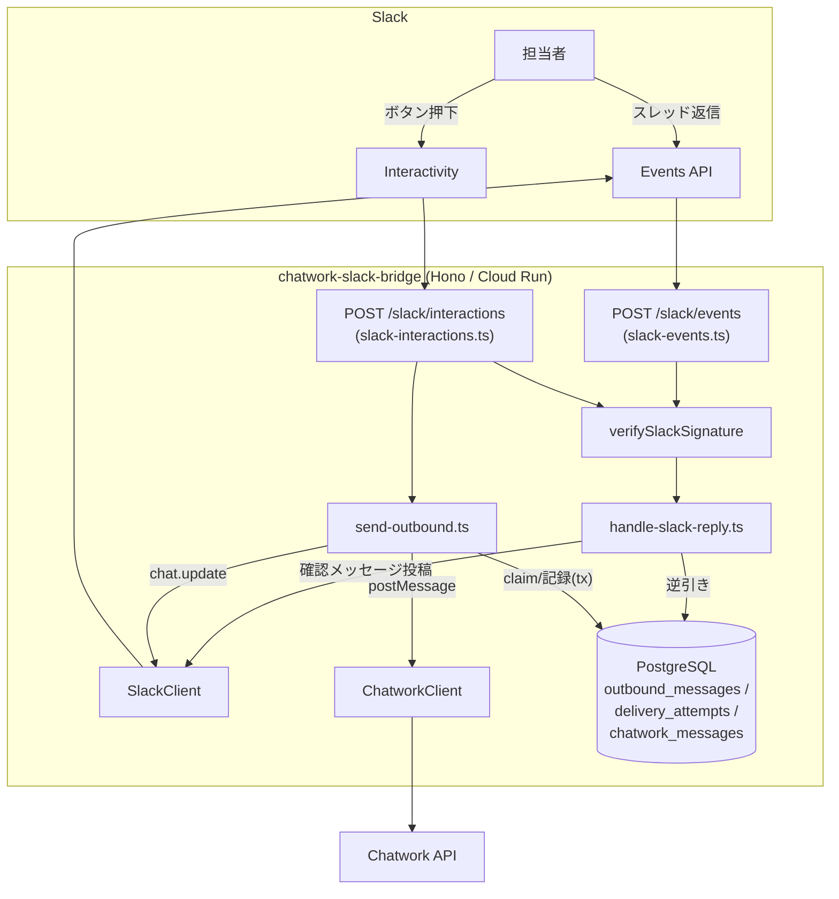
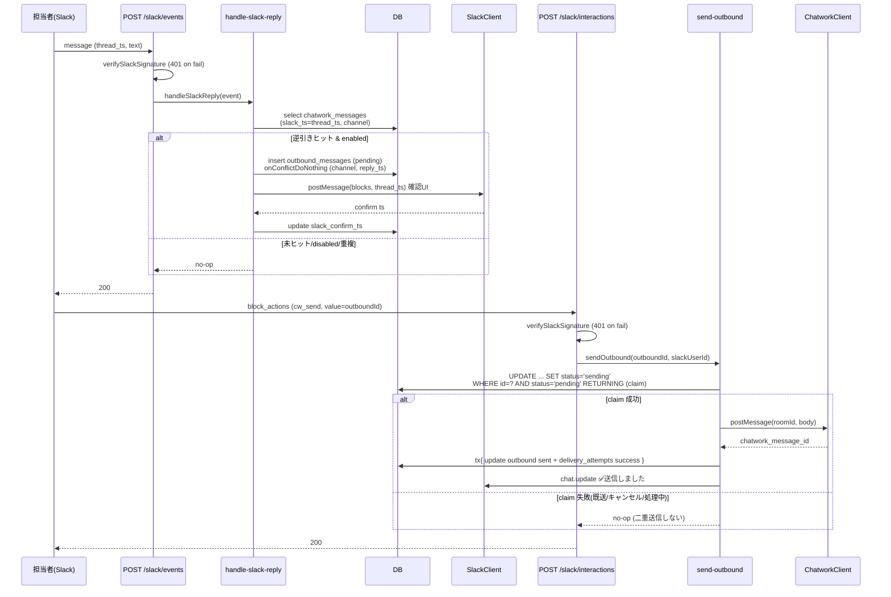
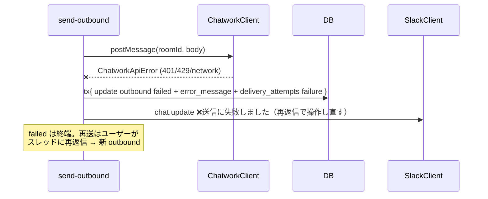
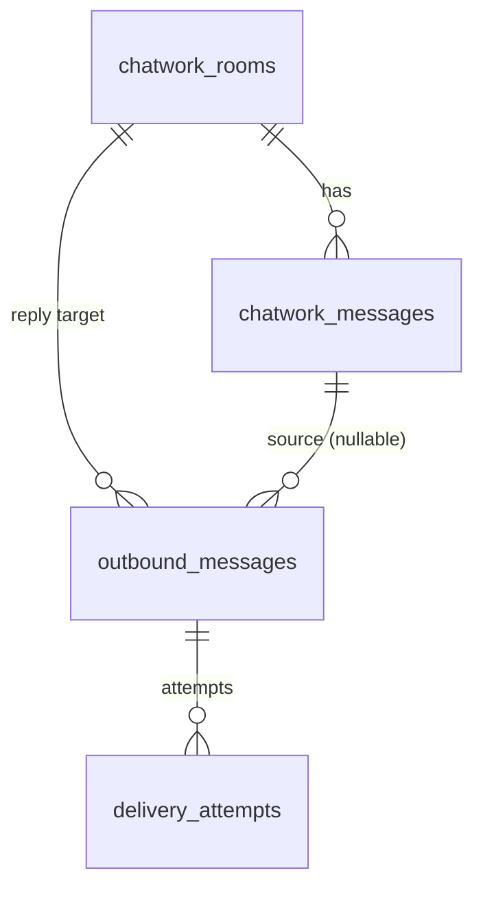
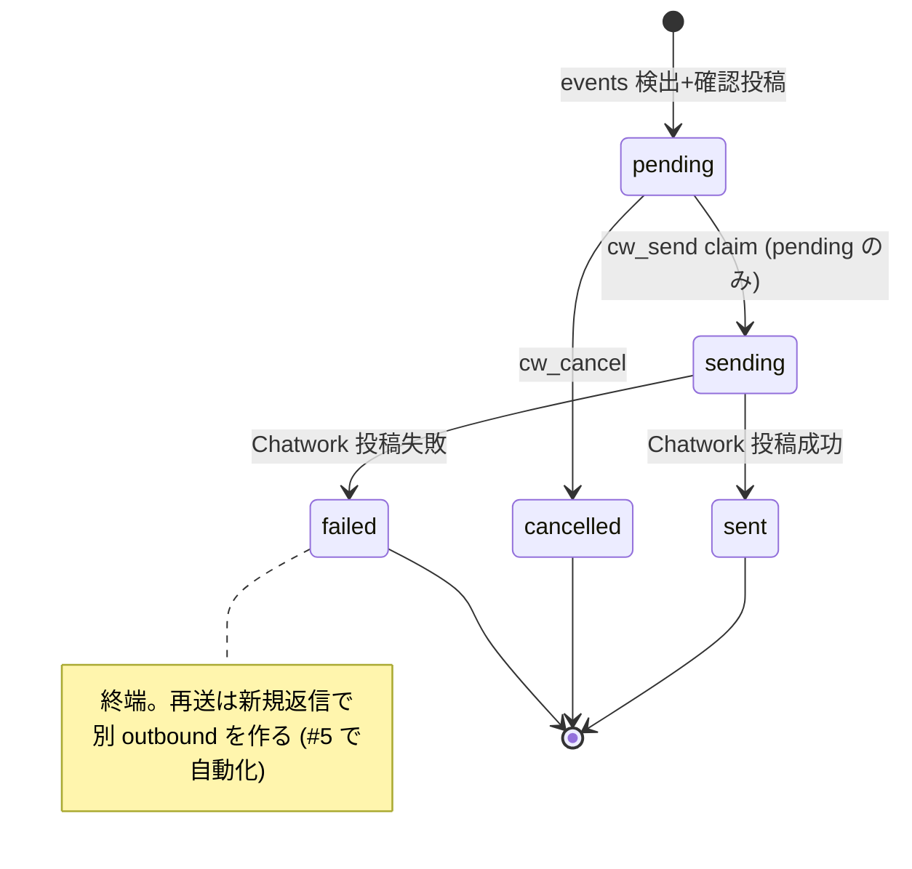

# 技術設計書 - slack-reply（Slack から Chatwork へ送信確認つき返信）

> 入力: `.specs/slack-reply/requirement.md`
> 参照: `.specs/forwarding/design.md`, `.specs/attachment-mirror/design.md`, `chatwork-slack-bridge-overview.md`, `docs/coding-rules.md`, `docs/review_rules.md`
> 既存実装の前提: `src/app/services/forward-message.ts` / `src/adapters/{chatwork,slack}/*` / `src/app/routes/chatwork-webhook.ts` / `src/db/schema.ts`（migration 0000–0002）/ `src/config/env.ts` / `src/adapters/secrets/factory.ts`

## 1. 要件トレーサビリティマトリックス

| 要件ID | 要件内容 | 設計項目 | 既存資産 | 新規理由 |
|--------|---------|---------|---------|---------|
| REQ-001 | Slack 署名検証 | `adapters/slack/verify-signature.ts` | ⚠️ chatwork `verify-signature.ts` を雛形流用 | Slack 仕様（v0 hex + timestamp skew）が別 |
| REQ-002 | `POST /slack/events` | `app/routes/slack-events.ts` | ⚠️ `chatwork-webhook.ts` 構造を踏襲 | Slack 専用ルート |
| REQ-003 | スレッド返信判定・ルーム逆引き | `app/services/handle-slack-reply.ts` の検出部 + `selectMessageByThread` | ✅ `chatwork_messages` 利用 | 逆引きクエリは新規 |
| REQ-004 | 送信確認メッセージ投稿 | `handle-slack-reply.ts` + `slack/confirm-message.ts`（Block 組み立て） | ✅ `format.ts` の escape 方針再利用 | 確認 UI は新規 |
| REQ-005 | `outbound_messages` 永続化 | `db/schema.ts` + migration 0003 | ❌ 新規テーブル | 送信ライフサイクル管理 |
| REQ-006 | `POST /slack/interactions` 送信/キャンセル | `app/routes/slack-interactions.ts` + `app/services/send-outbound.ts` | ✅ DB / chatwork client | claim + 送信は新規 |
| REQ-007 | Chatwork `postMessage` | `adapters/chatwork/client.ts` 追加メソッド | ✅ 既存 client 拡張 | 投稿 API 未実装 |
| REQ-008 | Slack client 拡張（blocks/update） | `adapters/slack/client.ts` / `types.ts` | ✅ 既存 client 拡張 | confirm 投稿・更新が必要 |
| REQ-009 | 送信 allowlist | `send-outbound.ts` + `config/env.ts` | ❌ 新規（任意） | 任意のアクセス制御 |
| REQ-010 | `SLACK_SIGNING_SECRET` 配線 | `config/env.ts` / `secrets/factory.ts` / `deploy-cloud-run.yml` / setup-guide | ⚠️ 既存配線に追加 | 必須キー追加（4 箇所同時） |
| REQ-011 | Slack App 設定手順 | `docs/setup-guide/` | ✅ 既存 setup-guide 拡張 | 双方向化の運用手順 |
| NFR-001 | セキュリティ/アダプタ境界 | 全モジュール配置 | ✅ 既存境界遵守 | - |
| NFR-002 | 秘密・本文の非ログ | 各 Error クラス / logger 呼び出し | ✅ 既存 `SlackApiError`/`ChatworkApiError` 方針 | - |
| NFR-003 | テスト / カバレッジ 80% | §7 テスト戦略 + 各 `*.test.ts` | ✅ Vitest / アダプタ境界モック | - |
| NFR-004 | 冪等性 / 二重送信防止 | `unique` 制約 + claim UPDATE | ✅ `onConflictDoNothing` 系の踏襲 | claim は新規 |
| NFR-005 | 整合性（トランザクション） | `send-outbound.ts` の `db.transaction` | ✅ Drizzle transaction | - |
| NFR-006 | Slack 3 秒 / 再送冪等 | §4.5 応答境界 + claim/unique | ✅ 同期モデル踏襲 | - |
| NFR-007 | 設定の後方互換 | §4.6 任意 allowlist / §7 必須キー配線 | ✅ optional config | - |

## 2. アーキテクチャ概要

### 2.1 システム構成図



### 2.2 コンポーネント相互作用（送信成功シーケンス）



### 2.3 失敗・例外フロー



## 3. 技術スタック

- 言語: TypeScript（strict）/ Runtime: Node.js 22
- HTTP: Hono（既存ルート構造踏襲）
- DB: PostgreSQL / Drizzle ORM / Drizzle Kit（migration 0003 追加）
- Validation: Zod（`safeParse` / `z.unknown` / `z.infer`）
- Slack: `@slack/web-api`（`chat.postMessage` blocks/thread_ts / `chat.update`）
- Chatwork: 自前 client（`fetch` + `X-ChatWorkToken`）
- 署名検証: `node:crypto`（`createHmac` / `timingSafeEqual`）

## 4. モジュール・クラス設計

### 4.1 [REQ-001] `adapters/slack/verify-signature.ts`

> 📌 要件: 「`v0=HMAC-SHA256(signingSecret, "v0:"+timestamp+":"+rawBody)` を timing-safe 比較 / ±300 秒スキューでリプレイ拒否 / fail closed」

```ts
/**
 * Slack request 署名を検証する（REQ-001）。
 * @param rawBody パース前リクエストボディ（Buffer）
 * @param timestamp X-Slack-Request-Timestamp（unix 秒の文字列）。欠落時は空文字
 * @param signature X-Slack-Signature（"v0=<hex>"）。欠落時は空文字
 * @param signingSecret Slack signing secret（secret adapter 経由）
 * @param nowSeconds 現在時刻（unix 秒）。テスト容易性のため引数で受ける（既定 Date.now()/1000）
 * @returns 署名一致かつスキュー内なら true。欠落・不正・リプレイ・不一致・空鍵なら false
 */
export function verifySlackSignature(
  rawBody: Buffer,
  timestamp: string,
  signature: string,
  signingSecret: string,
  nowSeconds?: number,
): boolean
```

設計ポイント:
- `MAX_SKEW_SECONDS = 300`。`timestamp` を整数化し `Math.abs(now - ts) > 300` なら false（NaN も false）。
- `signingSecret` が空なら **HMAC を計算せず即 false**（fail closed / chatwork 側と同方針）。
- `signature` から `v0=` プレフィックスを剥がし hex を `Buffer.from(hex, "hex")` に。期待値は `createHmac("sha256", signingSecret).update("v0:"+timestamp+":"+rawBody).digest()`。`timingSafeEqual` は長さ不一致で throw するため事前に長さ比較。
- 例外を投げず常に boolean を返す（ルートで例外伝播させない）。

### 4.2 [REQ-007] `adapters/chatwork/client.ts` に `postMessage` 追加

> 📌 要件: 「`POST /rooms/{room_id}/messages`（form `body`）→ `{ message_id }`。失敗は `ChatworkApiError`、トークン・本文非漏洩」

`ChatworkClient` interface に追加:

```ts
/**
 * ルームへメッセージを投稿する（POST /rooms/{room_id}/messages / REQ-007）。
 * @param roomId 投稿先ルーム ID
 * @param body 投稿本文（form-urlencoded の body フィールド）
 * @returns 採番された Chatwork message id（{ chatworkMessageId }）
 * @throws ChatworkApiError 認可/429/404/ネットワーク/不正レスポンス時（トークン・本文非含有）
 */
postMessage(roomId: ChatworkRoomId, body: string): Promise<{ chatworkMessageId: string }>;
```

実装:
- `fetch(url, { method: "POST", headers: { "X-ChatWorkToken": apiToken, "Content-Type": "application/x-www-form-urlencoded" }, body: new URLSearchParams({ body }).toString() })`。
- 非 2xx / JSON 不正 / shape 不正 → `ChatworkApiError(op, status?)`。`op = "chatwork.postMessage"`。
- レスポンス `{ message_id }` の `message_id` は `number | string` を許容し `String(...)` 化（既存型ガード方針に合わせ `isPostMessageResponseShape` を追加）。

### 4.3 [REQ-008] `adapters/slack/{client,types}.ts` 拡張

`SlackMessage` を拡張（後方互換）:

```ts
export interface SlackMessage {
  text: string;
  /** 確認 UI 等の Block Kit ブロック（任意。未指定なら text のみ）。 */
  blocks?: SlackBlock[];
}
```

`SlackClient` 拡張:
- `postMessage(channelId, message, options?: { threadTs?: SlackTs })` — 第 3 引数 `options` を**任意追加**して既存呼び出し（forwarding / mirror）と互換維持。`thread_ts` と `blocks` を SDK に渡す。
- `updateMessage(channelId, ts, message): Promise<void>` — `chat.update`。失敗は `SlackApiError`。

> CON-001: 既存 `postMessage(channelId, message)` 呼び出しは引数 2 個のまま動く（`options` 省略）。`format.ts` / `mirror-attachments.ts` は変更不要。

確認メッセージの Block 組み立ては `adapters/slack/confirm-message.ts` に分離（純粋関数）:

```ts
/** 確認メッセージの Block を組み立てる（送信前確認 / REQ-004）。本文は escape 済みを渡す。 */
export function buildConfirmBlocks(input: { quotedBody: string; outboundId: string }): SlackBlock[]
/** 送信結果に応じた更新メッセージ（✅/❌/🚫）を組み立てる。未認可は no-op のため forbidden 種別は持たない。 */
export function buildResultMessage(kind: "sent" | "failed" | "cancelled"): SlackMessage
```

- ボタン: `action_id = SLACK_ACTION_SEND ("cw_send")` / `SLACK_ACTION_CANCEL ("cw_cancel")`（名前付き定数 / coding-rules `[SHOULD]` マジック文字列排除）。`value = outboundId`。
- 引用本文は `escapeSlackText` 相当でエスケープしてから Block に載せる（NFR-002）。escape ロジックは `format.ts` 内の private 関数のため、**共通化のため `escapeSlackText` を `adapters/slack/escape.ts` に切り出して `format.ts` と confirm 双方から使う**（DRY / `format.ts` の挙動は不変に保つ）。

### 4.4 [REQ-002/003/004] `app/routes/slack-events.ts` + `app/services/handle-slack-reply.ts`

ルート（薄い）:
1. `raw = Buffer.from(await c.req.arrayBuffer())`、`timestamp = header(X-Slack-Request-Timestamp)`、`signature = header(X-Slack-Signature)`。
2. `verifySlackSignature(...)` false → `401`。
3. `JSON.parse(raw)` try/catch → `SlackEventEnvelopeSchema.safeParse`。失敗 → `200`（本文非ログ）。
4. `url_verification` → `c.json({ challenge })`（または text）。
5. `event_callback` & `event.type === "message"` → `handleSlackReply(event, channel, deps)`。それ以外 → `200`。

サービス `handleSlackReply`（検出 + 確認投稿）:
- **対象判定（REQ-003）**: `thread_ts` あり / `bot_id` なし / `subtype` なし / `user` あり / **`text` を trim して非空**。いずれか外れたら return（no-op）。空本文は Chatwork `postMessage` が 4xx になるため確認フローに乗せない。
- 逆引き: `selectMessageByThread(channel, threadTs)` = `select ... from chatwork_messages where slack_channel_id = channel and slack_ts = threadTs limit 1`。逆引きの一意性は migration 0003 の partial unique index（§5.5）が DB で担保する。なし → return。
- `chatwork_rooms.enabled` を確認（join もしくは 2 段 select）。disabled → return。
- `outbound_messages` に `pending` で `insert ... onConflictDoNothing({ target: [slackChannelId, slackReplyTs] }).returning({ id })`。投入値に **`slackUserId = event.user`（返信を書いた本人）** を含める（後の送信認可に使う / REQ-006・REQ-009）。空配列（既存）→ return（再送 / NFR-004）。
- `slackClient.postMessage(channel, { text, blocks: buildConfirmBlocks(...) }, { threadTs })` → 確認 `ts` を取得。
- `update outbound_messages set slack_confirm_ts = ts where id = outboundId`。
- **Slack 投稿失敗時**: 直前に作成した `pending` 行を best-effort で `delete`（識別子のみログ）。これにより UI 無しで pending が残留して詰まるのを防ぎ、ユーザーが再返信すれば再度確認フローに乗れる（Codex 指摘反映）。delete 自体が失敗しても握ってログのみ。

> `handleSlackReply` は forwarding の `forwardMessage` と同様、**例外を投げない**（ルートは 200 前提）。内部失敗は握ってログ。

### 4.5 [REQ-006/009] `app/routes/slack-interactions.ts` + `app/services/send-outbound.ts`

ルート（薄い）:
1. 署名検証（false → 401）。
2. raw body を `application/x-www-form-urlencoded` として `URLSearchParams` で解析し `payload` を取り出す → `JSON.parse` → `BlockActionsSchema.safeParse`。失敗 → `200`。
3. `actions[0].action_id` で分岐:
   - `cw_send` → `sendOutbound({ outboundId, slackUserId, channelId, confirmTs }, deps)`。
   - `cw_cancel` → `cancelOutbound(...)`。
   - 未知 → `200`。
4. `200` 返却。

サービス `sendOutbound`（claim → 送信 → 記録 → 更新）:

```ts
export interface SendOutboundDeps {
  db: DbClient;
  chatworkClient: ChatworkClient;
  slackClient: SlackClient;
  logger: Logger;
  /** 任意の allowlist（空 = 制限なし / REQ-009）。 */
  allowedReplyUserIds: readonly string[];
}
```

手順:
1. **対象取得 + 認可（REQ-006/009）**: `outbound_messages` を id で取得（`slack_user_id` / `slack_confirm_ts` / `slack_channel_id` 含む）。押下ユーザー `pressUserId` が **`row.slack_user_id`（返信本人）と一致しない、かつ `allowedReplyUserIds`（非空時）にも含まれない** → **共有確認メッセージは更新せず no-op + 識別子ログ（`op="slack.outbound.forbidden"`）して return**。`outbound` も `chat.update` も触らない。
   - **共有メッセージを上書きしない（Codex 指摘反映）**: 確認メッセージは共有のため、未認可押下で `chat.update` すると別ユーザーが他人の pending UI 破壊 / sent・cancelled 結果の上書きができてしまう（DoS・監査破壊・状態競合）。本人向けフィードバックが要る場合は将来 `response_url`/ephemeral で本人限定通知（YAGNI）。`chat.update` は **認可済みかつ状態遷移成功後のみ**に限定する。
2. **claim**: `update outbound_messages set status='sending', updated_at=now() where id=? and status='pending' returning { chatworkRoomId, body }`。0 行 → 既に sending/sent/cancelled/failed とみなし return（二重送信防止 / NFR-004）。
   - claim 対象は **`pending` のみ**。`failed` は終端で再 claim しない（再送はユーザーの再返信で新 outbound を作る / REQ-006。これによりボタン除去後の UI と状態遷移の矛盾を避ける / Codex 指摘反映）。
3. **Chatwork 投稿（tx 外）**: `chatworkClient.postMessage(roomId, body)`。
   - 成功 → `db.transaction(tx => { update outbound set status='sent', chatwork_message_id; insert delivery_attempts(success) })` → `chat.update` で「✅ 送信しました」（ボタン除去）。
   - 失敗（`ChatworkApiError`）→ `db.transaction(tx => { update outbound set status='failed', error_message; insert delivery_attempts(failure, http_status?, error_code=op) })` → `chat.update` で「❌ 送信に失敗しました。もう一度返信して操作し直してください」（ボタン除去・終端）。
4. **確定 tx が落ちた稀ケース**: 成功投稿後に tx が失敗すると `outbound` は `sending` のまま・`delivery_attempts` も残らない（tx ロールバック）。専用 `op`（`slack.outbound.commit_failed`）で識別子ログ。`sending` は claim 対象外のため二重投稿は起きない（NFR-005）。自動回復は #5。
5. `chat.update` 失敗は識別子のみログ（DB の真実は確定済み / NFR-005）。

`cancelOutbound`: 認可（手順1 と同じ。未認可は no-op + ログ、共有メッセージ不変）→ `update ... set status='cancelled' where id=? and status='pending' returning`。1 行のとき `chat.update`「🚫 キャンセルしました」。0 行は no-op。

> **claim の中間状態 `sending`**: `outbound_messages.status` の CHECK に `sending` を含める。Chatwork 投稿中にもう一度押されても `status='pending'` に該当せず claim 0 行 → 二重送信しない。`sending` 残留（プロセス死・commit 失敗）は #5 の retry/timeout 領域（本 Issue 対象外、`delivery_attempts` 不在で検出可能）。

### 4.6 ルート登録（`app/routes/index.ts` / `app/server.ts`）

- `createRoutes` に `createSlackEventsRoute(deps)` / `createSlackInteractionsRoute(deps)` を追加。
- `AppDeps` は既存（db / config / logger / chatworkClient / slackClient）で充足。`config.SLACK_ALLOWED_REPLY_USER_IDS` をパースして `send-outbound` に渡す。

## 5. データ設計

### 5.1 新テーブル `outbound_messages`（migration 0003）

```ts
export const OUTBOUND_STATUS = ["pending", "sending", "sent", "cancelled", "failed"] as const;
export type OutboundStatus = (typeof OUTBOUND_STATUS)[number];

export const outboundMessages = pgTable("outbound_messages", {
  id: bigint("id", { mode: "bigint" }).generatedAlwaysAsIdentity().primaryKey(),
  // 返信先 Chatwork ルーム（FK + 明示 index）。
  chatworkRoomId: text("chatwork_room_id").notNull().references(() => chatworkRooms.chatworkRoomId),
  // 返信元となった転送メッセージ（traceability。FK + 明示 index）。null 可（行削除耐性）。
  sourceChatworkMessageId: bigint("source_chatwork_message_id", { mode: "bigint" })
    .references(() => chatworkMessages.id),
  slackChannelId: text("slack_channel_id").notNull(),
  // スレッド親 ts（= 返信先メッセージの slack_ts）。
  slackThreadTs: text("slack_thread_ts").notNull(),
  // トリガとなったユーザー返信メッセージの ts（冪等キー）。
  slackReplyTs: text("slack_reply_ts").notNull(),
  // 確認メッセージの ts（chat.update 対象）。投稿後に設定。
  slackConfirmTs: text("slack_confirm_ts"),
  // 返信を書いた本人の Slack user id（作成時に記録）。送信/キャンセル操作の認可に使う（REQ-006/009）。
  slackUserId: text("slack_user_id"),
  body: text("body").notNull(),
  status: text("status").notNull().default("pending"),
  // 送信成功時の Chatwork message id。
  chatworkMessageId: text("chatwork_message_id"),
  // 失敗時の要約（識別子のみ。本文・トークン非含有）。
  errorMessage: text("error_message"),
  createdAt: timestamp("created_at", { withTimezone: true }).notNull().defaultNow(),
  updatedAt: timestamp("updated_at", { withTimezone: true }).notNull().defaultNow(),
}, (t) => [
  unique("outbound_messages_channel_reply_unique").on(t.slackChannelId, t.slackReplyTs),
  index("outbound_messages_room_idx").on(t.chatworkRoomId),
  index("outbound_messages_source_idx").on(t.sourceChatworkMessageId),
  index("outbound_messages_status_idx").on(t.status),
  check("outbound_messages_status_check",
    sql`${t.status} in ('pending','sending','sent','cancelled','failed')`),
]);
```

設計理由:
- 主キー `bigint generated always as identity`（coding-rules `[MUST]`）。
- FK カラム（`chatwork_room_id` / `source_chatwork_message_id`）に明示 index（coding-rules `[MUST]` / PG は FK 自動 index なし）。
- `unique (slack_channel_id, slack_reply_ts)` = 冪等キー（NFR-004。Events 再送で同一 reply を二重作成しない）。
- `status` は `text` + CHECK（coding-rules `[SHOULD]` 可変ビジネス値 / TS 側は union `OUTBOUND_STATUS`）。
- `error_message` は要約のみ（本文・トークン非含有 / NFR-002）。

### 5.2 新テーブル `delivery_attempts`（migration 0003）

```ts
export const DELIVERY_RESULT = ["success", "failure"] as const;
export type DeliveryResult = (typeof DELIVERY_RESULT)[number];

export const deliveryAttempts = pgTable("delivery_attempts", {
  id: bigint("id", { mode: "bigint" }).generatedAlwaysAsIdentity().primaryKey(),
  outboundMessageId: bigint("outbound_message_id", { mode: "bigint" })
    .notNull().references(() => outboundMessages.id),
  result: text("result").notNull(),
  // Chatwork API の HTTP ステータス（取得できなければ null）。小さい整数のため integer で十分。
  httpStatus: integer("http_status"),
  // 失敗時のエラーコード（op 名 / Slack/Chatwork エラーコード等の識別子。本文非含有）。
  errorCode: text("error_code"),
  attemptedAt: timestamp("attempted_at", { withTimezone: true }).notNull().defaultNow(),
}, (t) => [
  index("delivery_attempts_outbound_idx").on(t.outboundMessageId),
  check("delivery_attempts_result_check", sql`${t.result} in ('success','failure')`),
]);
```

設計理由:
- `outbound_message_id` FK + 明示 index（`[MUST]`）。
- 1 outbound に複数 attempt（失敗 → 再送）を追記し、配送試行を監査可能にする（coding-rules `[MUST]` 外部送信失敗の記録）。

### 5.2b 既存 `chatwork_messages` への逆引き index 追加（migration 0003）

REQ-003 のスレッド逆引き（`slack_channel_id = ? AND slack_ts = ?`）の一意性・性能を DB で担保するため、既存 `chatwork_messages` に index を追加する（既存データ非破壊の index 追加のみ。列追加・型変更はしない）。

```ts
// src/db/schema.ts の chatworkMessages の index 配列に追記する。
// 両カラム non-null（= forwarding で Slack 投稿済み）の行に限った partial unique index。
// Slack の ts はチャンネル内で一意のため、逆引きの一意性をデータ制約として保証する。
uniqueIndex("chatwork_messages_slack_channel_ts_unique")
  .on(table.slackChannelId, table.slackTs)
  .where(sql`${table.slackChannelId} is not null and ${table.slackTs} is not null`),
```

- Drizzle の `uniqueIndex(...).where(...)` で partial unique index を表現する（PG15+。実装時に生成 SQL を確認）。
- 既存行の `slack_channel_id` / `slack_ts` は forwarding 成功時のみ揃うため、partial 条件で「未投稿（null）」行を一意制約から除外する（複数 null を許容）。

### 5.3 ER 図



### 5.4 状態遷移



## 6. 技術的決定事項

| 決定項目 | 選択 | 理由 |
|---------|------|------|
| Slack 送信 UI | スレッド返信 + 確認ボタン | 返信先ルームをスレッド構造から一意に逆引きでき、既存 `slack_ts` を流用（要件確定 2026-06-06） |
| 二重送信防止 | `pending`→`sending` 条件付き UPDATE claim | DB レベルで 1 回だけ確保。ボタン連打・Slack 再送に耐える（advisory lock は #5 の領域） |
| 確認メッセージ | スレッド内の通常メッセージ + `chat.update` | ephemeral はボタン更新・監査に不向き。スレッド常設で結果と監査ログを残す |
| 冪等キー | `unique (slack_channel_id, slack_reply_ts)` | reply ts は Slack 上一意。Events 再送を吸収 |
| 逆引き一意性 | `chatwork_messages(slack_channel_id, slack_ts)` partial unique index | `limit 1` ではなく DB 制約で一意逆引きを担保（Codex 指摘） |
| 失敗後の再送 | `failed` は終端。再送は新規返信で別 outbound | ボタン除去 UI と状態遷移の矛盾を回避。自動 retry は #5 |
| 操作認可 | 押下者 == 返信本人 OR allowlist | allowlist 未設定でも他人の確認を送信/キャンセルさせない（Codex 指摘） |
| 未認可押下の扱い | no-op + ログ（共有メッセージ不変） | 共有確認メッセージを上書きすると他人 UI 破壊/結果上書きが可能になるため。本人通知は将来 response_url（Codex 指摘） |
| 署名検証配置 | `adapters/slack/verify-signature.ts` | アダプタ境界（`[MUST]`）/ chatwork と対称 |
| escape 共通化 | `format.ts` の escape を `adapters/slack/escape.ts` へ抽出 | DRY。confirm と format で同一エスケープを共有（`format.ts` 挙動は不変） |
| signing secret 配線 | env + factory + workflow + docs を同時更新 | 必須キー追加で本番起動を壊さない（メモリ required-config-keys-break-cloud-run） |
| allowlist | 任意 env（既定空 = 制限なし） | 後方互換を保ちつつ `[SHOULD]` のアクセス制御を提供 |
| Chatwork 投稿のトランザクション境界 | 投稿は tx 外、結果記録は tx 内 | 外部 I/O を tx に入れない。記録（outbound+attempts）は原子的（`[MUST]`） |

## 7. 実装ガイドライン

- **コーディング規約**: `docs/coding-rules.md` 準拠。ファイル kebab-case / 変数 camelCase / 型 PascalCase / 定数 UPPER_SNAKE / DB snake_case。`@/` エイリアス。未使用 import 禁止。マジック文字列（action_id / status）は名前付き定数。
- **型安全**: `OUTBOUND_STATUS` / `DELIVERY_RESULT` は const assertion + union。Zod スキーマから `z.infer`。branded type（`SlackChannelId` / `SlackTs` / `ChatworkRoomId`）を流用。`switch` は `never` 網羅。
- **バリデーション**: Slack イベント / interactions payload は境界で `safeParse`。`z.unknown()` を使い `z.any()` 禁止。`JSON.parse` 結果は必ず Zod 検証。
- **エラーハンドリング**: `ChatworkApiError` / `SlackApiError` を再利用。サービス層は never-throw（ルートは 200/401 のみ）。`delivery_attempts` / `outbound_messages.error_message` に失敗記録（`[MUST]`）。構造化ログは識別子のみ（NFR-002）。
- **DB**: すべて Drizzle クエリビルダ。複数書き込みは `db.transaction`。claim は `returning` 付き条件 UPDATE。
- **テスト戦略**: Vitest。アダプタ境界でモック（chatwork / slack / DB）。`[MUST]` 重要ロジック（Slack 署名検証 / Chatwork 送信フロー）を必ずテスト。カバレッジ 80% 以上。fixture はダミー値（CON-003）。
- **TSDoc**: 公開関数・アダプタ公開メソッドに `@param`/`@returns`/`@throws`。コメントは日本語で「なぜ」。
- **デプロイ**: REQ-010 の 4 箇所同時更新を必須とする。GitHub variable `SLACK_SIGNING_SECRET_SECRET` と Secret Manager シークレットの作成は**運用前提**として setup-guide に明記（コード側は値ではなくシークレット名のみを扱う）。

## 8. セキュリティ考慮（review_rules / coding-rules 反映）

- 署名検証は両ルートで必須・fail closed・timing-safe・リプレイ拒否（NFR-001）。
- 公開エンドポイントは 4 つに限定（`/health` `/chatwork/webhook` `/slack/events` `/slack/interactions`）。
- 秘密・本文を Error / ログに出さない（NFR-002）。`escapeSlackText` で通知インジェクション対策（メモリ slack-control-char-escaping）。
- 送信前確認の必須化（`[MUST]`）+ 任意 allowlist（`[SHOULD]`）+ ルーム enabled 判定。
- SQL は Drizzle パラメータ化のみ（`[MUST]`）。

## 9. YAGNI（本設計に含めない）

- AI 返信案生成 / 要約（#6）
- 添付の逆方向転送（Slack → Chatwork ファイル）
- リトライキュー・advisory lock による厳密 exactly-once（#5）
- 複数ルーム / ルーム別トークン（#24）
- メッセージ編集・削除同期 / リアクション同期
- モーダル UI・スラッシュコマンド
