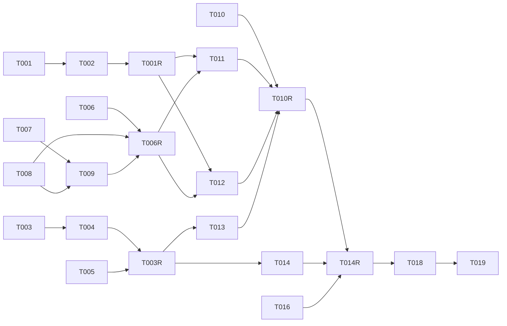

# タスクリスト - slack-reply（Slack から Chatwork へ送信確認つき返信）

> 入力: `.specs/slack-reply/design.md` / `.specs/slack-reply/requirement.md`
> 戦略: **systematic**（品質ゲート重視 / 各 `[code]` フェーズ後にレビューゲート）/ 粒度: 標準
> 前提: forwarding / sender-name / attachment-mirror 実装済み。ブランチ `feat/slack-reply`。

## 1. 概要

設計書（design.md）に基づき、Slack → Chatwork の送信確認つき返信を 5 つの実装フェーズ + レビューゲート + 最終ゲートに分解する。**1 フェーズ = 1 ロール**（`[code]` と `[orchestrator]` を混在させない）。すべての `[code]` フェーズの直後にレビューゲート（spec-review + spec-test + Codex セカンドオピニオン）を置く。

依存の都合で、DB → 設定/署名検証 → アダプタ拡張 → サービス/ルート → デプロイ/docs の順に積み上げる。

## 2. タスク一覧

### Phase 1: DB スキーマ・マイグレーション [code]
- [ ] T001: `outbound_messages` / `delivery_attempts` を `src/db/schema.ts` に追加（REQ-005 / design §5.1-5.2）
- [ ] T002: migration 0003 を Drizzle Kit で生成し内容を確認（REQ-005）

### Phase 1-R: DB レビューゲート [orchestrator]
- [ ] T001-R: Phase 1 の spec-review + spec-test + Codex セカンドオピニオン実行

### Phase 2: 設定・署名検証 [code]
- [ ] T003: `SLACK_SIGNING_SECRET`（必須）/ `SLACK_ALLOWED_REPLY_USER_IDS`（任意）を `config/env.ts` に追加（REQ-010 / REQ-009）
- [ ] T004: `secrets/factory.ts` に `SLACK_SIGNING_SECRET_SECRET` を追加（gcp backend / REQ-010）
- [ ] T005: `adapters/slack/verify-signature.ts`（`verifySlackSignature`）を実装（REQ-001 / design §4.1）

### Phase 2-R: 設定・署名検証 レビューゲート [orchestrator]
- [ ] T003-R: Phase 2 の spec-review + spec-test + Codex セカンドオピニオン実行

### Phase 3: アダプタ拡張 [code]
- [ ] T006: chatwork client に `postMessage` 追加（REQ-007 / design §4.2）
- [ ] T007: `adapters/slack/escape.ts` に `escapeSlackText` を抽出し `format.ts` から参照（DRY / design §4.3。`format.ts` 挙動不変）
- [ ] T008: Slack `SlackMessage` に `blocks?` 追加 + `postMessage` に `options.threadTs` + `updateMessage` 追加（REQ-008 / design §4.3）
- [ ] T009: `adapters/slack/confirm-message.ts`（`buildConfirmBlocks` / `buildResultMessage` + action_id 定数）を実装（REQ-004 / design §4.3）

### Phase 3-R: アダプタ拡張 レビューゲート [orchestrator]
- [ ] T006-R: Phase 3 の spec-review + spec-test + Codex セカンドオピニオン実行

### Phase 4: サービス・ルート結線 [code]
- [ ] T010: Slack イベント / interactions の Zod スキーマを定義（`adapters/slack/event-schema.ts` / REQ-002/006 / ASM-002）
- [ ] T011: `app/services/handle-slack-reply.ts`（検出・逆引き・確認投稿・pending 作成）を実装（REQ-002/003/004）
- [ ] T012: `app/services/send-outbound.ts`（allowlist・claim・Chatwork 投稿・tx 記録・chat.update・cancel）を実装（REQ-006/009 / design §4.5）
- [ ] T013: `app/routes/slack-events.ts` / `app/routes/slack-interactions.ts` を実装し `routes/index.ts` に登録（REQ-002/006 / design §4.4/4.6）

### Phase 4-R: サービス・ルート レビューゲート [orchestrator]
- [ ] T010-R: Phase 4 の spec-review + spec-test + Codex セカンドオピニオン実行

### Phase 5: デプロイ配線・ドキュメント [code]
- [ ] T014: `.github/workflows/deploy-cloud-run.yml` に `SLACK_SIGNING_SECRET_SECRET` を配線（REQ-010 / メモリ required-config-keys-break-cloud-run）
- [ ] T015: `.env.example` / docker-compose の env に `SLACK_SIGNING_SECRET` / `SLACK_ALLOWED_REPLY_USER_IDS` を追記（REQ-010）
- [ ] T016: `docs/setup-guide/` に Slack signing secret 取得・Secret Manager / GitHub variable・イベント購読・Interactivity・スコープ手順を追記（REQ-010/011）
- [ ] T017: `chatwork-slack-bridge-overview.md` の未決定事項「Slack 送信 UI」をスレッド返信方式で確定として更新（受け入れ基準）

### Phase 5-R: デプロイ・ドキュメント レビューゲート [orchestrator]
- [ ] T014-R: Phase 5 の spec-review + spec-test + Codex セカンドオピニオン実行

### Phase 6: 最終品質ゲート・PR [orchestrator]
- [ ] T018: Final Quality Gate（`pnpm lint` / `pnpm typecheck` / `pnpm test --coverage` がすべて green / カバレッジ 80%+）
- [ ] T019: 実装 PR を作成（closes #4）

## 3. タスク詳細

### T001: outbound_messages / delivery_attempts をスキーマに追加
- 要件ID: REQ-005 / NFR-004 / NFR-005
- 設計書参照: design.md §5.1, §5.2, §5.4
- 依存関係: なし
- 推定時間: 1.5h
- 対象ファイル: `src/db/schema.ts`, `src/db/schema.test.ts`
- 完了条件:
  - [ ] `OUTBOUND_STATUS = ['pending','sending','sent','cancelled','failed']` / `DELIVERY_RESULT` を const assertion + union 型で定義
  - [ ] `outboundMessages`: identity 主キー / FK（`chatwork_room_id` / `source_chatwork_message_id`）+ 明示 index / `unique (slack_channel_id, slack_reply_ts)` / status CHECK / `slack_user_id`（返信本人）/ timestamptz
  - [ ] `deliveryAttempts`: identity 主キー / `outbound_message_id` FK + index / result CHECK / `http_status` は `integer`
  - [ ] **既存 `chatworkMessages` に逆引き partial unique index `(slack_channel_id, slack_ts)`（両 non-null）を追加**（REQ-003 / design §5.2b。`integer` / `uniqueIndex` の import 追加）
  - [ ] スキーマのユニット assertion（既存 schema.test.ts の方針に合わせる）
- 並列実行: 単独（後続の土台）

### T002: migration 0003 生成
- 要件ID: REQ-005
- 設計書参照: design.md §5
- 依存関係: T001
- 推定時間: 0.5h
- 対象ファイル: `src/db/migrations/0003_*.sql`, `src/db/migrations/meta/*`
- 完了条件:
  - [ ] `pnpm db:generate`（Drizzle Kit）で 0003 を生成
  - [ ] 生成 SQL に 2 テーブル / FK / index / unique / CHECK が含まれることを目視確認
  - [ ] `_journal.json` / snapshot が整合

### T003: 設定キー追加（SLACK_SIGNING_SECRET / allowlist）
- 要件ID: REQ-010 / REQ-009 / NFR-007
- 設計書参照: design.md §4.6, §7
- 依存関係: なし
- 推定時間: 0.5h
- 対象ファイル: `src/config/env.ts`, `src/config/env.test.ts`
- 完了条件:
  - [ ] `SLACK_SIGNING_SECRET: z.string().min(1)`（必須）を `ConfigSchema` と `loadConfig` の `secrets.get` 列に追加
  - [ ] `SLACK_ALLOWED_REPLY_USER_IDS: z.string().optional()`（任意。カンマ区切り）を追加
  - [ ] テスト: 必須欠落で `ConfigError` / 任意未設定でも成功 / 値はエラーに含まれない

### T004: secret factory に SLACK_SIGNING_SECRET_SECRET 追加
- 要件ID: REQ-010
- 設計書参照: design.md §7（required-config-keys-break-cloud-run）
- 依存関係: T003
- 推定時間: 0.5h
- 対象ファイル: `src/adapters/secrets/factory.ts`, `src/adapters/secrets/factory.test.ts`
- 完了条件:
  - [ ] gcp backend で `SLACK_SIGNING_SECRET_SECRET`（`process.env` 直読み）を必須チェック対象に追加
  - [ ] `secretNames.SLACK_SIGNING_SECRET` を `createGcpSecretProvider` に渡す
  - [ ] テスト: 欠落で `SecretConfigError`（missingKeys にキー名）/ 値非含有

### T005: verifySlackSignature 実装
- 要件ID: REQ-001 / NFR-001 / NFR-002（必須テスト対象）
- 設計書参照: design.md §4.1 / ASM-001
- 依存関係: なし
- 推定時間: 1.5h
- 対象ファイル: `src/adapters/slack/verify-signature.ts`, `src/adapters/slack/verify-signature.test.ts`
- 完了条件:
  - [ ] `v0:` プレフィックス組み立て + HMAC-SHA256 hex + timing-safe 比較
  - [ ] ±300 秒スキューでリプレイ拒否（NaN / 欠落も false）
  - [ ] signing secret 空 / 署名欠落 / 長さ不一致 / 不一致 = false（fail closed）
  - [ ] テスト: 正当=true / 改竄=false / スキュー超過=false / 空鍵=false / secret・token 非漏洩
- 並列実行: T003/T004 と同時実行可能

### T006: chatwork postMessage 実装
- 要件ID: REQ-007 / ASM-003（必須テスト対象 = Chatwork 送信フロー）
- 設計書参照: design.md §4.2
- 依存関係: なし（既存 client 拡張）
- 推定時間: 1.5h
- 対象ファイル: `src/adapters/chatwork/client.ts`, `src/adapters/chatwork/client.test.ts`, `src/adapters/chatwork/types.ts`（必要なら戻り型）
- 完了条件:
  - [ ] `ChatworkClient.postMessage(roomId, body)` を interface + 実装に追加（`POST /rooms/{id}/messages` form `body`）
  - [ ] `{ message_id }` を `String(...)` 化して `{ chatworkMessageId }` で返す（number/string 両対応の型ガード）
  - [ ] 非 2xx / JSON 不正 / shape 不正 → `ChatworkApiError`（op=`chatwork.postMessage`）
  - [ ] テスト: 正常（number/string message_id）/ 401/403/404/429/500 / ネットワーク失敗 / トークン・本文非漏洩

### T007: escapeSlackText を escape.ts に抽出
- 要件ID: REQ-004 / NFR-002（DRY）
- 設計書参照: design.md §4.3, §6
- 依存関係: なし
- 推定時間: 0.5h
- 対象ファイル: `src/adapters/slack/escape.ts`, `src/adapters/slack/format.ts`（import 差し替え）, `src/adapters/slack/escape.test.ts`
- 完了条件:
  - [ ] `escapeSlackText` を `escape.ts` に移し export、`format.ts` はそれを import（`format.ts` の出力・既存テストは不変）
  - [ ] `restoreLeadingQuoteMarkers` は format 固有のため format.ts に残す（confirm では使わない）
  - [ ] 既存 `format.test.ts` が引き続き green

### T008: Slack client 拡張（blocks / threadTs / updateMessage）
- 要件ID: REQ-008 / NFR-002（必須テスト対象 = 送信フロー）
- 設計書参照: design.md §4.3 / CON-001
- 依存関係: なし
- 推定時間: 2h
- 対象ファイル: `src/adapters/slack/client.ts`, `src/adapters/slack/types.ts`, `src/adapters/slack/client.test.ts`
- 完了条件:
  - [ ] `SlackMessage.blocks?: SlackBlock[]` を追加（`SlackBlock` 型も types.ts に定義）
  - [ ] `postMessage(channelId, message, options?: { threadTs })` に拡張（既存 2 引数呼び出し互換 / `blocks`・`thread_ts` を SDK へ）
  - [ ] `updateMessage(channelId, ts, message)`（`chat.update`）を追加、失敗は `SlackApiError`
  - [ ] テスト: blocks/thread_ts 付き投稿 / update 正常 / `ok:false`→SlackApiError / SDK 例外→SlackApiError / token・本文非漏洩 / **既存 postMessage(2 引数)・uploadFile が非破壊**

### T009: confirm-message ビルダ実装
- 要件ID: REQ-004 / REQ-006
- 設計書参照: design.md §4.3
- 依存関係: T007（escape）, T008（SlackBlock 型）
- 推定時間: 1h
- 対象ファイル: `src/adapters/slack/confirm-message.ts`, `src/adapters/slack/confirm-message.test.ts`
- 完了条件:
  - [ ] `SLACK_ACTION_SEND = "cw_send"` / `SLACK_ACTION_CANCEL = "cw_cancel"` 定数
  - [ ] `buildConfirmBlocks({ quotedBody, outboundId })`: 引用 + ［送信(primary)］/［キャンセル］、`value=outboundId`、引用本文は escape 済み前提（呼び出し側 or 内部で escape）
  - [ ] `buildResultMessage(kind)`: sent ✅ / failed ❌ / cancelled 🚫 / forbidden ⛔
  - [ ] テスト: 各 kind / action_id・value の正しさ / 制御文字エスケープ

### T010: Slack イベント / interactions Zod スキーマ
- 要件ID: REQ-002 / REQ-006 / ASM-002 / coding-rules `[MUST]` 入力バリデーション
- 設計書参照: design.md §4.4, §4.5
- 依存関係: なし
- 推定時間: 1h
- 対象ファイル: `src/adapters/slack/event-schema.ts`, `src/adapters/slack/event-schema.test.ts`
- 完了条件:
  - [ ] `SlackEventEnvelopeSchema`（url_verification / event_callback + message event）/ `BlockActionsSchema`
  - [ ] `z.unknown()` ベース / `z.infer` 型導出 / 未知フィールド無視
  - [ ] テスト: url_verification / message(thread) / subtype 付き / bot_message / block_actions 正常・不正

### T011: handle-slack-reply サービス
- 要件ID: REQ-002 / REQ-003 / REQ-004 / NFR-004
- 設計書参照: design.md §4.4
- 依存関係: T001, T008, T009, T010
- 推定時間: 2.5h
- 対象ファイル: `src/app/services/handle-slack-reply.ts`, `src/app/services/handle-slack-reply.test.ts`
- 完了条件:
  - [ ] 対象判定（thread_ts あり / bot_id なし / subtype なし / user あり / **text trim 後 非空**）
  - [ ] `slack_channel_id=channel AND slack_ts=threadTs` で逆引き → room/source 取得、`enabled` 確認
  - [ ] `outbound_messages` を pending（**`slack_user_id = event.user` を含む**）で `onConflictDoNothing((channel, reply_ts))` 作成、既存なら no-op（再送）
  - [ ] 確認メッセージ投稿（threadTs）→ `slack_confirm_ts` 更新
  - [ ] **Slack 投稿失敗時は作成した pending 行を best-effort で delete**（識別子ログ。詰まり防止 / Codex 指摘）
  - [ ] never-throw（内部失敗は識別子のみログ）
  - [ ] テスト: 検出→pending(+slack_user_id)+確認投稿 / 空 text→no-op / 逆引き不一致→no-op / disabled→no-op / 再送(同 reply ts)→二重作成しない / bot 投稿→no-op / Slack 投稿失敗→pending 削除+ログ

### T012: send-outbound サービス
- 要件ID: REQ-006 / REQ-009 / NFR-004 / NFR-005（必須テスト対象 = 送信フロー）
- 設計書参照: design.md §4.5, §5.4
- 依存関係: T001, T006, T008, T009
- 推定時間: 3h
- 対象ファイル: `src/app/services/send-outbound.ts`, `src/app/services/send-outbound.test.ts`
- 完了条件:
  - [ ] **認可**: 押下者 == `outbound.slack_user_id`（返信本人）OR allowlist（非空時）。不一致→forbidden 更新で return（Codex 指摘）
  - [ ] claim: `status='pending'` のみを `sending` に条件付き UPDATE + `returning`（0 行→二重送信せず return）。**`failed` は claim 対象外（終端）**
  - [ ] Chatwork 投稿（tx 外）→ 成功: tx{ outbound sent + chatwork_message_id / delivery_attempts success } → chat.update ✅
  - [ ] 失敗: tx{ outbound failed + error_message / delivery_attempts failure(http_status/error_code) } → chat.update ❌（終端・再返信を促す）
  - [ ] 確定 tx 失敗の稀ケースは `op=slack.outbound.commit_failed` で識別子ログ（sending 残留 / 二重投稿なし）
  - [ ] `cancelOutbound`: 認可 + pending のみ cancelled + chat.update 🚫
  - [ ] chat.update 失敗は識別子ログのみ（DB 真実は確定）
  - [ ] テスト: 正常送信 / Chatwork 失敗 / 二重押下(claim 0)→二重送信なし / cancel / 認可 NG(他人)→forbidden / allowlist 例外許可 / tx 原子性

### T013: ルート実装・登録
- 要件ID: REQ-002 / REQ-006 / CON-002 / NFR-001
- 設計書参照: design.md §4.4, §4.5, §4.6
- 依存関係: T005, T010, T011, T012
- 推定時間: 2h
- 対象ファイル: `src/app/routes/slack-events.ts`, `src/app/routes/slack-interactions.ts`, `src/app/routes/index.ts`, 各 `*.test.ts`
- 完了条件:
  - [ ] events: raw body 取得 → 署名検証(401) → JSON/Zod(200 on invalid) → url_verification challenge → message → handleSlackReply → 200
  - [ ] interactions: 署名検証(401) → urlencoded `payload` 解析 → Zod → action 分岐(cw_send/cw_cancel/未知) → 200
  - [ ] `routes/index.ts` に両ルート登録、`send-outbound` へ `allowedReplyUserIds`（config パース）を渡す配線
  - [ ] テスト: 署名失敗→401 / url_verification→challenge / 不正 payload→200 / 正常分岐 / 公開境界（署名前に DB/API 未到達）

### T014: deploy workflow 配線
- 要件ID: REQ-010
- 設計書参照: design.md §7 / メモリ required-config-keys-break-cloud-run
- 依存関係: T003, T004
- 推定時間: 0.5h
- 対象ファイル: `.github/workflows/deploy-cloud-run.yml`
- 完了条件:
  - [ ] deploy step env に `SLACK_SIGNING_SECRET_SECRET: ${{ vars.SLACK_SIGNING_SECRET_SECRET }}`
  - [ ] `--set-env-vars` に `@@SLACK_SIGNING_SECRET_SECRET=${SLACK_SIGNING_SECRET_SECRET}` を追加
  - [ ] （docs に GitHub variable / Secret Manager 作成が運用前提として記載される＝T016）

### T015: .env.example / compose 更新
- 要件ID: REQ-010
- 依存関係: T003
- 推定時間: 0.3h
- 対象ファイル: `.env.example`, `docker-compose*.yml`（存在すれば）
- 完了条件:
  - [ ] `SLACK_SIGNING_SECRET=` / `SLACK_ALLOWED_REPLY_USER_IDS=`（任意・コメント付き）を追記

### T016: setup-guide 追記
- 要件ID: REQ-010 / REQ-011
- 設計書参照: design.md §7, §8
- 依存関係: なし（文書）
- 推定時間: 1.5h
- 対象ファイル: `docs/setup-guide/README.md`（該当節）
- 完了条件:
  - [ ] signing secret 取得（App Basic Information）/ Secret Manager 登録 / GitHub variable `SLACK_SIGNING_SECRET_SECRET` 作成手順
  - [ ] Event Subscriptions（`/slack/events` / `message.channels` `message.groups`）/ Interactivity（`/slack/interactions`）
  - [ ] Bot scope 追加（`channels:history` / `groups:history`）+ granular アプリは再インストールで token 不変・signing secret 不変の注記（メモリ slack-granular-app-token-no-rotation）
  - [ ] 実 ID / 実 secret を載せない（CON-003）

### T017: overview 未決定事項の確定反映
- 要件ID: 受け入れ基準
- 依存関係: なし（文書）
- 推定時間: 0.3h
- 対象ファイル: `chatwork-slack-bridge-overview.md`
- 完了条件:
  - [ ] 「未決定事項 > Slack での送信UI」をスレッド返信+確認ボタンで確定として更新（AI プロバイダは未決定のまま残す）

### T018: Final Quality Gate
- 要件ID: 受け入れ基準 / coding-rules `[MUST]`
- 依存関係: T001–T017
- 推定時間: 0.5h
- 対象ファイル: なし（コマンド実行）
- 完了条件:
  - [ ] `pnpm lint` green / `pnpm typecheck` green / `pnpm test --coverage` green かつ 80%+

### T019: 実装 PR 作成
- 要件ID: CON-004
- 依存関係: T018
- 推定時間: 0.3h
- 対象ファイル: なし（gh）
- 完了条件:
  - [ ] `gh api user` で anyoneanderson 確認後、`feat/slack-reply` から PR（closes #4 / 概要・テスト結果・デプロイ前提を記載）

## 4. 依存関係図

## 5. 並列実行計画

| フェーズ | 並列実行可能タスク |
|---------|-------------------|
| 1 | T001 →（生成）T002 |
| 2 | T003→T004 と T005 を並列 |
| 3 | T006 / (T007→) と T008 を並列、T009 は T007・T008 後 |
| 4 | T010 先行 → T011 / T012 並列 → T013 |
| 5 | T014 / T015 / T016 / T017 を並列（独立ファイル） |
| 6 | T018 → T019（直列） |

## 6. 品質チェックリスト（生成後の自己点検）

1. [x] すべてのタスクが要件 ID / design と紐付く
2. [x] design にない機能のタスクを含まない（AI 返信・添付逆送・retry queue は YAGNI）
3. [x] 依存関係が明確
4. [x] 各 `[code]` フェーズ後にレビューゲート（spec-review + spec-test + Codex）
5. [x] 完了条件が測定可能
6. [x] 必須キー追加（SLACK_SIGNING_SECRET）の 4 箇所同時更新（env/factory/workflow/docs）をタスク化（T003/T004/T014/T016）
