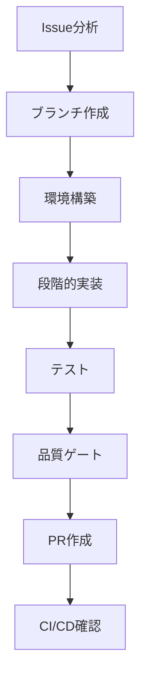

# Issue to PR ワークフローガイド

> spec-workflow-init により自動生成されました。
> 生成日時: 2026-05-21 12:30（スキル更新に伴い再生成: ランタイム組み込みマルチエージェント / セカンドオピニオン毎回）

## ワークフロー概要



## 開発環境

- **言語 / フレームワーク**: TypeScript / Hono
- **パッケージマネージャ**: pnpm
- **コンテナ**: Docker / Docker Compose
- **データベース**: PostgreSQL（Drizzle ORM）
- **テストフレームワーク**: Vitest
- **CI/CD**: GitHub Actions
- **ブランチ戦略**: GitHub Flow（feature → main）
- **ブランチ命名**: `{type}/{issue}-{slug}`
- **PRターゲット**: `main`
- **開発スタイル**: 実装ファースト

## 1. Issue分析とセットアップ

### Issue情報の取得

```bash
gh issue view {issue_number}
```

Issueを注意深く読み、以下を特定する:
- 受け入れ基準
- 技術的な制約
- 関連するIssueやPR

### 仕様書の確認

仕様はフェーズ単位で分割されている（1 spec = 1 Feature Issue）。対象フェーズの spec を読む。

```bash
ls .specs/{feature}/          # 例: .specs/foundation/
cat .specs/{feature}/requirement.md
cat .specs/{feature}/design.md
cat .specs/{feature}/tasks.md
```

### featureブランチの作成

```bash
git checkout main
git pull origin main
git checkout -b feat/1-foundation
```

> ブランチ名は `{type}/{issue}-{slug}` 形式（例: `feat/1-foundation`, `fix/43-signature-verify`）。
> `type` は Conventional Commits に揃える（`feat`, `fix`, `chore`, `docs`, `refactor`, `test`）。

## 2. 環境構築

```bash
# PostgreSQL を起動（Docker Compose）
docker compose up -d db

# 依存関係をインストール
pnpm install

# Drizzle マイグレーションを適用
pnpm db:migrate
```

> 秘密情報（`CHATWORK_API_TOKEN`, `SLACK_BOT_TOKEN`, `SLACK_SIGNING_SECRET`, `DATABASE_URL`）はローカルでは `.env` で管理し、コミットしないこと（`docs/coding-rules.md` セキュリティ参照）。

## 3. 段階的実装

### Phase 1: 分析と設計

- 関連するソースコードを読み、既存のパターンを理解する
- アダプタ境界（`src/adapters/`）と影響範囲を特定する
- 実装方針を計画する

### Phase 2: コア実装

`docs/coding-rules.md` に従って機能を実装する。特に外部サービス依存はアダプタ境界に閉じ込め、署名検証・Zod バリデーション・secret adapter 経由の秘密情報取り扱いを徹底する。

```bash
# 開発サーバーを起動して変更を確認
pnpm dev
```

### Phase 3: コードレビューゲート

`docs/review_rules.md` に基づいて実装コードをレビューする。

#### レビュー観点
- review_rules.md に定義された重大度別チェック（セキュリティ、型安全、パターン準拠等）
- coding-rules.md の [MUST] ルール違反がないか（署名検証・秘密情報・SQLインジェクション対策・送信前確認 など）
- レビュー対象外ファイル（review_rules.md §6 で定義）はスキップ

#### レビュー結果の判定

| 重大度 | 検出時のアクション |
|--------|-----------------|
| 重大（セキュリティ・バグ・ドキュメント更新漏れ） | 即修正 → 再レビュー |
| 改善提案（品質・可読性） | 修正 → 再レビュー |
| 軽微（スタイル等） | ログのみ、続行可 |

#### 修正ループ（最大3回）
1. レビューで問題を検出
2. 問題箇所を修正
3. 修正箇所のみ再レビュー
4. 繰り返し（最大3回まで）
5. 3回目で未解消の改善提案 → 「軽微」に降格して続行
6. 3回目で未解消の重大指摘 → ユーザーに判断を委ねる
7. レビューパス → 次の Phase へ

セカンドオピニオンを **毎回** 実施する。cmux-second-opinion で別AI（Codex）にレビューを依頼し、`docs/review_rules.md` を基準に独立レビューさせる。

### Phase 4: テスト実装

実装した機能のテストを Vitest で作成する。署名検証・重複チェック・Chatwork 送信フローは必須テスト対象（coding-rules.md）。

```bash
# テスト実行
pnpm test
```

### Phase 5: テストレビューゲート

テストコードをレビューする。コードレビューゲートと同じ修正ループ構造を適用。

#### テスト固有のレビュー観点
- カバレッジが完了条件（80%以上）を満たしているか
- エッジケース・エラーパス（空配列・null・未参加ルーム・レート制限超過）のテストがあるか
- テストの独立性（外部 API / DB をアダプタ境界でモックし、ネットワーク非依存か）
- AAA パターン（Arrange → Act → Assert）に従っているか

#### レビュー結果の判定・修正ループ

（Phase 3 と同じ判定テーブル・修正ループを適用。セカンドオピニオンも毎回実施）

### Phase 6: 品質ゲート

```bash
pnpm lint
pnpm typecheck
pnpm build
pnpm test
```

## 4. テスト

### API E2Eテスト

```bash
pnpm test:e2e
```

検証項目:
- 全APIエンドポイント（`/chatwork/webhook`, `/slack/events`, `/slack/interactions`, `/internal/send-chatwork-message`）が期待通りのレスポンスを返す
- 署名検証失敗のリクエストが拒否される
- エラーケースが適切に処理される

## 5. PR作成と品質ゲート

### PR作成前チェックリスト

- [ ] 全テスト通過: `pnpm test`
- [ ] Lint通過: `pnpm lint`
- [ ] 型チェック通過: `pnpm typecheck`
- [ ] ビルド成功: `pnpm build`
- [ ] カバレッジ基準（80%以上）達成: `pnpm test:coverage`
- [ ] 秘密情報・実値（実Slack/ChatworkのID、クライアント名、本文ログ）が含まれていない

### PR作成

```bash
gh pr create --base main --title "feat: {description} (closes #{issue_number})" --body "## 概要
- {summary_points}

## テスト計画
- [ ] ユニットテスト追加・更新
- [ ] API E2Eテスト検証済み

## 関連
- Closes #{issue_number}
- 仕様書: .specs/{feature}/
"
```

> このディレクトリは `~/Documents/zenchaine/` 配下のため、`gh` / `git` は **anyoneanderson** アカウントを使用する。GitHub MCP 操作には `github-zenchaine` を使うこと（CLAUDE.md 参照）。Claude Code は direnv が効かないため、`gh` 実行前に `gh api user --jq '.login'` で確認する。

## 6. CI/CD確認

### CIパイプラインの監視

```bash
gh run list --limit 5
gh run watch
```

### エラー復旧

CIが失敗した場合:

1. 失敗したステップを確認:
   ```bash
   gh run view {run_id} --log-failed
   ```
2. ローカルで問題を修正
3. 修正をプッシュ:
   ```bash
   git add -A && git commit -m "fix: CI失敗を修正" && git push
   ```
4. CIを再度監視

## エージェントロール（オプション）

### マルチエージェント役割分担戦略

各工程を専門のエージェントに委任する:

| フェーズ | 実装者 | テスター | レビュアー |
|---------|--------|---------|-----------|
| 分析 | 設計レビュー | テスト計画 | - |
| 実装 | コード作成 | テスト作成 | - |
| レビュー | - | - | コード＋テストレビュー |
| 品質ゲート | - | 全テスト実行 | 最終確認 |

### ロール割り当て

| ロール | エージェント | AI | 責務 |
|--------|-------------|-----|------|
| 実装者 | workflow-implementer | codex | coding-rules.md に従った実装コード作成 |
| レビュアー | workflow-reviewer | claude | review_rules.md / coding-rules.md 基準のコードレビュー |
| テスター | workflow-tester | codex | テスト作成・実行、カバレッジ確認 |

### エージェント定義ファイル

- `.claude/agents/workflow-implementer.md` — 実装エージェント
- `.claude/agents/workflow-reviewer.md` — レビューエージェント
- `.claude/agents/workflow-tester.md` — テストエージェント

- `.codex/agents/workflow-implementer.toml` — 実装エージェント
- `.codex/agents/workflow-reviewer.toml` — レビューエージェント
- `.codex/agents/workflow-tester.toml` — テストエージェント

### ランタイム組み込みディスパッチ

- **Codex**: `.codex/agents/workflow-*.toml` の custom agent を使用する。`エージェント` 列の名前で agent を起動し、タスク固有のコンテキストだけを渡す。
- **Claude Code**: `.claude/agents/workflow-*.md` を Claude Code agent team として使用する。Claude Code に、`エージェント` 列の名前に基づく teammate を持つ agent team を作成するよう依頼し、各 teammate にはタスク固有のコンテキストだけを渡す。`CLAUDE_CODE_EXPERIMENTAL_AGENT_TEAMS=1` が必要。
- **セカンドオピニオン**: 上記の役割分担とは別に、各レビューゲートで cmux-second-opinion により別AI（Codex）の独立レビューを **毎回** 実施する。
- **フォールバック**: ランタイム組み込み agent が使えない場合は順次実行するか、明示選択された場合のみ cmux dispatch を使う。

---

> このワークフローは spec-workflow-init で生成されました。プロジェクトの成長に合わせてカスタマイズしてください。
