# Chatwork → Slack Bridge セットアップマニュアル

Chatwork の新着メッセージを Slack に転送する Bridge（forwarding / Issue #3）を動かすための設定手順です。
Slack アプリ・Chatwork Webhook・シークレット登録・デプロイ・動作確認までを順に説明します。

---

## 0. 全体像

```
Chatwork (Webhook) ──▶ Bridge (/chatwork/webhook) ──▶ Slack (chat.postMessage)
                         ├─ 署名検証（Webhookトークン）
                         ├─ 重複チェック・保存（PostgreSQL）
                         └─ ルーティング（種別/紐付けで投稿先決定）
```

必要なもの:

| 区分 | 用意するもの | 用途 | 最終的な置き場所 |
|------|------|------|------|
| Slack | Bot トークン（`xoxb-…`） | Slack 投稿 | Secret Manager |
| Slack | Signing Secret | Slack request の署名検証（slack-reply / §8） | Secret Manager |
| Slack | 集約チャンネル 2 つの ID | 未紐付けルームの転送先 | GitHub 変数（非秘密） |
| Chatwork | API トークン | ルーム名・種別・メンバー取得 | Secret Manager |
| Chatwork | Webhook 署名トークン | Webhook の署名検証 | Secret Manager |

> **双方向化（Slack → Chatwork 返信）を使う場合**は、上記に加えて Slack の **Signing Secret** の登録と、Event Subscriptions / Interactivity / 追加スコープの設定が必要です。手順は [§8 Slack → Chatwork 返信（slack-reply / #4）](#8-slack--chatwork-返信slack-reply-4) を参照してください。

> **前提**: Bridge 本体（foundation / cloud-deploy / forwarding）はデプロイ済みで、公開 URL（例 `https://<your-domain>/chatwork/webhook`）に到達できること。デプロイ手順は [`../deploy/cloud-run.md`](../deploy/cloud-run.md) / [`../deploy/docker.md`](../deploy/docker.md) を参照。

---

## 1. Slack の設定

### 1-1. アプリを作成する

[https://api.slack.com/apps](https://api.slack.com/apps) を開き、対象ワークスペースにログインして **「Create New App」** をクリックします。

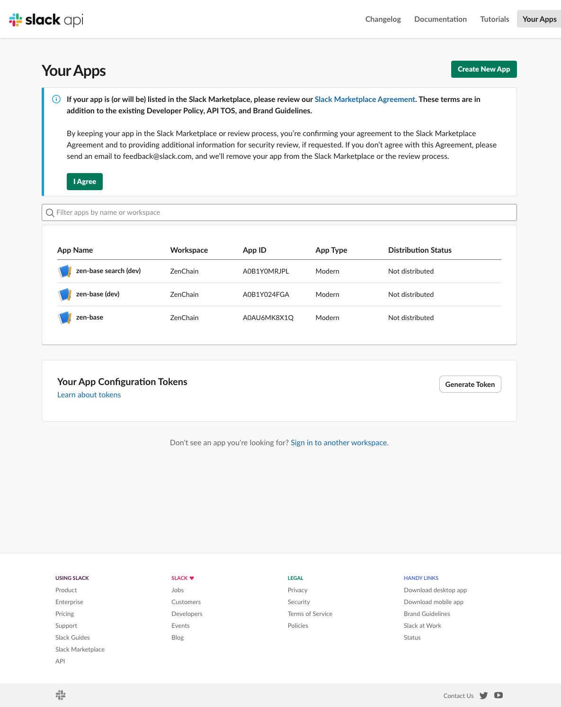

**「From scratch」** を選びます。

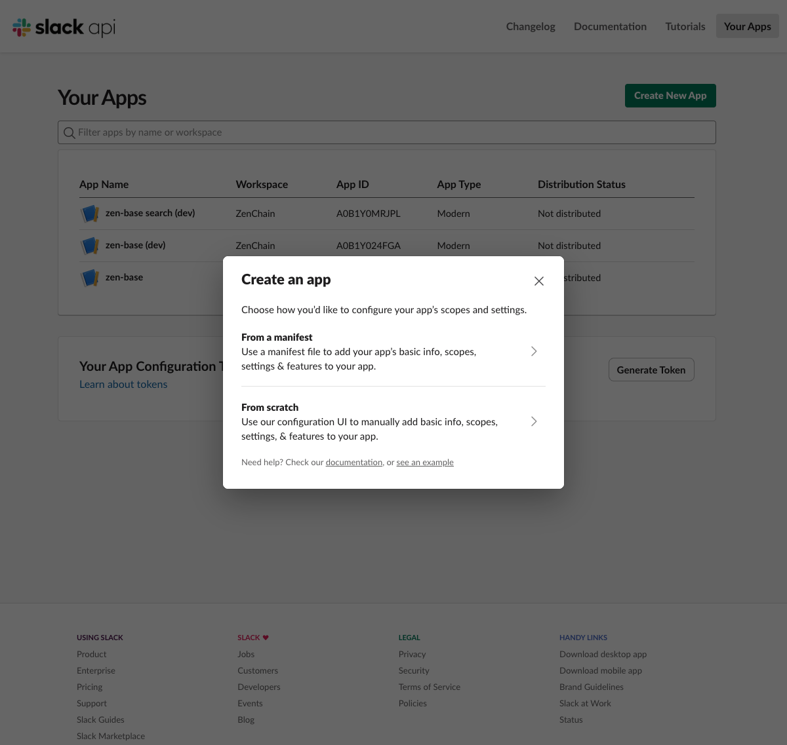

アプリ名（例: `Chatwork Slack Bridge`）を入力し、インストール先ワークスペースを選んで **「Create App」**。

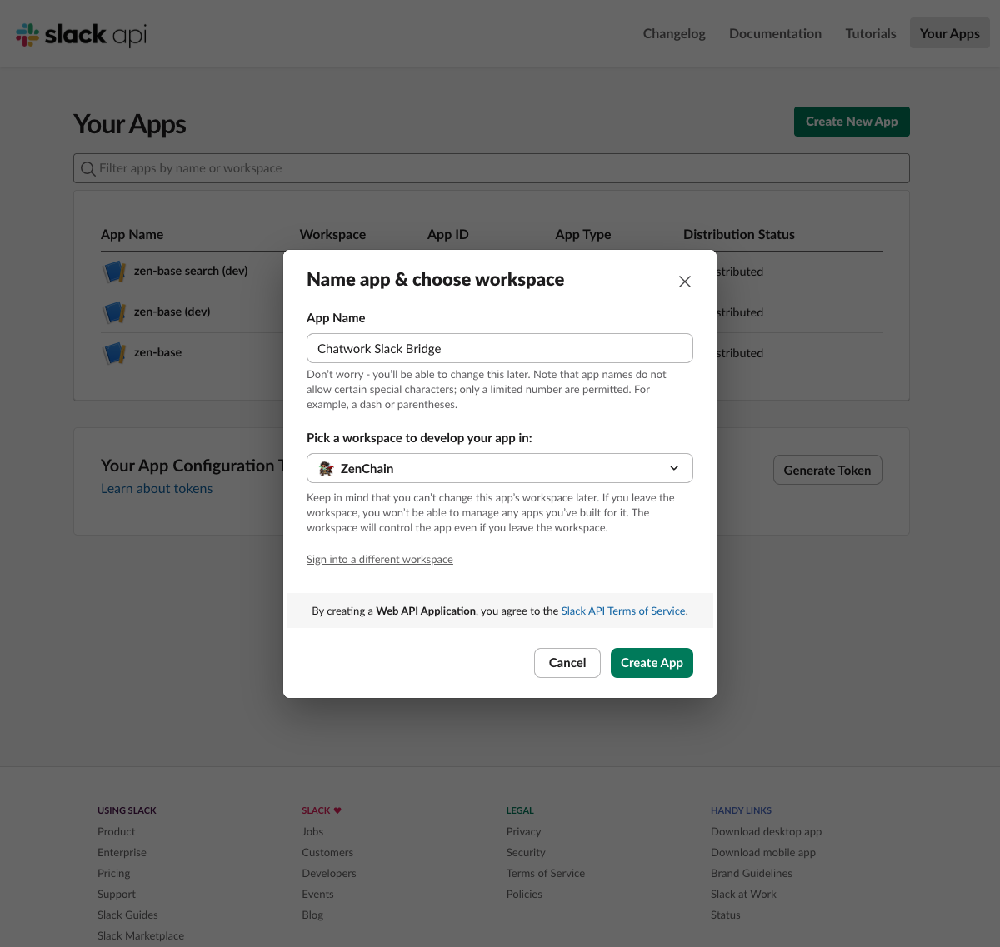

作成すると Basic Information 画面になります。

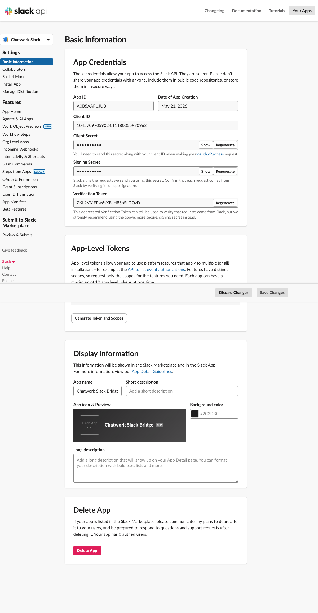

### 1-2. Bot スコープ `chat:write` / `files:write` を追加する

左メニュー **「OAuth & Permissions」** →「ボットトークンのスコープ」で以下の 2 つを追加します:

- **`chat:write`** — メッセージ投稿（forwarding）に必要
- **`files:write`** — Chatwork 添付ファイルを Slack に再アップロードする（[#18 attachment-mirror](https://github.com/anyoneanderson/chatwork-slack-bridge/issues/18)）ために必要

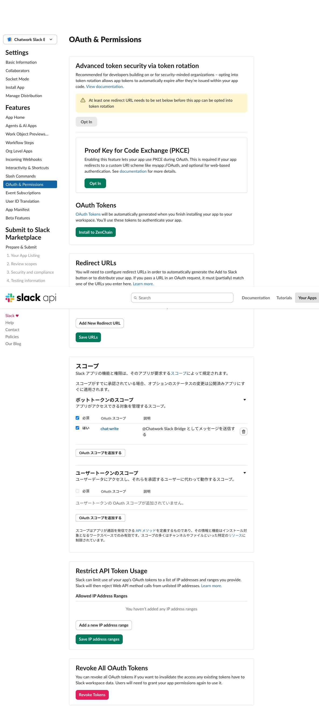

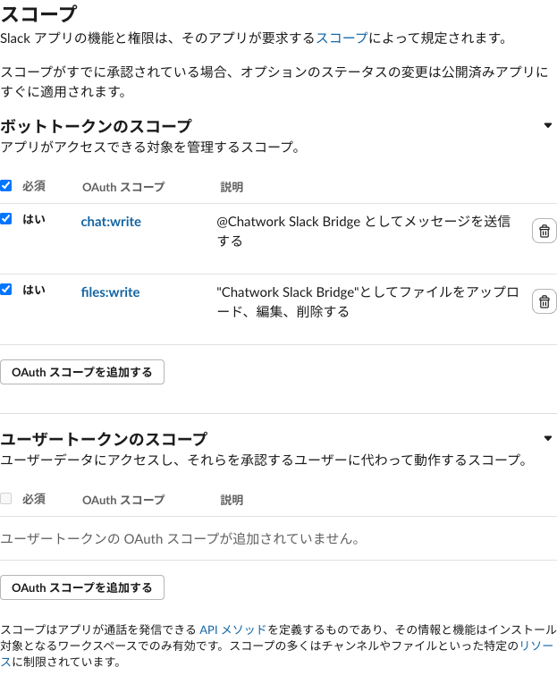

> **既存ワークスペースに後から `files:write` を追加する場合**は、スコープ追加後に **ワークスペースへの再インストールが必要**です（次節 1-3 / 後述の「§7 既存環境へのスコープ追加（`files:write`）」参照）。なお、本アプリのような **モダンな granular permission アプリでは、再インストールしても Bot トークンの値は変わりません**（スコープが同じトークンに付与されます）。その場合は Secret Manager の更新も Cloud Run の再デプロイも不要です。詳細・判定方法は §7 を参照してください。

### 1-3. ワークスペースにインストールしてトークンを取得する

**「Install App」**（または OAuth 画面の「Install to ＜ワークスペース＞」）→ 権限の確認画面で **「許可する」**。

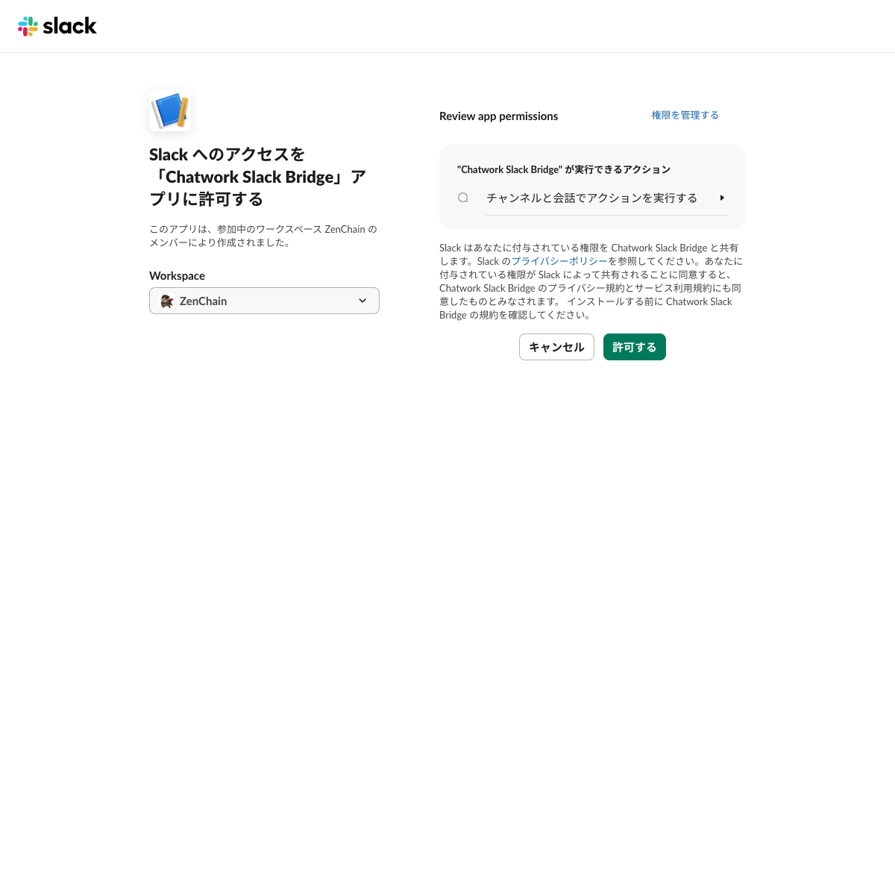

インストール後、**Bot User OAuth Token（`xoxb-…`）** が表示されます。これが `SLACK_BOT_TOKEN` です。後で Secret Manager に登録します（**第三者に開示しない**こと）。

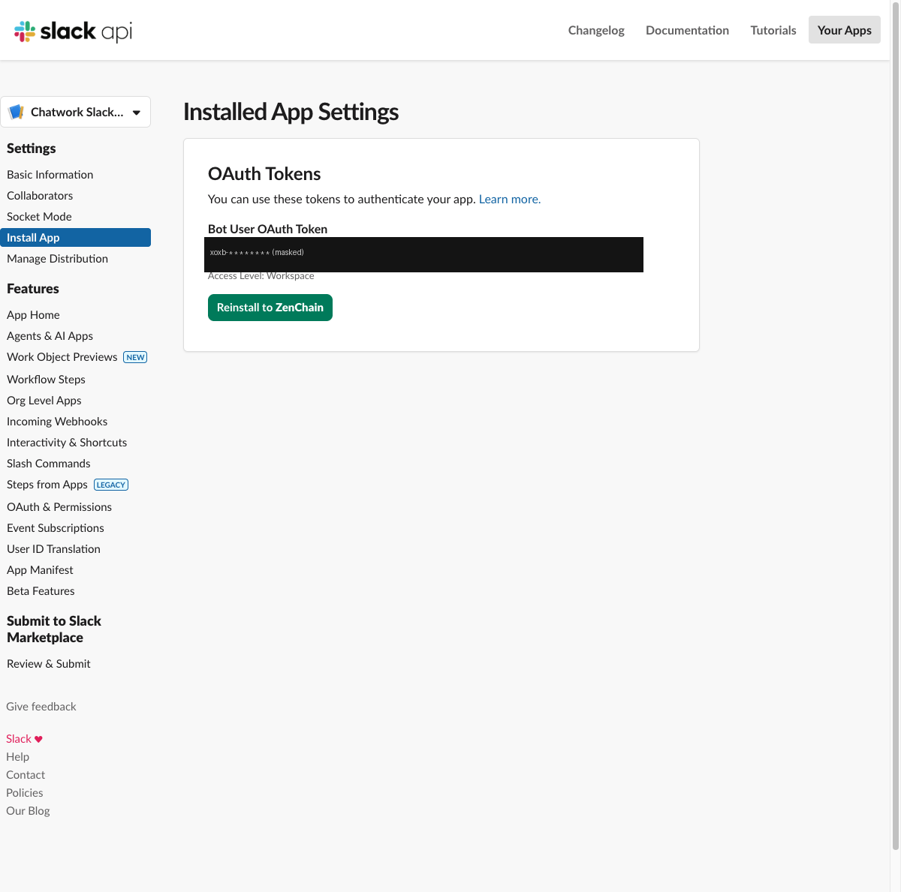

### 1-4. 集約チャンネルを 2 つ作成し、Bot を招待する

未紐付けルームの転送先となる集約チャンネルを 2 つ作成します（例: `chatwork-groups`＝グループ用、`chatwork-dms`＝DM 用）。Slack で **「+」→「チャンネル」** から作成します。

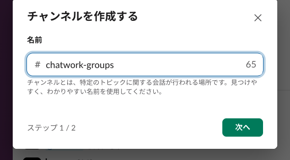

作成した各チャンネルに **Bot（Chatwork Slack Bridge）を招待**します:

1. チャンネルを開く → チャンネル名をクリック → **「インテグレーション」** タブ
2. **「アプリを追加する」** → 一覧から **Chatwork Slack Bridge** を選び **「追加」**

> `/invite @Chatwork Slack Bridge` をメッセージ欄から実行しても招待できます。

各チャンネルの **チャンネル ID（`C…`）** を控えます（チャンネル詳細の最下部「チャンネル ID」でコピー可能）。これが `SLACK_DEFAULT_GROUP_CHANNEL_ID` / `SLACK_DEFAULT_DM_CHANNEL_ID` です。

---

## 2. Chatwork の設定

### 2-1. API トークンを取得する

[API トークン画面](https://www.chatwork.com/service/packages/chatwork/subpackages/api/token.php)（設定 → サービス連携 → API → APIトークン）でトークンを取得します。これが `CHATWORK_API_TOKEN`（ルーム名・種別・メンバー取得に使用）です。

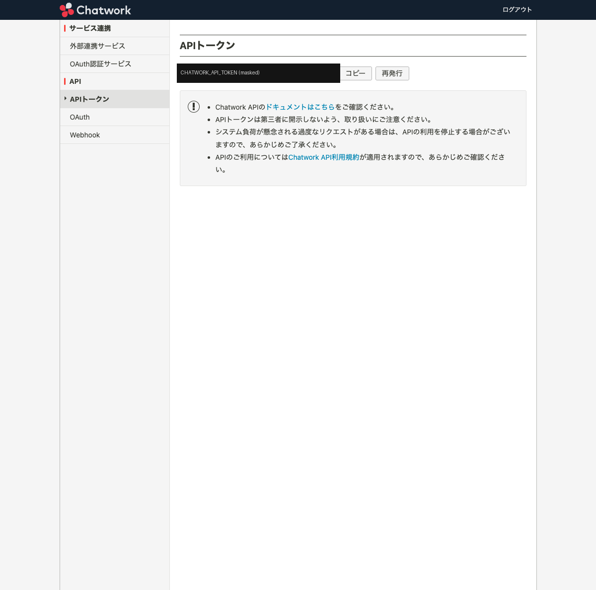

> このトークンを持つアカウントが、**転送したいルームに参加している**必要があります（未参加ルームは取得不可）。

### 2-2. Webhook を作成する

[Webhook 画面](https://www.chatwork.com/service/packages/chatwork/subpackages/webhook/list.php) →「新規作成」で以下を設定します:

- **Webhook 名**: 任意（例 `chatwork-slack-bridge`）
- **Webhook URL**: `https://<your-domain>/chatwork/webhook`（デプロイ済み Bridge の公開 URL）
- **イベント**: **「ルームイベント」** → **「メッセージ作成」** にチェック
- **ルーム ID**: 転送したい Chatwork ルームの ID（チャットを開いたときの URL `#!rid` の後の数字）

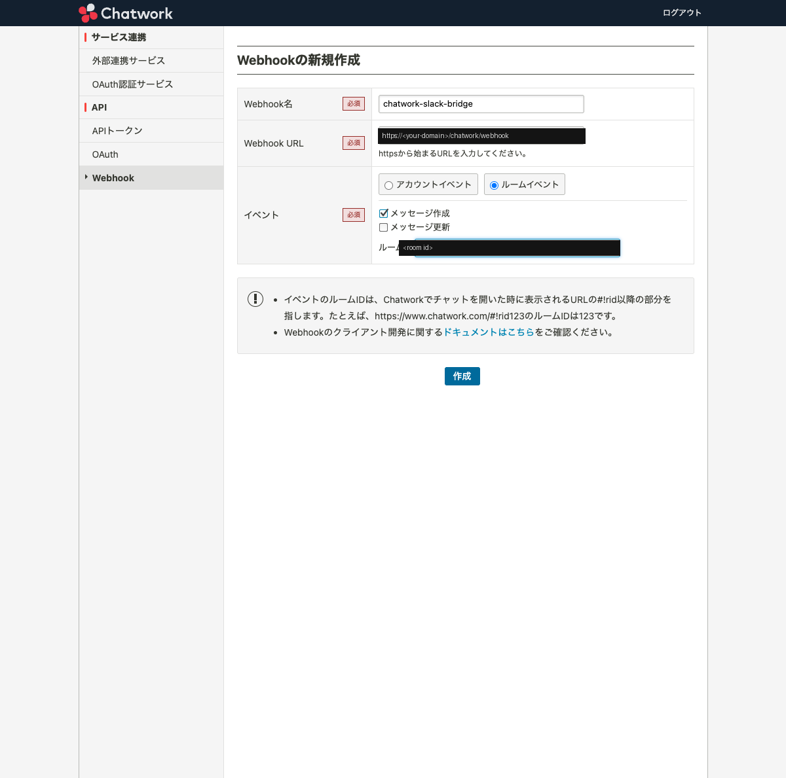

「作成」すると、**Webhook 設定 ID** と **署名トークン**が発行されます。この署名トークンが `CHATWORK_WEBHOOK_TOKEN`（Webhook の署名検証に使用）です。

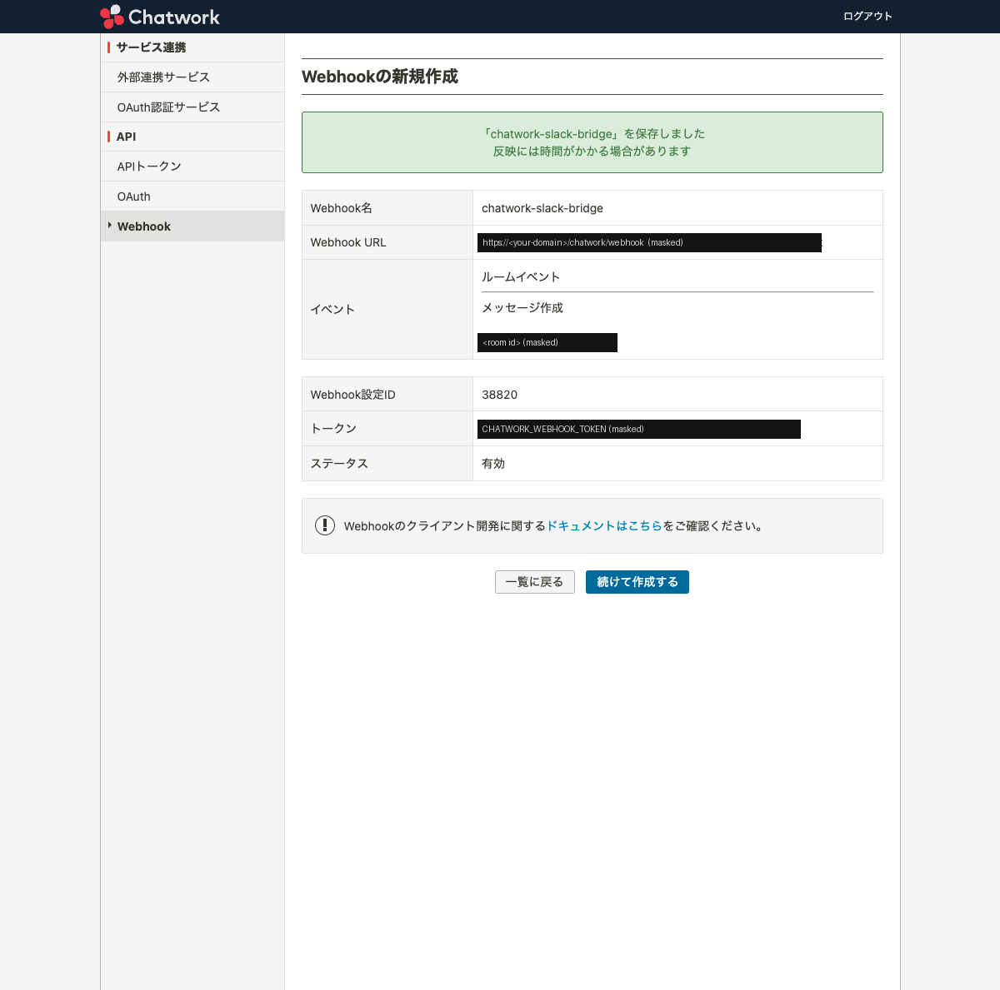

> **⚠ 複数ルームについて**: Chatwork の「ルームイベント」Webhook は **1 ルーム = 1 Webhook** で、**それぞれ別の署名トークン**が発行されます。現バージョンの Bridge は単一の `CHATWORK_WEBHOOK_TOKEN` で検証するため、まずは **1 ルームでの利用**を想定しています。複数ルーム対応（トークンの DB 管理）は今後のフェーズで対応予定です。

---

## 3. シークレット・設定の登録（GCP / GitHub）

Bridge は本番（`SECRET_BACKEND=gcp`）で、**秘密の実体を Secret Manager**に置き、**GitHub Actions の変数にはシークレット「名」と非秘密の設定値**を置きます（実トークンは GitHub に置かない）。

### 3-1. Secret Manager にトークンを登録する

```bash
PROJECT=<your-gcp-project>
RUNTIME_SA=<cloud-run-runtime-service-account>   # 例: cloud-run-sa@<project>.iam.gserviceaccount.com

create_secret () {  # name value
  printf '%s' "$2" | gcloud secrets create "$1" --data-file=- --replication-policy=automatic --project "$PROJECT"
  gcloud secrets add-iam-policy-binding "$1" \
    --member="serviceAccount:$RUNTIME_SA" \
    --role="roles/secretmanager.secretAccessor" --project "$PROJECT"
}

create_secret chatwork-slack-bridge-chatwork-webhook-token '<CHATWORK_WEBHOOK_TOKEN>'
create_secret chatwork-slack-bridge-chatwork-api-token     '<CHATWORK_API_TOKEN>'
create_secret chatwork-slack-bridge-slack-bot-token        '<SLACK_BOT_TOKEN>'
```

> **slack-reply（双方向化）を使う場合**は、Slack の Signing Secret も登録します（取得手順は §8-1）。
> `SLACK_SIGNING_SECRET` は **必須キー**で、未登録のまま `SECRET_BACKEND=gcp` でデプロイすると本番起動が失敗します（詳細は §8）。
>
> ```bash
> create_secret chatwork-slack-bridge-slack-signing-secret '<SLACK_SIGNING_SECRET>'
> ```

### 3-2. GitHub repository variables を登録する

デプロイワークフロー（`.github/workflows/deploy-cloud-run.yml`）は `vars.*` を参照します。3 つのトークンは **Secret Manager のシークレット名**、2 つのチャンネル ID は **値そのもの**を入れます。

```bash
REPO=<owner>/<repo>
gh variable set CHATWORK_WEBHOOK_TOKEN_SECRET --repo "$REPO" --body "chatwork-slack-bridge-chatwork-webhook-token"
gh variable set CHATWORK_API_TOKEN_SECRET     --repo "$REPO" --body "chatwork-slack-bridge-chatwork-api-token"
gh variable set SLACK_BOT_TOKEN_SECRET        --repo "$REPO" --body "chatwork-slack-bridge-slack-bot-token"
gh variable set SLACK_DEFAULT_GROUP_CHANNEL_ID --repo "$REPO" --body "<group channel id>"   # 例: C0XXXXXXX
gh variable set SLACK_DEFAULT_DM_CHANNEL_ID     --repo "$REPO" --body "<dm channel id>"      # 例: C0YYYYYYY
```

> **slack-reply（双方向化）を使う場合**は、Signing Secret のシークレット「名」を GitHub variable `SLACK_SIGNING_SECRET_SECRET` に設定します（既存 `SLACK_BOT_TOKEN_SECRET` と同じ間接参照の仕組み）。
> このキーは **必須**で、**GitHub variable が未作成だとデプロイ時に空文字へ展開され、本番 Cloud Run の起動が失敗します**（詳細は §8-2）。
>
> ```bash
> gh variable set SLACK_SIGNING_SECRET_SECRET --repo "$REPO" --body "chatwork-slack-bridge-slack-signing-secret"
> ```

> ローカル（`SECRET_BACKEND=env`）で動かす場合は、これらを `.env` に直接設定します（`.env.example` 参照）。`.env` はコミットしないこと。slack-reply を使う場合は `SLACK_SIGNING_SECRET=`（必須）と、任意で `SLACK_ALLOWED_REPLY_USER_IDS=`（送信 allowlist）も設定します。

---

## 4. デプロイと動作確認

### 4-1. デプロイ

`main` への push（または既定のデプロイ手順）でデプロイします。デプロイ時にマイグレーション（`chatwork_rooms` / `chatwork_messages`）が適用されます。

### 4-2. ヘルスチェック

```bash
curl -i https://<your-domain>/health        # → 200 {"status":"ok","db":"ok"}
```

### 4-3. 署名検証の確認（任意）

署名なし／不正署名のリクエストは拒否されます（公開エンドポイントは署名で認可）。

```bash
curl -s -o /dev/null -w "%{http_code}\n" -X POST https://<your-domain>/chatwork/webhook \
  -H "Content-Type: application/json" -d '{"test":true}'   # → 401
```

### 4-4. 転送テスト

Webhook を設定した Chatwork ルームに**テストメッセージを 1 通投稿**します。
未紐付けのグループルームなら、`SLACK_DEFAULT_GROUP_CHANNEL_ID` のチャンネル（例 `#chatwork-groups`）に転送されれば成功です。

---

## 5. 転送ルーティングの仕組み

| 条件 | DB 保存 | Slack 投稿先 |
|------|:------:|------------|
| `room_type = my`（マイチャット） | ✕ | ✕（転送しない） |
| `enabled = false`（無効化） | ○ | ✕（保存のみ） |
| 紐付け済み（`slack_channel_id` あり） | ○ | その専用チャンネル |
| 未紐付け ＋ `room_type = group` | ○ | `SLACK_DEFAULT_GROUP_CHANNEL_ID` |
| 未紐付け ＋ `room_type = direct` | ○ | `SLACK_DEFAULT_DM_CHANNEL_ID` |

- 初見ルームは `enabled = true` / 専用チャンネル未設定で自動登録され、種別集約チャンネルへ流れます。
- 後から `chatwork_rooms.slack_channel_id` を設定すると専用チャンネルへ切り替わります。
- 不要なルームは `enabled = false` で保存のみ（Slack 投稿を停止）にできます。

---

## 6. 既知の制限・今後の改善

- **送信者表示**: 現状は送信者が account_id（数字）で表示されます。表示名解決は [#17](https://github.com/anyoneanderson/chatwork-slack-bridge/issues/17) で対応予定。
- **絵文字・装飾**: Chatwork 独自のメッセージ記法（`(emoticon)` / `[info]` / `[download]` 等）の整形は [#17](https://github.com/anyoneanderson/chatwork-slack-bridge/issues/17) で対応済み。
- **添付ファイル**: 画像・ファイル添付は Slack 本文投稿のスレッドに**実体として再アップロード**されます（[#18 attachment-mirror](https://github.com/anyoneanderson/chatwork-slack-bridge/issues/18)）。これには Bot スコープ `files:write` が必要です（§1-2 / §7）。取得・アップロードに失敗した場合や 1 ファイル 100MB を超える場合は、本文の `📎 ファイル名 (サイズ)` テキスト表示にフォールバックし、転送自体は継続します。
- **複数ルーム**: 上記のとおり Chatwork はルームごとに別トークンのため、マルチルーム（トークンの DB 管理）と管理 CLI を今後のフェーズで予定。
- **Slack → Chatwork 返信**: 転送メッセージの Slack スレッドへ返信 → 確認ボタンで Chatwork へ投稿できます（[#4 slack-reply](https://github.com/anyoneanderson/chatwork-slack-bridge/issues/4)）。有効化手順は [§8](#8-slack--chatwork-返信slack-reply-4) を参照。

---

## 7. 既存環境へのスコープ追加（`files:write`）

添付ファイルの Slack 再アップロード（[#18 attachment-mirror](https://github.com/anyoneanderson/chatwork-slack-bridge/issues/18)）を**すでに稼働中の Bridge に後から有効化**する場合の手順です。新規セットアップ時は §1-2 でスコープを追加済みのため、この節は不要です。

> **まず結論**: 多くの場合（本アプリのような **モダンな granular permission アプリ**）は **7-1 → 7-2 の「スコープ追加 → 再インストール」だけで完了**します。再インストールしても **Bot トークンの値は変わらず**、同じトークンに新スコープが付与されるため、Secret Manager 更新（7-3）も Cloud Run 再デプロイ（7-4）も**不要**です。
>
> 例外として、**再インストールで Bot トークンの値が変わった**場合（古い classic アプリ等）のみ、7-3 → 7-4 を実施します。**変わったかどうかは 7-2 の手順で判定**できます（再インストール後トークンと Secret Manager の値を sha256 で比較）。

### 7-1. `files:write` スコープを追加する

[https://api.slack.com/apps](https://api.slack.com/apps) で対象アプリを開き、**「OAuth & Permissions」** →「ボットトークンのスコープ」に **`files:write`** を追加します（既存の `chat:write` はそのまま残します）。


### 7-2. ワークスペースに再インストールする

スコープを追加すると、画面上部に **「Reinstall your app」（アプリを再インストール）** の案内が出ます。これをクリックし、権限確認画面で **「許可する」** を押します。

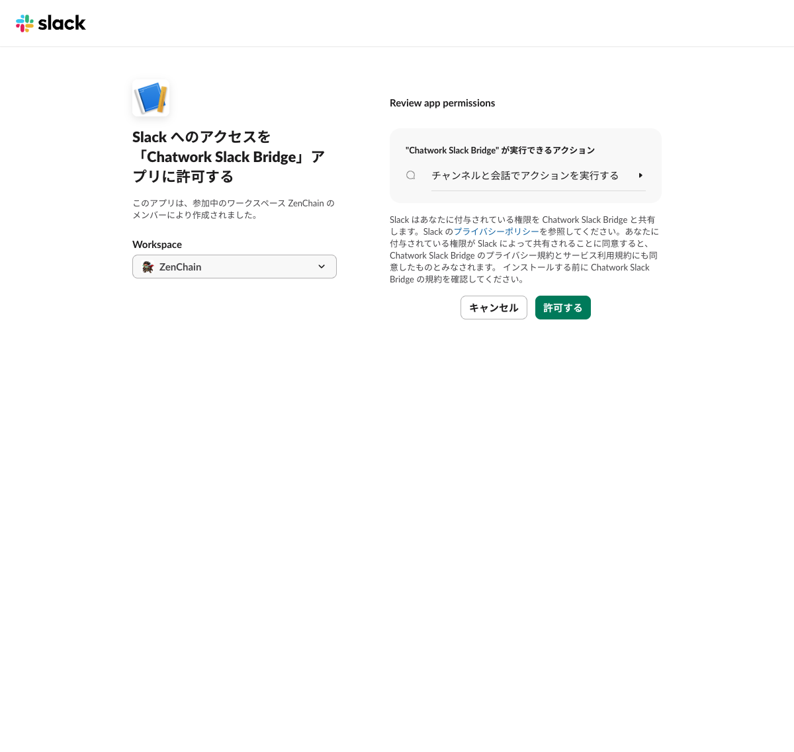

既存チャンネルへの Bot 招待（§1-4）はやり直し不要です（招待状態は維持されます）。

> **Bot トークンが変わったかどうかの判定**: 再インストール後、「OAuth & Permissions」の **Bot User OAuth Token（`xoxb-…`）** を確認します。granular permission アプリでは**値が変わりません**（この場合 7-3・7-4 は不要で、`files:write` は同じトークンに即時付与されます）。本当に変わっていないかは、再インストール後トークンと Secret Manager の現行値を **sha256 で比較**して確かめられます（実値を画面・ログに出さずに判定できます）:
>
> ```bash
> # Slack 画面の「Copy」でトークンをクリップボードへコピーしてから実行
> pbpaste | tr -d '\n' | shasum -a 256
> gcloud secrets versions access latest \
>   --secret=chatwork-slack-bridge-slack-bot-token --project <your-gcp-project> \
>   | tr -d '\n' | shasum -a 256
> ```
>
> 2 つの sha256 が一致すれば **トークンは不変** → 7-3・7-4 はスキップして §7-5（動作確認）へ進みます。`auth.test` のレスポンスヘッダ `x-oauth-scopes` に `files:write` が含まれることも確認できます。
> **一致しない（＝トークンが変わった）場合のみ**、続けて 7-3・7-4 を実施します。

### 7-3.（トークンが変わった場合のみ）Secret Manager の `SLACK_BOT_TOKEN` を更新する

> 7-2 の sha256 比較で**トークンが不変だった場合、この節は不要**です（§7-5 へ）。再インストールで**トークンが変わった場合のみ**実施します。

新しい Bot トークンを Secret Manager のシークレットに **新バージョンとして追加**します（§3-1 で作成した `chatwork-slack-bridge-slack-bot-token` を想定）。

```bash
PROJECT=<your-gcp-project>

# 新しい xoxb トークンを新バージョンとして追加（既存バージョンは残る）
printf '%s' '<NEW_SLACK_BOT_TOKEN>' \
  | gcloud secrets versions add chatwork-slack-bridge-slack-bot-token \
      --data-file=- --project "$PROJECT"
```

> デプロイワークフローはシークレットを `:latest` で参照する想定のため、シークレット「名」（GitHub 変数 `SLACK_BOT_TOKEN_SECRET`）の変更は不要です。新バージョンを追加するだけで構いません。

### 7-4.（トークンが変わった場合のみ）Cloud Run を再デプロイする（忘れやすい）

> 7-3 を実施した場合のみ必要です（トークン不変なら不要）。**Secret Manager の値を更新したとき**は、**ここが最重要ポイント**になります。Secret Manager に新バージョンを追加しただけでは、**稼働中の Cloud Run リビジョンには反映されません**。

- Cloud Run は **起動時（新リビジョン作成時）にシークレットを読み込み**、そのリビジョンが生きている間はその値をキャッシュし続けます。
- したがって Secret Manager に新バージョンを足しても、**既存リビジョンは古いトークンを使い続けます**。
- **再デプロイ（新リビジョンの作成）でのみ新トークンが読み込まれます**。

そのため、`main` への push などで **必ず再デプロイ**してください（既定のデプロイ手順は §4-1）。

```bash
# 例: 何も変更がなくても新リビジョンを強制作成して新トークンを読み込ませる
gcloud run services update <GCP_SERVICE_NAME> \
  --project <your-gcp-project> --region <your-region> \
  --update-labels "reload=$(date +%s)"
```

> **症状の見分け方**: スコープ追加・再インストール・Secret 更新まで済んでいるのに添付アップロードが失敗し、ログに Slack の `not_authed` / `invalid_auth` が出る場合は、**Cloud Run の再デプロイ忘れ**（古いリビジョンが旧トークンをキャッシュ）をまず疑ってください。本文の転送（`chat:write`）は古いトークンでも成功するため、「本文は届くが添付だけ来ない」状態になりがちです。

### 7-5. 動作確認

Webhook 設定済みの Chatwork ルームに**小さな画像（例: 数十 KB の PNG）を添付したメッセージを 1 通**投稿します。Slack の転送先チャンネルに本文が投稿され、**そのスレッドに画像の実体がアップロード**されれば成功です（§「5. 転送ルーティングの仕組み」の投稿先に従います）。

---

## 8. Slack → Chatwork 返信（slack-reply / #4）

ここまでの設定（forwarding）は **Chatwork → Slack の片方向**転送です。**転送メッセージの Slack スレッドへ返信 → 確認ボタンで Chatwork へ投稿**する双方向化（[#4 slack-reply](https://github.com/anyoneanderson/chatwork-slack-bridge/issues/4)）を有効にするには、以下を設定します。

```
[Chatwork] サンプルルーム            ← forwarding が投稿した親メッセージ（slack_ts を保持）
山田太郎:
お世話になっております。ご確認お願いします。
 └ （担当者がこのスレッドに返信）了解しました、明日までに対応します
 └ 🤖 この内容を Chatwork に送信しますか？      ← bridge が確認メッセージを投稿
      > 了解しました、明日までに対応します
      [ 送信 ]  [ キャンセル ]
   → [送信] 押下 → Chatwork へ投稿 → 確認メッセージを「✅ 送信しました」に更新
```

> **誤爆防止**: スレッド返信は即時送信されず、必ず［送信］/［キャンセル］の確認を 1 段挟みます。［送信］/［キャンセル］を押せるのは原則 **返信を書いた本人**だけです（共有スレッドでの他人操作を防ぐ）。

### 8-1. Signing Secret を取得する

Slack request の署名検証に **Signing Secret**（`SLACK_SIGNING_SECRET`）を使います。これは Bot トークンとは別物で、[https://api.slack.com/apps](https://api.slack.com/apps) で対象アプリを開き、**「Basic Information」** → **「App Credentials」** → **「Signing Secret」** の「Show」で表示・コピーできます。

> **Signing Secret は再インストールでは変わりません**（App の固定値）。スコープ追加・再インストール（§8-4）で Bot トークンや Signing Secret が変わることはありません（granular permission アプリ。§7 と同じ性質）。第三者に開示しないこと。

### 8-2. Signing Secret を登録する（Secret Manager / GitHub variable）

forwarding と同じ間接参照の仕組みです。**秘密の実体は Secret Manager**、**GitHub variable にはシークレット「名」**を入れます（実値は GitHub に置かない）。手順は §3 と同形です（§3-1 / §3-2 の slack-reply 用ブロックに記載のコマンドを参照）。

- Secret Manager に `SLACK_SIGNING_SECRET` を登録（例: `chatwork-slack-bridge-slack-signing-secret`）。Cloud Run ランタイム SA に `secretAccessor` を付与（§3-1 の `create_secret` 関数で自動付与）。
- そのシークレット名を GitHub variable `SLACK_SIGNING_SECRET_SECRET` に設定。

> ⚠ **`SLACK_SIGNING_SECRET` は必須キー**です。`SECRET_BACKEND=gcp`（本番 / Cloud Run）の起動時に gcp secret factory が `SLACK_SIGNING_SECRET_SECRET`（GitHub variable）を必須チェックします。**GitHub variable が未作成だとデプロイで空文字に展開され、本番起動が失敗します**（`SecretConfigError`）。Secret Manager 登録・GitHub variable 作成・デプロイ（再リビジョン作成）まで**ワンセット**で行ってください。
>
> ローカル（`SECRET_BACKEND=env`）では `.env` に `SLACK_SIGNING_SECRET=` を直接設定します。

### 8-3. Event Subscriptions / Interactivity の Request URL を設定する

対象アプリの左メニューで以下を設定します（`<your-domain>` はデプロイ済み Bridge の公開ホスト）。

- **「Event Subscriptions」** を有効化 → **Request URL** に `https://<your-domain>/slack/events` を入力。「Verified」になることを確認します（Bridge が `url_verification` の challenge に応答します）。
  - **「Subscribe to bot events」** に、転送先チャンネルの種別に応じて購読を追加します:
    - public チャンネルへ転送している場合: `message.channels`
    - private チャンネルへ転送している場合: `message.groups`
- **「Interactivity & Shortcuts」** を有効化 → **Request URL** に `https://<your-domain>/slack/interactions` を入力（［送信］/［キャンセル］ボタン押下の受け口）。

### 8-4. Bot スコープを追加して再インストールする

スレッド返信の本文を Events で受け取るため、既存の `chat:write` に加えて以下を **「OAuth & Permissions」→「ボットトークンのスコープ」** に追加します:

- **`channels:history`** — public チャンネルのメッセージ取得（`message.channels` を受け取るため）
- **`groups:history`** — private チャンネルのメッセージ取得（`message.groups` を受け取るため）

追加後、画面上部の **「Reinstall your app」** で再インストールし、権限確認で「許可する」を押します。

> **granular permission アプリのため、再インストールしても Bot トークン・Signing Secret の値は変わりません**（同じトークンに新スコープが付与されます。§7 の `files:write` 追加と同じ性質）。そのため Secret Manager の更新も Cloud Run の再デプロイも**不要**です（万一トークンが変わった古い classic アプリの場合のみ §7-3 / §7-4 の手順を実施）。Signing Secret も §8-1 のとおり再インストールで不変です。

### 8-5.（任意）送信操作を allowlist で絞る

`SLACK_ALLOWED_REPLY_USER_IDS`（カンマ区切りの Slack user ID。**任意 / 既定は空**）を設定すると、本人に加えて allowlist のユーザー（管理者・代理操作）も送信/キャンセルを操作できます。**未設定の場合は「返信を書いた本人のみ」**が操作できます（後方互換）。このキーは任意のため、未設定でも起動・動作します。

- ローカル: `.env` の `SLACK_ALLOWED_REPLY_USER_IDS=`
- 本番: GitHub variable `SLACK_ALLOWED_REPLY_USER_IDS` に設定します（`SLACK_DEFAULT_*_CHANNEL_ID` と同じ非秘密の設定値）。deploy workflow がこの variable を `--set-env-vars` で Cloud Run に渡すよう配線済みです。任意のため、未設定（空文字）の場合は本人のみ許可で安全に動作します。

### 8-6. 動作確認

forwarding が投稿した Slack メッセージの**スレッドに返信**します。Bridge が「🤖 この内容を Chatwork に送信しますか？」と［送信］/［キャンセル］ボタン付きの確認メッセージを同スレッドに投稿します。［送信］を押すと対象 Chatwork ルームへ投稿され、確認メッセージが「✅ 送信しました」に更新されれば成功です。

---

## 設定値リファレンス

| キー | 種別 | 説明 |
|------|------|------|
| `CHATWORK_WEBHOOK_TOKEN` | secret | Webhook 署名検証用トークン |
| `CHATWORK_API_TOKEN` | secret | Chatwork API（ルーム/メンバー取得）用トークン |
| `SLACK_BOT_TOKEN` | secret | Slack 投稿・添付アップロード用 Bot トークン（`chat:write` / `files:write` / `channels:history` / `groups:history`） |
| `SLACK_SIGNING_SECRET` | secret | Slack request 署名検証用シークレット（slack-reply。**必須**。§8） |
| `SLACK_ALLOWED_REPLY_USER_IDS` | config | 送信操作の allowlist（任意・カンマ区切り。未設定＝本人のみ。§8-5） |
| `SLACK_DEFAULT_GROUP_CHANNEL_ID` | config | グループ種別の集約チャンネル ID |
| `SLACK_DEFAULT_DM_CHANNEL_ID` | config | DM 種別の集約チャンネル ID |

gcp バックエンドでは、上記 secret は GitHub 変数 `*_SECRET`（Secret Manager のシークレット名）経由で実行時に取得されます。`SLACK_SIGNING_SECRET` の GitHub 変数は `SLACK_SIGNING_SECRET_SECRET` です（未作成だと本番起動が失敗します。§8-2）。
